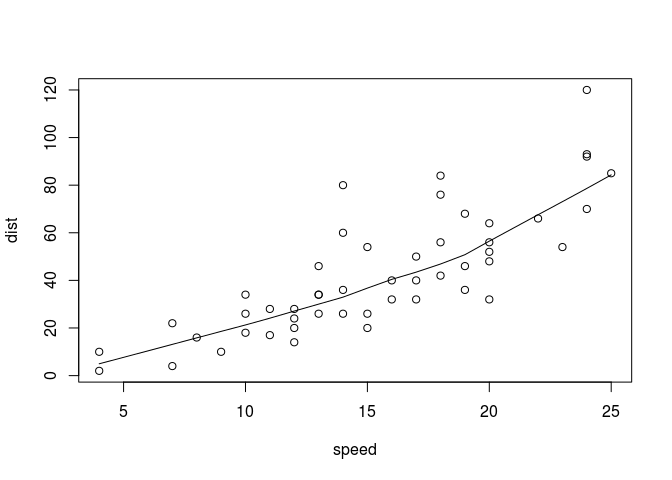
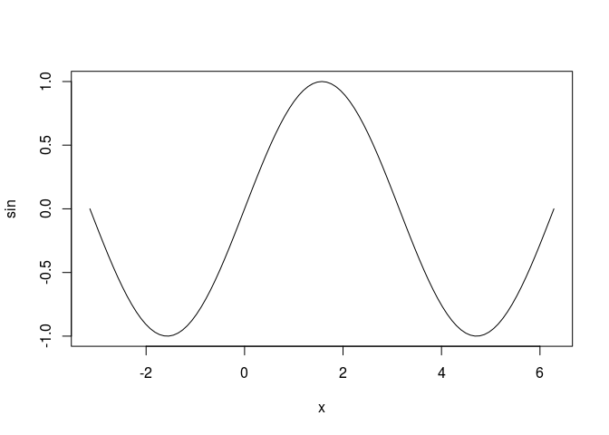
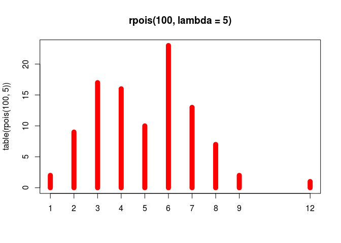
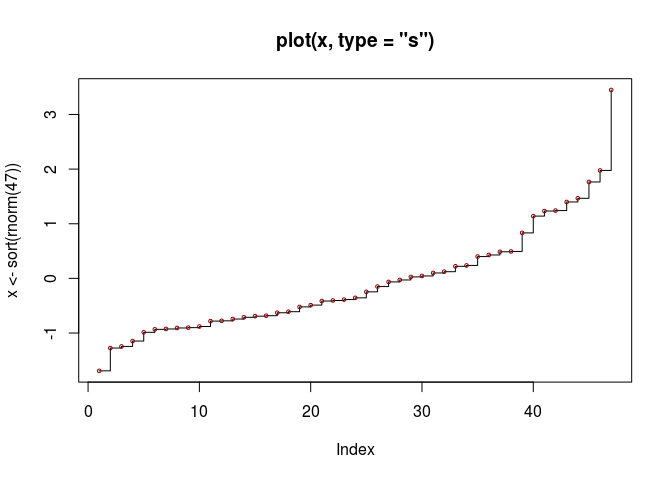

``` r
x <- -5:5
if(x[1] > 0) {sqrt(x[1])} else {print("NA")}
```

    ## [1] "NA"

``` r
ifelse(x >= 0, sqrt(x), NA)
```

    ## Warning in sqrt(x): NaNs produced

    ##  [1]       NA       NA       NA       NA       NA 0.000000 1.000000
    ##  [8] 1.414214 1.732051 2.000000 2.236068

``` r
getwd()
```

    ## [1] "/home/jw/Documents/@날짜순 정렬/2017_02/[RStudio] - acorn 수업"

``` r
AA = 'tttt'
switch(AA, foo = {print('foo')}, bar = {print('bar')}, {print('default')})
```

    ## [1] "default"

``` r
name <- c("kim", "lee", "choe", "park")
which(name == "choi")
```

    ## integer(0)

``` r
foo = seq(1, 100, by = 2)
foo.squared = NULL
for(i in 1:50) {foo.squared[i] = foo[i] ^ 2}
#foo.squared[2]
```

``` r
for(i in 1:50) {print(foo.squared[i])}
```

    ## [1] 1
    ## [1] 9
    ## [1] 25
    ## [1] 49
    ## [1] 81
    ## [1] 121
    ## [1] 169
    ## [1] 225
    ## [1] 289
    ## [1] 361
    ## [1] 441
    ## [1] 529
    ## [1] 625
    ## [1] 729
    ## [1] 841
    ## [1] 961
    ## [1] 1089
    ## [1] 1225
    ## [1] 1369
    ## [1] 1521
    ## [1] 1681
    ## [1] 1849
    ## [1] 2025
    ## [1] 2209
    ## [1] 2401
    ## [1] 2601
    ## [1] 2809
    ## [1] 3025
    ## [1] 3249
    ## [1] 3481
    ## [1] 3721
    ## [1] 3969
    ## [1] 4225
    ## [1] 4489
    ## [1] 4761
    ## [1] 5041
    ## [1] 5329
    ## [1] 5625
    ## [1] 5929
    ## [1] 6241
    ## [1] 6561
    ## [1] 6889
    ## [1] 7225
    ## [1] 7569
    ## [1] 7921
    ## [1] 8281
    ## [1] 8649
    ## [1] 9025
    ## [1] 9409
    ## [1] 9801

``` r
I <- 10
#while(I < 10) {}
while(I > 1) {cat(I, "the iteration \n"); I <- I - 1}
```

    ## 10 the iteration 
    ## 9 the iteration 
    ## 8 the iteration 
    ## 7 the iteration 
    ## 6 the iteration 
    ## 5 the iteration 
    ## 4 the iteration 
    ## 3 the iteration 
    ## 2 the iteration

``` r
i <- c(1:10)
for(n in i) {}
for(n in i) {if (n %% 2 == 1) {next} else print(n)}
```

    ## [1] 2
    ## [1] 4
    ## [1] 6
    ## [1] 8
    ## [1] 10

``` r
cnt <- 1
repeat {print(cnt); cnt <- cnt + 2; if(cnt > 15) break}
```

    ## [1] 1
    ## [1] 3
    ## [1] 5
    ## [1] 7
    ## [1] 9
    ## [1] 11
    ## [1] 13
    ## [1] 15

creating function
=================

``` r
summation = function(x) {
  result = 0;
  for(i in 1:length(x)){
    result <- result + x[i]
  }
  return(result)
}
```

``` r
y <- 1:10
summation(y)
```

    ## [1] 55

``` r
#print(summation(y))
```

``` r
gugu <- function(i, j) {
  mul = NULL
  for(a in 1:length(i)){
    for(b in 1:length(j)){
      mul <- a * b
      print(mul)
    }
  }
}
```

``` r
gugu(c(1:9), c(2:9))
```

    ## [1] 1
    ## [1] 2
    ## [1] 3
    ## [1] 4
    ## [1] 5
    ## [1] 6
    ## [1] 7
    ## [1] 8
    ## [1] 2
    ## [1] 4
    ## [1] 6
    ## [1] 8
    ## [1] 10
    ## [1] 12
    ## [1] 14
    ## [1] 16
    ## [1] 3
    ## [1] 6
    ## [1] 9
    ## [1] 12
    ## [1] 15
    ## [1] 18
    ## [1] 21
    ## [1] 24
    ## [1] 4
    ## [1] 8
    ## [1] 12
    ## [1] 16
    ## [1] 20
    ## [1] 24
    ## [1] 28
    ## [1] 32
    ## [1] 5
    ## [1] 10
    ## [1] 15
    ## [1] 20
    ## [1] 25
    ## [1] 30
    ## [1] 35
    ## [1] 40
    ## [1] 6
    ## [1] 12
    ## [1] 18
    ## [1] 24
    ## [1] 30
    ## [1] 36
    ## [1] 42
    ## [1] 48
    ## [1] 7
    ## [1] 14
    ## [1] 21
    ## [1] 28
    ## [1] 35
    ## [1] 42
    ## [1] 49
    ## [1] 56
    ## [1] 8
    ## [1] 16
    ## [1] 24
    ## [1] 32
    ## [1] 40
    ## [1] 48
    ## [1] 56
    ## [1] 64
    ## [1] 9
    ## [1] 18
    ## [1] 27
    ## [1] 36
    ## [1] 45
    ## [1] 54
    ## [1] 63
    ## [1] 72

``` r
gugu2 <- function(i, j){
  for(x in i){
    cat("**", x, "but \n")
    
  }
}
```

``` r
score <- matrix(nrow = 4, ncol = 5, byrow = TRUE)
colnames(score) <- c("kor","eng", "math", "stu_tot", "avg")
row.names(score) <- c("kim", "lee", "park", "subject_tot")

# input score
for(i in 1:3){
  for(j in 1:3){
    score[i,j] = sample(1:100, 1, replace = TRUE)
    #i = i + 1
  }
}

# stu_tot
for(i in 1:3){
  score[i,4] = sum(score[i,1:3])
}

# avg 
for(i in 1:3)
  score[i,5] = round(mean(score[i,1:3]), 3)

# subject_tot
for(j in 1:5){
  score[4, j] = sum(score[1:3, j])
}
score
```

    ##             kor eng math stu_tot     avg
    ## kim          76  68   49     193  64.333
    ## lee          69   3   44     116  38.667
    ## park         12  10   18      40  13.333
    ## subject_tot 157  81  111     349 116.333

``` r
# comment avg
a <- matrix(nrow = 4, ncol = 1, byrow = TRUE)

for(i in 1:3){
  if (score[i,5] > 80){
    a[i] <- 'NICE'
  }
  else a[i] <- 'NORMAL'
}
score <- cbind(score, (a[1:4]))
score
```

    ##             kor   eng  math  stu_tot avg               
    ## kim         "76"  "68" "49"  "193"   "64.333"  "NORMAL"
    ## lee         "69"  "3"  "44"  "116"   "38.667"  "NORMAL"
    ## park        "12"  "10" "18"  "40"    "13.333"  "NORMAL"
    ## subject_tot "157" "81" "111" "349"   "116.333" NA

``` r
example("plot")
```

    ## 
    ## plot> require(stats) # for lowess, rpois, rnorm
    ## 
    ## plot> plot(cars)



    ## 
    ## plot> lines(lowess(cars))
    ## 
    ## plot> plot(sin, -pi, 2*pi) # see ?plot.function



    ## 
    ## plot> ## Discrete Distribution Plot:
    ## plot> plot(table(rpois(100, 5)), type = "h", col = "red", lwd = 10,
    ## plot+      main = "rpois(100, lambda = 5)")



    ## 
    ## plot> ## Simple quantiles/ECDF, see ecdf() {library(stats)} for a better one:
    ## plot> plot(x <- sort(rnorm(47)), type = "s", main = "plot(x, type = \"s\")")



    ## 
    ## plot> points(x, cex = .5, col = "dark red")
