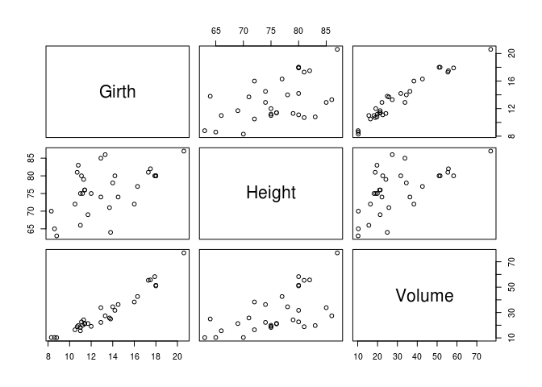

``` r
honeymoon <- c(12, 14, 8, 9)
names(honeymoon) <- c("하와이", "동남아", "유럽", "기타")
pie(honeymoon, col = rainbow(4))
```


``` r
per <- round(100 * honeymoon / sum(honeymoon), 1)
lab <- paste(names(honeymoon), "\n", per, "%")

pie(honeymoon, labels = lab, col = rainbow(4), edges = 13, radius = 1, clockwise = TRUE, main = "여행지 분포도", density = 100)

text(0.3, 0.3, "27.9%", col = "black")
text(-0.4, 0.1, "32.6%", col = "black")
text(0.5, -0.3, "20.9%", col = "black")
text(-0.2, -0.5, "18.6%", col = "black")
```


``` r
weight <- round(rnorm(30, 50, 10))
stem(weight)
```

    ## 
    ##   The decimal point is 1 digit(s) to the right of the |
    ## 
    ##   3 | 6
    ##   4 | 0344
    ##   4 | 57777889
    ##   5 | 0122334
    ##   5 | 679
    ##   6 | 00112
    ##   6 | 6
    ##   7 | 2

``` r
stem(weight, scale = 1.0)
```

    ## 
    ##   The decimal point is 1 digit(s) to the right of the |
    ## 
    ##   3 | 6
    ##   4 | 0344
    ##   4 | 57777889
    ##   5 | 0122334
    ##   5 | 679
    ##   6 | 00112
    ##   6 | 6
    ##   7 | 2

``` r
stem(weight, scale = 2.0)
```

    ## 
    ##   The decimal point is at the |
    ## 
    ##   36 | 0
    ##   38 | 
    ##   40 | 0
    ##   42 | 0
    ##   44 | 000
    ##   46 | 0000
    ##   48 | 000
    ##   50 | 00
    ##   52 | 0000
    ##   54 | 0
    ##   56 | 00
    ##   58 | 0
    ##   60 | 0000
    ##   62 | 0
    ##   64 | 
    ##   66 | 0
    ##   68 | 
    ##   70 | 
    ##   72 | 0

``` r
stem(weight, scale = 0.5)
```

    ## 
    ##   The decimal point is 1 digit(s) to the right of the |
    ## 
    ##   3 | 6
    ##   4 | 034457777889
    ##   5 | 0122334679
    ##   6 | 001126
    ##   7 | 2

``` r
plot(cars$dist, type = "o", cex = 0.5, xlab = "speed", ylab = "dist")
```


``` r
m <- lm(dist ~ speed, data = cars)
m
```

    ## 
    ## Call:
    ## lm(formula = dist ~ speed, data = cars)
    ## 
    ## Coefficients:
    ## (Intercept)        speed  
    ##     -17.579        3.932

``` r
plot(cars); abline(m)
```


``` r
p <- predict(m, interval = "confidence")
head(p)
```

    ##         fit        lwr       upr
    ## 1 -1.849460 -12.329543  8.630624
    ## 2 -1.849460 -12.329543  8.630624
    ## 3  9.947766   1.678977 18.216556
    ## 4  9.947766   1.678977 18.216556
    ## 5 13.880175   6.307527 21.452823
    ## 6 17.812584  10.905120 24.720047

``` r
x <- c(cars$speed, tail(cars$speed, 1), rev(cars$speed), cars$speed[1])
y <- c(p[, "lwr"], tail(p[, "upr"], 1), rev(p[, "upr"]), p[, "lwr"][1])
plot(cars); abline(m); polygon(x, y, col = rgb(.7, .7, .5, .5))
```


``` r
x <- seq(-2 * pi, 2 * pi, 0.01)
y <- matrix(c(cos(x), sin(x)), ncol = 2)
matplot(x, y, col = c("red", "black"), cex = .2)
```


``` r
matplot(x, y, lyt = c("solid", "dashed"), cex = .2, type = "l")
```

    ## Warning in plot.window(...): "lyt" is not a graphical parameter

    ## Warning in plot.xy(xy, type, ...): "lyt" is not a graphical parameter

    ## Warning in axis(side = side, at = at, labels = labels, ...): "lyt" is not a
    ## graphical parameter

    ## Warning in axis(side = side, at = at, labels = labels, ...): "lyt" is not a
    ## graphical parameter

    ## Warning in box(...): "lyt" is not a graphical parameter

    ## Warning in title(...): "lyt" is not a graphical parameter

``` r
abline(h = 0, v = 0)
```


``` r
trees
```

    ##    Girth Height Volume
    ## 1    8.3     70   10.3
    ## 2    8.6     65   10.3
    ## 3    8.8     63   10.2
    ## 4   10.5     72   16.4
    ## 5   10.7     81   18.8
    ## 6   10.8     83   19.7
    ## 7   11.0     66   15.6
    ## 8   11.0     75   18.2
    ## 9   11.1     80   22.6
    ## 10  11.2     75   19.9
    ## 11  11.3     79   24.2
    ## 12  11.4     76   21.0
    ## 13  11.4     76   21.4
    ## 14  11.7     69   21.3
    ## 15  12.0     75   19.1
    ## 16  12.9     74   22.2
    ## 17  12.9     85   33.8
    ## 18  13.3     86   27.4
    ## 19  13.7     71   25.7
    ## 20  13.8     64   24.9
    ## 21  14.0     78   34.5
    ## 22  14.2     80   31.7
    ## 23  14.5     74   36.3
    ## 24  16.0     72   38.3
    ## 25  16.3     77   42.6
    ## 26  17.3     81   55.4
    ## 27  17.5     82   55.7
    ## 28  17.9     80   58.3
    ## 29  18.0     80   51.5
    ## 30  18.0     80   51.0
    ## 31  20.6     87   77.0

``` r
#fix(trees)
summary(trees)
```

    ##      Girth           Height       Volume     
    ##  Min.   : 8.30   Min.   :63   Min.   :10.20  
    ##  1st Qu.:11.05   1st Qu.:72   1st Qu.:19.40  
    ##  Median :12.90   Median :76   Median :24.20  
    ##  Mean   :13.25   Mean   :76   Mean   :30.17  
    ##  3rd Qu.:15.25   3rd Qu.:80   3rd Qu.:37.30  
    ##  Max.   :20.60   Max.   :87   Max.   :77.00

``` r
boxplot(trees)
```


``` r
pairs(trees)
```



``` r
matplot(trees)
```


``` r
x <- rnorm(1000, mean = 100, sd = 1)
qqnorm(x); qqline(x, lty = 2); abline(h = 100, v = 0)
```


``` r
y <- runif(1000)
qqnorm(y); qqline(y); abline(h = 0.5, v = 0)
```


``` r
install.packages("mlmRev", repos="http://cran.nexr.com/")
```

    ## Installing package into '/home/jw/R/x86_64-pc-linux-gnu-library/3.3'
    ## (as 'lib' is unspecified)

``` r
library(mlmRev)
```

    ## Loading required package: lme4

    ## Loading required package: Matrix

``` r
data(Chem97)
library(lattice)
histogram(~gcsescore, data = Chem97)
```


``` r
#histogram(~gcsescore|score, data = Chem97)
#histogram(~gcsescore|factor(score), data = Chem97)
```
