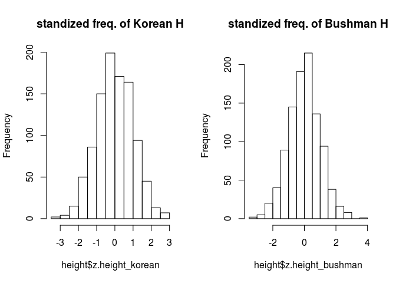

``` r
install.packages("sqldf", repos="http://cran.nexr.com/")
```

    ## Installing package into '/home/jw/R/x86_64-pc-linux-gnu-library/3.3'
    ## (as 'lib' is unspecified)

``` r
library(sqldf)
```

    ## Loading required package: gsubfn

    ## Loading required package: proto

    ## Loading required package: RSQLite

``` r
library(MASS)
str(Cars93)
```

    ## 'data.frame':    93 obs. of  27 variables:
    ##  $ Manufacturer      : Factor w/ 32 levels "Acura","Audi",..: 1 1 2 2 3 4 4 4 4 5 ...
    ##  $ Model             : Factor w/ 93 levels "100","190E","240",..: 49 56 9 1 6 24 54 74 73 35 ...
    ##  $ Type              : Factor w/ 6 levels "Compact","Large",..: 4 3 1 3 3 3 2 2 3 2 ...
    ##  $ Min.Price         : num  12.9 29.2 25.9 30.8 23.7 14.2 19.9 22.6 26.3 33 ...
    ##  $ Price             : num  15.9 33.9 29.1 37.7 30 15.7 20.8 23.7 26.3 34.7 ...
    ##  $ Max.Price         : num  18.8 38.7 32.3 44.6 36.2 17.3 21.7 24.9 26.3 36.3 ...
    ##  $ MPG.city          : int  25 18 20 19 22 22 19 16 19 16 ...
    ##  $ MPG.highway       : int  31 25 26 26 30 31 28 25 27 25 ...
    ##  $ AirBags           : Factor w/ 3 levels "Driver & Passenger",..: 3 1 2 1 2 2 2 2 2 2 ...
    ##  $ DriveTrain        : Factor w/ 3 levels "4WD","Front",..: 2 2 2 2 3 2 2 3 2 2 ...
    ##  $ Cylinders         : Factor w/ 6 levels "3","4","5","6",..: 2 4 4 4 2 2 4 4 4 5 ...
    ##  $ EngineSize        : num  1.8 3.2 2.8 2.8 3.5 2.2 3.8 5.7 3.8 4.9 ...
    ##  $ Horsepower        : int  140 200 172 172 208 110 170 180 170 200 ...
    ##  $ RPM               : int  6300 5500 5500 5500 5700 5200 4800 4000 4800 4100 ...
    ##  $ Rev.per.mile      : int  2890 2335 2280 2535 2545 2565 1570 1320 1690 1510 ...
    ##  $ Man.trans.avail   : Factor w/ 2 levels "No","Yes": 2 2 2 2 2 1 1 1 1 1 ...
    ##  $ Fuel.tank.capacity: num  13.2 18 16.9 21.1 21.1 16.4 18 23 18.8 18 ...
    ##  $ Passengers        : int  5 5 5 6 4 6 6 6 5 6 ...
    ##  $ Length            : int  177 195 180 193 186 189 200 216 198 206 ...
    ##  $ Wheelbase         : int  102 115 102 106 109 105 111 116 108 114 ...
    ##  $ Width             : int  68 71 67 70 69 69 74 78 73 73 ...
    ##  $ Turn.circle       : int  37 38 37 37 39 41 42 45 41 43 ...
    ##  $ Rear.seat.room    : num  26.5 30 28 31 27 28 30.5 30.5 26.5 35 ...
    ##  $ Luggage.room      : int  11 15 14 17 13 16 17 21 14 18 ...
    ##  $ Weight            : int  2705 3560 3375 3405 3640 2880 3470 4105 3495 3620 ...
    ##  $ Origin            : Factor w/ 2 levels "USA","non-USA": 2 2 2 2 2 1 1 1 1 1 ...
    ##  $ Make              : Factor w/ 93 levels "Acura Integra",..: 1 2 4 3 5 6 7 9 8 10 ...

``` r
#sqldf('select Type, count(*) as n from Cars93 group by Type order by Type')
sqldf('SELECT Type, count(*) as n FROM Cars93 GROUP BY Type ORDER BY Type')
```

    ## Loading required package: tcltk

    ## Warning: Quoted identifiers should have class SQL, use DBI::SQL() if the
    ## caller performs the quoting.

    ##      Type  n
    ## 1 Compact 16
    ## 2   Large 11
    ## 3 Midsize 22
    ## 4   Small 21
    ## 5  Sporty 14
    ## 6     Van  9

``` r
#install.packages("sqldf", dependencies = T)
install.packages("PASWR", dependencies = T, , repos="http://cran.nexr.com/")
```

    ## Installing package into '/home/jw/R/x86_64-pc-linux-gnu-library/3.3'
    ## (as 'lib' is unspecified)

``` r
#library(sqldf)
library(PASWR)
```

    ## Loading required package: e1071

    ## Loading required package: lattice

``` r
str(titanic3)
```

    ## 'data.frame':    1309 obs. of  14 variables:
    ##  $ pclass   : Factor w/ 3 levels "1st","2nd","3rd": 1 1 1 1 1 1 1 1 1 1 ...
    ##  $ survived : int  1 1 0 0 0 1 1 0 1 0 ...
    ##  $ name     : Factor w/ 1307 levels "Abbing, Mr. Anthony",..: 22 24 25 26 27 31 46 47 51 55 ...
    ##  $ sex      : Factor w/ 2 levels "female","male": 1 2 1 2 1 2 1 2 1 2 ...
    ##  $ age      : num  29 0.917 2 30 25 ...
    ##  $ sibsp    : int  0 1 1 1 1 0 1 0 2 0 ...
    ##  $ parch    : int  0 2 2 2 2 0 0 0 0 0 ...
    ##  $ ticket   : Factor w/ 929 levels "110152","110413",..: 188 50 50 50 50 125 93 16 77 826 ...
    ##  $ fare     : num  211 152 152 152 152 ...
    ##  $ cabin    : Factor w/ 187 levels "","A10","A11",..: 45 81 81 81 81 151 147 17 63 1 ...
    ##  $ embarked : Factor w/ 4 levels "","Cherbourg",..: 4 4 4 4 4 4 4 4 4 2 ...
    ##  $ boat     : Factor w/ 28 levels "","1","10","11",..: 13 4 1 1 1 14 3 1 28 1 ...
    ##  $ body     : int  NA NA NA 135 NA NA NA NA NA 22 ...
    ##  $ home.dest: Factor w/ 369 levels "","?Havana, Cuba",..: 309 231 231 231 231 237 163 25 23 229 ...

``` r
nrow(titanic3)
```

    ## [1] 1309

``` r
# (TitanicData <- titanic3[,]) # 너무 길어서 주석처리
```


``` r
# (TitanicSubset2Cols2 <- titanic3[, c(1, 2)]) # 너무 길어서 주석처리
```


``` r
head(titanic3)
```

    ##   pclass survived                            name    sex     age sibsp
    ## 1    1st        1   Allen, Miss. Elisabeth Walton female 29.0000     0
    ## 2    1st        1  Allison, Master. Hudson Trevor   male  0.9167     1
    ## 3    1st        0    Allison, Miss. Helen Loraine female  2.0000     1
    ## 4    1st        0 Allison, Mr. Hudson Joshua Crei   male 30.0000     1
    ## 5    1st        0 Allison, Mrs. Hudson J C (Bessi female 25.0000     1
    ## 6    1st        1             Anderson, Mr. Harry   male 48.0000     0
    ##   parch ticket     fare   cabin    embarked boat body
    ## 1     0  24160 211.3375      B5 Southampton    2   NA
    ## 2     2 113781 151.5500 C22 C26 Southampton   11   NA
    ## 3     2 113781 151.5500 C22 C26 Southampton        NA
    ## 4     2 113781 151.5500 C22 C26 Southampton       135
    ## 5     2 113781 151.5500 C22 C26 Southampton        NA
    ## 6     0  19952  26.5500     E12 Southampton    3   NA
    ##                         home.dest
    ## 1                    St Louis, MO
    ## 2 Montreal, PQ / Chesterville, ON
    ## 3 Montreal, PQ / Chesterville, ON
    ## 4 Montreal, PQ / Chesterville, ON
    ## 5 Montreal, PQ / Chesterville, ON
    ## 6                    New York, NY

``` r
nrow(titanic3[titanic3$sex == "female", ])
```

    ## [1] 466

``` r
nrow(titanic3[(titanic3$sex == "female" & titanic3$embarked == "Southampton"), ])
```

    ## [1] 291

``` r
sum(titanic3$fare[titanic3$sex == "female"])
```

    ## [1] 21528.31

``` r
length(unique(titanic3$cabin))
```

    ## [1] 187

``` r
#nrow(Data[grep("^A", Data$name), ])
nrow(titanic3[grep("^A", titanic3$name), ])
```

    ## [1] 75

``` r
nrow(titanic3)
```

    ## [1] 1309

``` r
sqldf('select count(*) from titanic3')
```

    ##   count(*)
    ## 1     1309

``` r
# (TitanicData <- titanic3[,]) # 너무 길어서 주석처리
```


``` r
# sqldf('select * from titanic3') # 너무 길어서 주석처리
```


``` r
# (TitanicSubset2Cols2 <- titanic3[, c(1, 2)]) # 너무 길어서 주석처리
```


``` r
# sqldf('select pclass, survived from titanic3') # 너무 길어서 주석처리
```


``` r
head(titanic3)
```

    ##   pclass survived                            name    sex     age sibsp
    ## 1    1st        1   Allen, Miss. Elisabeth Walton female 29.0000     0
    ## 2    1st        1  Allison, Master. Hudson Trevor   male  0.9167     1
    ## 3    1st        0    Allison, Miss. Helen Loraine female  2.0000     1
    ## 4    1st        0 Allison, Mr. Hudson Joshua Crei   male 30.0000     1
    ## 5    1st        0 Allison, Mrs. Hudson J C (Bessi female 25.0000     1
    ## 6    1st        1             Anderson, Mr. Harry   male 48.0000     0
    ##   parch ticket     fare   cabin    embarked boat body
    ## 1     0  24160 211.3375      B5 Southampton    2   NA
    ## 2     2 113781 151.5500 C22 C26 Southampton   11   NA
    ## 3     2 113781 151.5500 C22 C26 Southampton        NA
    ## 4     2 113781 151.5500 C22 C26 Southampton       135
    ## 5     2 113781 151.5500 C22 C26 Southampton        NA
    ## 6     0  19952  26.5500     E12 Southampton    3   NA
    ##                         home.dest
    ## 1                    St Louis, MO
    ## 2 Montreal, PQ / Chesterville, ON
    ## 3 Montreal, PQ / Chesterville, ON
    ## 4 Montreal, PQ / Chesterville, ON
    ## 5 Montreal, PQ / Chesterville, ON
    ## 6                    New York, NY

``` r
sqldf('select * from titanic3 limit 6')
```

    ##   pclass survived                            name    sex     age sibsp
    ## 1    1st        1   Allen, Miss. Elisabeth Walton female 29.0000     0
    ## 2    1st        1  Allison, Master. Hudson Trevor   male  0.9167     1
    ## 3    1st        0    Allison, Miss. Helen Loraine female  2.0000     1
    ## 4    1st        0 Allison, Mr. Hudson Joshua Crei   male 30.0000     1
    ## 5    1st        0 Allison, Mrs. Hudson J C (Bessi female 25.0000     1
    ## 6    1st        1             Anderson, Mr. Harry   male 48.0000     0
    ##   parch ticket     fare   cabin    embarked boat body
    ## 1     0  24160 211.3375      B5 Southampton    2   NA
    ## 2     2 113781 151.5500 C22 C26 Southampton   11   NA
    ## 3     2 113781 151.5500 C22 C26 Southampton        NA
    ## 4     2 113781 151.5500 C22 C26 Southampton       135
    ## 5     2 113781 151.5500 C22 C26 Southampton        NA
    ## 6     0  19952  26.5500     E12 Southampton    3   NA
    ##                         home.dest
    ## 1                    St Louis, MO
    ## 2 Montreal, PQ / Chesterville, ON
    ## 3 Montreal, PQ / Chesterville, ON
    ## 4 Montreal, PQ / Chesterville, ON
    ## 5 Montreal, PQ / Chesterville, ON
    ## 6                    New York, NY

``` r
nrow(titanic3[titanic3$sex == "female", ])
```

    ## [1] 466

``` r
sqldf('select count(name) from titanic3 where sex = "female"')
```

    ##   count(name)
    ## 1         466

``` r
nrow(titanic3[(titanic3$sex == "female" & titanic3$embarked == "Southampton"), ])
```

    ## [1] 291

``` r
sqldf('select count(name) from titanic3 where sex = "female" and embarked = "Southampton"')
```

    ##   count(name)
    ## 1         291

``` r
sum(titanic3$fare[titanic3$sex == "female"])
```

    ## [1] 21528.31

``` r
sqldf('select sum(fare) from titanic3 where sex = "female"')
```

    ##   sum(fare)
    ## 1  21528.31

``` r
length(unique(titanic3$cabin))
```

    ## [1] 187

``` r
# do not need to use group by command
sqldf('select count(distinct cabin) from titanic3')
```

    ##   count(distinct cabin)
    ## 1                   187

``` r
#Count the number of people in the ship whose name start with ‘A’. Below is the R equivalent to do the same.
nrow(titanic3[grep("^A", titanic3$name), ])
```

    ## [1] 75

``` r
sqldf('select count(name) from titanic3 where name like "A%"')
```

    ##   count(name)
    ## 1          75

``` r
install.packages("RMySQL", repos="http://cran.nexr.com/")
```

    ## Installing package into '/home/jw/R/x86_64-pc-linux-gnu-library/3.3'
    ## (as 'lib' is unspecified)

``` r
library(RMySQL)
```

    ## Loading required package: DBI

    ## 
    ## Attaching package: 'RMySQL'

    ## The following object is masked from 'package:RSQLite':
    ## 
    ##     isIdCurrent

``` r
1+1
```

    ## [1] 2

``` r
#con <- dbConnect(MySQL(), user = "root", password = "123", dbname = "acorn", host = "localhost")
con <- dbConnect(MySQL(), user = "root", password = "123", dbname = "acorn", host = "127.0.0.1")

dbListTables(con)
```

    ##  [1] "Writers"                    "auth_group"                
    ##  [3] "auth_group_permissions"     "auth_permission"           
    ##  [5] "auth_user"                  "auth_user_groups"          
    ##  [7] "auth_user_user_permissions" "django_admin_log"          
    ##  [9] "django_content_type"        "django_migrations"         
    ## [11] "django_session"             "member"                    
    ## [13] "mycomment"                  "pet"                       
    ## [15] "pointhistory"               "project1"                  
    ## [17] "test"                       "tit3"

``` r
x <- 1:10
y <- letters[1:10]
trial <- data.frame(x, y, stringsAsFactors = FALSE)
dbWriteTable(con, "trial", trial)
```

    ## [1] TRUE

``` r
dbListTables(con)
```

    ##  [1] "Writers"                    "auth_group"                
    ##  [3] "auth_group_permissions"     "auth_permission"           
    ##  [5] "auth_user"                  "auth_user_groups"          
    ##  [7] "auth_user_user_permissions" "django_admin_log"          
    ##  [9] "django_content_type"        "django_migrations"         
    ## [11] "django_session"             "member"                    
    ## [13] "mycomment"                  "pet"                       
    ## [15] "pointhistory"               "project1"                  
    ## [17] "test"                       "tit3"                      
    ## [19] "trial"

``` r
(data1 <- dbGetQuery(con, "select * from trial"))
```

    ##    row_names  x y
    ## 1          1  1 a
    ## 2          2  2 b
    ## 3          3  3 c
    ## 4          4  4 d
    ## 5          5  5 e
    ## 6          6  6 f
    ## 7          7  7 g
    ## 8          8  8 h
    ## 9          9  9 i
    ## 10        10 10 j

``` r
(query <- dbSendQuery(con, "select * from trial")) #=> # not working
```

    ## <MySQLResult:3,0,6>

``` r
#dbRemoveTable(con, "trial")
dbFetch(query, n = 5)
```

    ##   row_names x y
    ## 1         1 1 a
    ## 2         2 2 b
    ## 3         3 3 c
    ## 4         4 4 d
    ## 5         5 5 e

``` r
dbGetInfo(query)
```

    ## $statement
    ## [1] "select * from trial"
    ## 
    ## $isSelect
    ## [1] 1
    ## 
    ## $rowsAffected
    ## [1] -1
    ## 
    ## $rowCount
    ## [1] 5
    ## 
    ## $completed
    ## [1] 0
    ## 
    ## $fieldDescription
    ## $fieldDescription[[1]]
    ## NULL

``` r
dbGetStatement(query)
```

    ## [1] "select * from trial"

``` r
dbGetRowCount(query)
```

    ## [1] 5

``` r
dbGetRowsAffected(query)
```

    ## [1] -1

``` r
dbColumnInfo(query)
```

    ##        name    Sclass      type length
    ## 1 row_names character BLOB/TEXT  65535
    ## 2         x    double    BIGINT     20
    ## 3         y character BLOB/TEXT  65535

``` r
dbClearResult(query)
```

    ## [1] TRUE

``` r
dbDisconnect(con)
```

    ## [1] TRUE

``` r
library(stringr)
mtcars$mfg <- str_split_fixed(rownames(mtcars), ' ', 2)[, 1]
mtcars$mfg[mtcars$mfg == 'Merc'] <- 'Mercedes'
mtcars$model <- str_split_fixed(rownames(mtcars), ' ', 2)[, 2]
#con <- dbConnect(MySQL(), username = "root", password = "123", dbname = "acorn", host = "localhost")
con <- dbConnect(MySQL(), username = "root", password = "123", dbname = "acorn", host = "127.0.0.1")

dbWriteTable(con, 'motortrend', mtcars)
```

    ## [1] TRUE

``` r
dbListTables(con)
```

    ##  [1] "Writers"                    "auth_group"                
    ##  [3] "auth_group_permissions"     "auth_permission"           
    ##  [5] "auth_user"                  "auth_user_groups"          
    ##  [7] "auth_user_user_permissions" "django_admin_log"          
    ##  [9] "django_content_type"        "django_migrations"         
    ## [11] "django_session"             "member"                    
    ## [13] "motortrend"                 "mycomment"                 
    ## [15] "pet"                        "pointhistory"              
    ## [17] "project1"                   "test"                      
    ## [19] "tit3"                       "trial"

``` r
dbGetQuery(con, "select * from motortrend")
```

    ##              row_names  mpg cyl  disp  hp drat    wt  qsec vs am gear carb
    ## 1            Mazda RX4 21.0   6 160.0 110 3.90 2.620 16.46  0  1    4    4
    ## 2        Mazda RX4 Wag 21.0   6 160.0 110 3.90 2.875 17.02  0  1    4    4
    ## 3           Datsun 710 22.8   4 108.0  93 3.85 2.320 18.61  1  1    4    1
    ## 4       Hornet 4 Drive 21.4   6 258.0 110 3.08 3.215 19.44  1  0    3    1
    ## 5    Hornet Sportabout 18.7   8 360.0 175 3.15 3.440 17.02  0  0    3    2
    ## 6              Valiant 18.1   6 225.0 105 2.76 3.460 20.22  1  0    3    1
    ## 7           Duster 360 14.3   8 360.0 245 3.21 3.570 15.84  0  0    3    4
    ## 8            Merc 240D 24.4   4 146.7  62 3.69 3.190 20.00  1  0    4    2
    ## 9             Merc 230 22.8   4 140.8  95 3.92 3.150 22.90  1  0    4    2
    ## 10            Merc 280 19.2   6 167.6 123 3.92 3.440 18.30  1  0    4    4
    ## 11           Merc 280C 17.8   6 167.6 123 3.92 3.440 18.90  1  0    4    4
    ## 12          Merc 450SE 16.4   8 275.8 180 3.07 4.070 17.40  0  0    3    3
    ## 13          Merc 450SL 17.3   8 275.8 180 3.07 3.730 17.60  0  0    3    3
    ## 14         Merc 450SLC 15.2   8 275.8 180 3.07 3.780 18.00  0  0    3    3
    ## 15  Cadillac Fleetwood 10.4   8 472.0 205 2.93 5.250 17.98  0  0    3    4
    ## 16 Lincoln Continental 10.4   8 460.0 215 3.00 5.424 17.82  0  0    3    4
    ## 17   Chrysler Imperial 14.7   8 440.0 230 3.23 5.345 17.42  0  0    3    4
    ## 18            Fiat 128 32.4   4  78.7  66 4.08 2.200 19.47  1  1    4    1
    ## 19         Honda Civic 30.4   4  75.7  52 4.93 1.615 18.52  1  1    4    2
    ## 20      Toyota Corolla 33.9   4  71.1  65 4.22 1.835 19.90  1  1    4    1
    ## 21       Toyota Corona 21.5   4 120.1  97 3.70 2.465 20.01  1  0    3    1
    ## 22    Dodge Challenger 15.5   8 318.0 150 2.76 3.520 16.87  0  0    3    2
    ## 23         AMC Javelin 15.2   8 304.0 150 3.15 3.435 17.30  0  0    3    2
    ## 24          Camaro Z28 13.3   8 350.0 245 3.73 3.840 15.41  0  0    3    4
    ## 25    Pontiac Firebird 19.2   8 400.0 175 3.08 3.845 17.05  0  0    3    2
    ## 26           Fiat X1-9 27.3   4  79.0  66 4.08 1.935 18.90  1  1    4    1
    ## 27       Porsche 914-2 26.0   4 120.3  91 4.43 2.140 16.70  0  1    5    2
    ## 28        Lotus Europa 30.4   4  95.1 113 3.77 1.513 16.90  1  1    5    2
    ## 29      Ford Pantera L 15.8   8 351.0 264 4.22 3.170 14.50  0  1    5    4
    ## 30        Ferrari Dino 19.7   6 145.0 175 3.62 2.770 15.50  0  1    5    6
    ## 31       Maserati Bora 15.0   8 301.0 335 3.54 3.570 14.60  0  1    5    8
    ## 32          Volvo 142E 21.4   4 121.0 109 4.11 2.780 18.60  1  1    4    2
    ##         mfg       model
    ## 1     Mazda         RX4
    ## 2     Mazda     RX4 Wag
    ## 3    Datsun         710
    ## 4    Hornet     4 Drive
    ## 5    Hornet  Sportabout
    ## 6   Valiant            
    ## 7    Duster         360
    ## 8  Mercedes        240D
    ## 9  Mercedes         230
    ## 10 Mercedes         280
    ## 11 Mercedes        280C
    ## 12 Mercedes       450SE
    ## 13 Mercedes       450SL
    ## 14 Mercedes      450SLC
    ## 15 Cadillac   Fleetwood
    ## 16  Lincoln Continental
    ## 17 Chrysler    Imperial
    ## 18     Fiat         128
    ## 19    Honda       Civic
    ## 20   Toyota     Corolla
    ## 21   Toyota      Corona
    ## 22    Dodge  Challenger
    ## 23      AMC     Javelin
    ## 24   Camaro         Z28
    ## 25  Pontiac    Firebird
    ## 26     Fiat        X1-9
    ## 27  Porsche       914-2
    ## 28    Lotus      Europa
    ## 29     Ford   Pantera L
    ## 30  Ferrari        Dino
    ## 31 Maserati        Bora
    ## 32    Volvo        142E

``` r
#dbDisconnect(con)
```

``` r
# http://biostat.mc.vanderbilt.edu/wiki/Main/DataSets
# titanic3.csv
titanic3 = read.csv("/home/jw/Downloads/titanic3.csv")
head(titanic3)
```

    ##   pclass survived                                            name    sex
    ## 1      1        1                   Allen, Miss. Elisabeth Walton female
    ## 2      1        1                  Allison, Master. Hudson Trevor   male
    ## 3      1        0                    Allison, Miss. Helen Loraine female
    ## 4      1        0            Allison, Mr. Hudson Joshua Creighton   male
    ## 5      1        0 Allison, Mrs. Hudson J C (Bessie Waldo Daniels) female
    ## 6      1        1                             Anderson, Mr. Harry   male
    ##     age sibsp parch ticket     fare   cabin embarked boat body
    ## 1 29.00     0     0  24160 211.3375      B5        S    2   NA
    ## 2  0.92     1     2 113781 151.5500 C22 C26        S   11   NA
    ## 3  2.00     1     2 113781 151.5500 C22 C26        S        NA
    ## 4 30.00     1     2 113781 151.5500 C22 C26        S       135
    ## 5 25.00     1     2 113781 151.5500 C22 C26        S        NA
    ## 6 48.00     0     0  19952  26.5500     E12        S    3   NA
    ##                         home.dest
    ## 1                    St Louis, MO
    ## 2 Montreal, PQ / Chesterville, ON
    ## 3 Montreal, PQ / Chesterville, ON
    ## 4 Montreal, PQ / Chesterville, ON
    ## 5 Montreal, PQ / Chesterville, ON
    ## 6                    New York, NY

``` r
str(titanic3)
```

    ## 'data.frame':    1309 obs. of  14 variables:
    ##  $ pclass   : int  1 1 1 1 1 1 1 1 1 1 ...
    ##  $ survived : int  1 1 0 0 0 1 1 0 1 0 ...
    ##  $ name     : Factor w/ 1307 levels "Abbing, Mr. Anthony",..: 22 24 25 26 27 31 46 47 51 55 ...
    ##  $ sex      : Factor w/ 2 levels "female","male": 1 2 1 2 1 2 1 2 1 2 ...
    ##  $ age      : num  29 0.92 2 30 25 48 63 39 53 71 ...
    ##  $ sibsp    : int  0 1 1 1 1 0 1 0 2 0 ...
    ##  $ parch    : int  0 2 2 2 2 0 0 0 0 0 ...
    ##  $ ticket   : Factor w/ 929 levels "110152","110413",..: 188 50 50 50 50 125 93 16 77 825 ...
    ##  $ fare     : num  211 152 152 152 152 ...
    ##  $ cabin    : Factor w/ 187 levels "","A10","A11",..: 45 81 81 81 81 151 147 17 63 1 ...
    ##  $ embarked : Factor w/ 4 levels "","C","Q","S": 4 4 4 4 4 4 4 4 4 2 ...
    ##  $ boat     : Factor w/ 28 levels "","1","10","11",..: 13 4 1 1 1 14 3 1 28 1 ...
    ##  $ body     : int  NA NA NA 135 NA NA NA NA NA 22 ...
    ##  $ home.dest: Factor w/ 370 levels "","Aberdeen / Portland, OR",..: 311 232 232 232 232 239 163 24 22 230 ...

``` r
#con <- dbConnect(MySQL(), username = "root", password = "123", dbname = "acorn", host = "localhost")
con <- dbConnect(MySQL(), username = "root", password = "123", dbname = "acorn", host = "127.0.0.1")
dbWriteTable(con, 'titanic3', titanic3)
```

    ## [1] TRUE

``` r
dbListTables(con)
```

    ##  [1] "Writers"                    "auth_group"                
    ##  [3] "auth_group_permissions"     "auth_permission"           
    ##  [5] "auth_user"                  "auth_user_groups"          
    ##  [7] "auth_user_user_permissions" "django_admin_log"          
    ##  [9] "django_content_type"        "django_migrations"         
    ## [11] "django_session"             "member"                    
    ## [13] "motortrend"                 "mycomment"                 
    ## [15] "pet"                        "pointhistory"              
    ## [17] "project1"                   "test"                      
    ## [19] "tit3"                       "titanic3"                  
    ## [21] "trial"

``` r
(query <- dbSendQuery(con, "select * from titanic3"))
```

    ## <MySQLResult:23785808,2,4>

``` r
dbColumnInfo(query)
```

    ##         name    Sclass      type length
    ## 1  row_names character BLOB/TEXT  65535
    ## 2     pclass    double    BIGINT     20
    ## 3   survived    double    BIGINT     20
    ## 4       name character BLOB/TEXT  65535
    ## 5        sex character BLOB/TEXT  65535
    ## 6        age    double    DOUBLE     22
    ## 7      sibsp    double    BIGINT     20
    ## 8      parch    double    BIGINT     20
    ## 9     ticket character BLOB/TEXT  65535
    ## 10      fare    double    DOUBLE     22
    ## 11     cabin character BLOB/TEXT  65535
    ## 12  embarked character BLOB/TEXT  65535
    ## 13      boat character BLOB/TEXT  65535
    ## 14      body    double    BIGINT     20
    ## 15 home.dest character BLOB/TEXT  65535

``` r
# dplyr chaining 활용
library(dplyr)
```

    ## 
    ## Attaching package: 'dplyr'

    ## The following object is masked from 'package:MASS':
    ## 
    ##     select

    ## The following objects are masked from 'package:stats':
    ## 
    ##     filter, lag

    ## The following objects are masked from 'package:base':
    ## 
    ##     intersect, setdiff, setequal, union

``` r
#con <- dbConnect(MySQL(), username = "root", password = "123", dbname = "acorn", host = "localhost")
con <- src_mysql(user = "root", password = "123", dbname = "acorn", host = "127.0.0.1")
mydata <- con %>%
  tbl("titanic3") %>%
  select(pclass, sex, age, fare, survived, parch) %>%
  filter(survived == 1) %>%
  collect()
```

``` r
#dbDisconnect(con)
#con <- src_mysql(user = "root", password = "123", dbname = "acorn", host = "127.0.0.1")
con <- dbConnect(MySQL(), username = "root", password = "123", dbname = "acorn", host = "127.0.0.1")
dbListTables(con)
```

    ##  [1] "Writers"                    "auth_group"                
    ##  [3] "auth_group_permissions"     "auth_permission"           
    ##  [5] "auth_user"                  "auth_user_groups"          
    ##  [7] "auth_user_user_permissions" "django_admin_log"          
    ##  [9] "django_content_type"        "django_migrations"         
    ## [11] "django_session"             "member"                    
    ## [13] "motortrend"                 "mycomment"                 
    ## [15] "pet"                        "pointhistory"              
    ## [17] "project1"                   "test"                      
    ## [19] "tit3"                       "titanic3"                  
    ## [21] "trial"

``` r
#dbGetQuery(con, "select * from titanic3") %>%
#  select(pclass, sex, age, fare, survived, parch) %>%
#  filter(survived == "1")

# dbGetQuery(con, "select pclass, sex, age, fare, survived, parch from titanic3 where survived='1'") # 너무 길어서 주석처리
```


``` r
# dbDisconnect(con)
# library(dplyr)
# library(stringr)
# library(RMySQL)
# 
# head(titanic3)
# str(titanic3)
# 
# #myData <- dbGetQuery(con, "select * from titanic3") %>%
# #  select(mean(survived), sex, pclass) %>%
# #  group_by(sex, pclass) %>%
# #  #filter(survived == "1")
# #  summarise(survived_ratio = mean(survived, na.rm = T))
# 
# myData <- dbGetQuery(con, "select avg(survived), sex, pclass from titanic3 group by sex, pclass")
# 
# myData <- dbGetQuery(con, "select sex, pclass from titanic3")
# 
# 
# 
#   select(mean(survived), sex, pclass) %>%
#   group_by(sex, pclass) %>%
#     
# #    
# summarise(survived_ratio = mean(survived, na.rm = T))
# 
# 
# library(ggplot2)
# ggplot(myData, aes(pclass, survived_ratio, color = sex, group = sex)) + geom_point(size = 3) + geom_line()
```

``` r
score4 <- c(3, 3, 6, 7, 7, 10, 10, 10, 11, 13, 30)
min(score4)
```

    ## [1] 3

``` r
max(score4)
```

    ## [1] 30

``` r
print('asdfasdfasdf')
```

    ## [1] "asdfasdfasdf"

``` r
range(score4)
```

    ## [1]  3 30

``` r
mean(score4)
```

    ## [1] 10

``` r
median(score4)
```

    ## [1] 10

``` r
sum(score4)
```

    ## [1] 110

``` r
print('sort / order / rank')
```

    ## [1] "sort / order / rank"

``` r
sort(score4)
```

    ##  [1]  3  3  6  7  7 10 10 10 11 13 30

``` r
order(score4)
```

    ##  [1]  1  2  3  4  5  6  7  8  9 10 11

``` r
rank(score4)
```

    ##  [1]  1.5  1.5  3.0  4.5  4.5  7.0  7.0  7.0  9.0 10.0 11.0

``` r
print('standard deviation')
```

    ## [1] "standard deviation"

``` r
sd(score4)
```

    ## [1] 7.362065

``` r
print('summary print')
```

    ## [1] "summary print"

``` r
summary(score4)
```

    ##    Min. 1st Qu.  Median    Mean 3rd Qu.    Max. 
    ##     3.0     6.5    10.0    10.0    10.5    30.0

``` r
print('table print')
```

    ## [1] "table print"

``` r
table(score4)
```

    ## score4
    ##  3  6  7 10 11 13 30 
    ##  2  1  2  3  1  1  1

``` r
print('fivenum print')
```

    ## [1] "fivenum print"

``` r
fivenum(score4)
```

    ## [1]  3.0  6.5 10.0 10.5 30.0

``` r
print('quantile print')
```

    ## [1] "quantile print"

``` r
quantile(score4, 0.75)
```

    ##  75% 
    ## 10.5

``` r
boxplot(score4, xlab="정수")
```


``` r
par("mar")
```

    ## [1] 5.1 4.1 4.1 2.1

``` r
var(score4)
```

    ## [1] 54.2

``` r
(total <- sum((score4 - mean(score4)) * (score4 - mean(score4))))
```

    ## [1] 542

``` r
(var_val <- total / (length(score4) - 1))
```

    ## [1] 54.2

``` r
sqrt(var_val)
```

    ## [1] 7.362065

``` r
diff(range(score4))
```

    ## [1] 27

``` r
IQR(score4)
```

    ## [1] 4

``` r
(quantile(score4, 0.75) - quantile(score4, 0.25)) * 1.5
```

    ## 75% 
    ##   6

``` r
install.packages("moments", repos="http://cran.nexr.com/")
```

    ## Installing package into '/home/jw/R/x86_64-pc-linux-gnu-library/3.3'
    ## (as 'lib' is unspecified)

``` r
library(moments)
```

    ## 
    ## Attaching package: 'moments'

    ## The following objects are masked from 'package:e1071':
    ## 
    ##     kurtosis, moment, skewness

``` r
n.sample <- rnorm(n = 10000, mean = 55, sd = 45)
skewness(n.sample)
```

    ## [1] -0.004622803

``` r
kurtosis(n.sample)
```

    ## [1] 3.012902

``` r
install.packages("Hmisc", repos="http://cran.nexr.com/")
```

    ## Installing package into '/home/jw/R/x86_64-pc-linux-gnu-library/3.3'
    ## (as 'lib' is unspecified)

``` r
library(Hmisc)
```

    ## Loading required package: survival

    ## Loading required package: Formula

    ## Loading required package: ggplot2

    ## 
    ## Attaching package: 'Hmisc'

    ## The following objects are masked from 'package:dplyr':
    ## 
    ##     combine, src, summarize

    ## The following object is masked from 'package:e1071':
    ## 
    ##     impute

    ## The following objects are masked from 'package:base':
    ## 
    ##     format.pval, round.POSIXt, trunc.POSIXt, units

``` r
describe(n.sample)
```

    ## n.sample 
    ##        n  missing distinct     Info     Mean      Gmd      .05      .10 
    ##    10000        0    10000        1    54.43    51.47  -21.132   -4.129 
    ##      .25      .50      .75      .90      .95 
    ##   23.421   54.822   85.125  112.188  129.230 
    ## 
    ## lowest : -122.2441 -109.4377 -106.1685 -102.5659  -99.3790
    ## highest:  211.5162  211.7307  212.0444  212.0602  226.4695

``` r
GiniMd(n.sample, na.rm=FALSE)
```

    ## [1] 51.47403

``` r
install.packages("pastecs", repos="http://cran.nexr.com/")
```

    ## Installing package into '/home/jw/R/x86_64-pc-linux-gnu-library/3.3'
    ## (as 'lib' is unspecified)

``` r
library(pastecs)
```

    ## Loading required package: boot

    ## 
    ## Attaching package: 'boot'

    ## The following object is masked from 'package:survival':
    ## 
    ##     aml

    ## The following object is masked from 'package:lattice':
    ## 
    ##     melanoma

    ## 
    ## Attaching package: 'pastecs'

    ## The following objects are masked from 'package:dplyr':
    ## 
    ##     first, last

``` r
library(MASS)
round(
  stat.desc(Cars93[c("Price", "MPG.highway")], desc = TRUE, norm = TRUE, p = 0.9)
)
```

    ##             Price MPG.highway
    ## nbr.val        93          93
    ## nbr.null        0           0
    ## nbr.na          0           0
    ## min             7          20
    ## max            62          50
    ## range          54          30
    ## sum          1814        2705
    ## median         18          28
    ## mean           20          29
    ## SE.mean         1           1
    ## CI.mean.0.9     2           1
    ## var            93          28
    ## std.dev        10           5
    ## coef.var        0           0
    ## skewness        1           1
    ## skew.2SE        3           2
    ## kurtosis        3           2
    ## kurt.2SE        3           2
    ## normtest.W      1           1
    ## normtest.p      0           0

``` r
# (height_korean <- rnorm(n = 1000, mean = 170, sd = 10)) # 너무 길어서 주석처리
```


``` r
# (height_korean <- (height_korean - mean(height_korean)) / sd(height_korean)) # 너무 길어서 주석처리
```


``` r
# simplify scaling normal distribution
# (height_korean <- scale(height_korean)) # 너무 길어서 주석처리
```


``` r
densityplot(height_korean)
```


``` r
height_korean <- rnorm(n = 1000, mean = 170, sd = 10)
height_bushman <- rnorm(n = 1000, mean = 150, sd = 8)
height <- data.frame(height_korean, height_bushman)
rm(height_korean, height_bushman)

head(height)
```

    ##   height_korean height_bushman
    ## 1      170.7944       152.9160
    ## 2      177.6920       142.5641
    ## 3      179.1385       151.8644
    ## 4      162.6876       147.0600
    ## 5      161.9257       157.8019
    ## 6      152.6217       148.9975

``` r
attach(height)
# attach는 인자로 주어진 데이터 프레임이나 리스트를 곧바로 접근할 수 있게 해준다.
# 이를 해제하려면 detach()를 사용한다.
# attach를 쓰면  height$height_korean이 아니라 그냥 height_korean으로 쓸 수 있다

par(mfrow = c(1, 2))
# mfrow를 지정하면 한 창에 여러개의 그래프를 나열할 수 있다.

hist(height_korean, freq = TRUE, main = "korean height freq histogram")
hist(height_korean, freq = FALSE, main = "korean height pdf histogram")
```


``` r
hist(height_bushman, freq = TRUE, main = "bushman height freq histogram")
hist(height_bushman, freq = FALSE, main = "bushman height pdf histogram")
```


``` r
# 변수값에 대한 연산결과를 데이터 프레임의 다른 변수에 저장하는 함수이다.
height <- transform(height, 
                    z.height_korean = scale(height_korean), 
                    z.height_bushman = scale(height_bushman)
)

height <- transform(height, 
                    z2.height_korean = (height_korean - mean(height_korean)) / sd(height_korean), 
                    z2.height_bushman = (height_bushman - mean(height_bushman)) / sd(height_bushman)
)

par(mfrow = c(1, 2))
hist(height$z.height_korean, freq = TRUE, main = "standized freq. of Korean H")
hist(height$z.height_bushman, freq = TRUE, main = "standized freq. of Bushman H")
```


