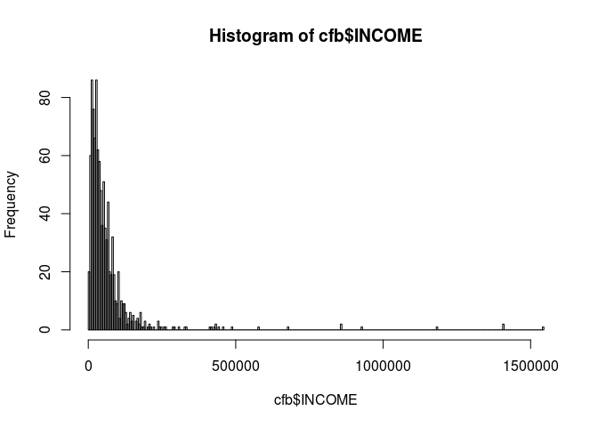
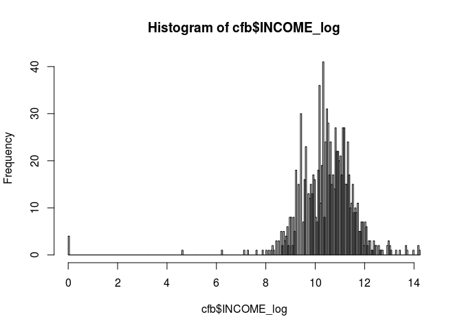
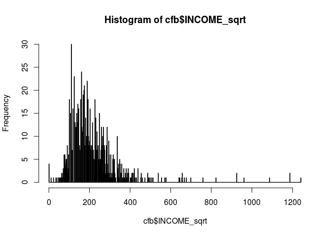
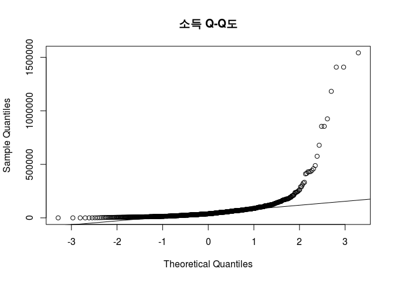
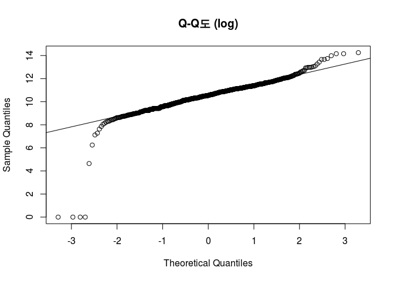
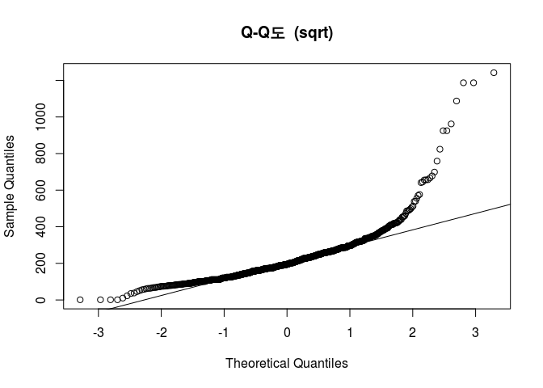
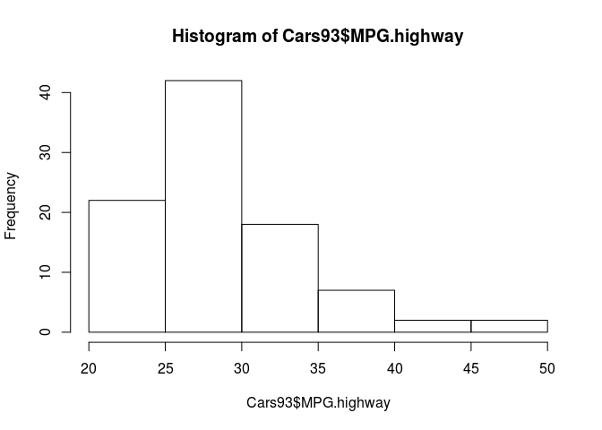

``` r
install.packages("UsingR", repos="http://cran.nexr.com/")
```

    ## Installing package into '/home/jw/R/x86_64-pc-linux-gnu-library/3.3'
    ## (as 'lib' is unspecified)

``` r
library(UsingR)
```

    ## Loading required package: MASS

    ## Loading required package: HistData

    ## Loading required package: Hmisc

    ## Loading required package: lattice

    ## Loading required package: survival

    ## Loading required package: Formula

    ## Loading required package: ggplot2

    ## 
    ## Attaching package: 'Hmisc'

    ## The following objects are masked from 'package:base':
    ## 
    ##     format.pval, round.POSIXt, trunc.POSIXt, units

    ## 
    ## Attaching package: 'UsingR'

    ## The following object is masked from 'package:survival':
    ## 
    ##     cancer

``` r
head(cfb)
```

    ##              WGT AGE EDUC   INCOME CHECKING SAVING  NMMF STOCKS   FIN
    ## X17470  5749.975  54   14 66814.19     6000   2000     0    500 39600
    ## X315    5870.634  40   12 42144.34      400      0     0      0  5400
    ## X8795   8043.695  35   14 25697.77     1000    160     0      0 15460
    ## X10720  6092.872  55   12 35976.87     2600  19100     0      0 54700
    ## X19170  7161.757  40   12 39060.61     1000   8300     0   3500 12800
    ## X22075 11429.633  82   12 13362.84     1000      0 50000      0 70500
    ##        VEHIC HOMEEQ OTHNFIN  DEBT NETWORTH
    ## X17470  6400  84000       0 40200   170800
    ## X315   21000   8000       0 58640    17760
    ## X8795   2000  12000       0 19610     9850
    ## X10720 18250  90000       0  8000   284950
    ## X19170  9100  47000       0 21000   268900
    ## X22075  7500 175000       0     0   253000

``` r
summary(cfb$INCOME)
```

    ##    Min. 1st Qu.  Median    Mean 3rd Qu.    Max. 
    ##       0   20560   38030   63400   69900 1542000

``` r
# 지수형태의 히스토그램
hist(cfb$INCOME, breaks = 500, freq = TRUE)
```



``` r
# 로그 형태로 바꾸면 정규분포화됨 
cfb <- transform(cfb, INCOME_log = log(INCOME + 1))
hist(cfb$INCOME_log, breaks = 500, freq = TRUE)
```



``` r
# 
cfb <- transform(cfb, INCOME_sqrt = sqrt(INCOME + 1))
hist(cfb$INCOME_sqrt, breaks = 500, freq = TRUE)
```



``` r
# 정규성 확인 방법
qqnorm(cfb$INCOME, main = "소득 Q-Q도")
qqline(cfb$INCOME)
```



``` r
qqnorm(cfb$INCOME_log, main = "Q-Q도 (log)") 
qqline(cfb$INCOME_log)
```



``` r
qqnorm(cfb$INCOME_sqrt, main = "Q-Q도  (sqrt)")
qqline(cfb$INCOME_sqrt)
```



``` r
par(mfrow = c(1, 1))
```

``` r
library(MASS)
# Data from 93 Cars on Sale in the USA in 1993
str(Cars93)
```

    ## 'data.frame':    93 obs. of  27 variables:
    ##  $ Manufacturer      : Factor w/ 32 levels "Acura","Audi",..: 1 1 2 2 3 4 4 4 4 5 ...
    ##  $ Model             : Factor w/ 93 levels "100","190E","240",..: 49 56 9 1 6 24 54 74 73 35 ...
    ##  $ Type              : Factor w/ 6 levels "Compact","Large",..: 4 3 1 3 3 3 2 2 3 2 ...
    ##  $ Min.Price         : num  12.9 29.2 25.9 30.8 23.7 14.2 19.9 22.6 26.3 33 ...
    ##  $ Price             : num  15.9 33.9 29.1 37.7 30 15.7 20.8 23.7 26.3 34.7 ...
    ##  $ Max.Price         : num  18.8 38.7 32.3 44.6 36.2 17.3 21.7 24.9 26.3 36.3 ...
    ##  $ MPG.city          : int  25 18 20 19 22 22 19 16 19 16 ...
    ##  $ MPG.highway       : int  31 25 26 26 30 31 28 25 27 25 ...
    ##  $ AirBags           : Factor w/ 3 levels "Driver & Passenger",..: 3 1 2 1 2 2 2 2 2 2 ...
    ##  $ DriveTrain        : Factor w/ 3 levels "4WD","Front",..: 2 2 2 2 3 2 2 3 2 2 ...
    ##  $ Cylinders         : Factor w/ 6 levels "3","4","5","6",..: 2 4 4 4 2 2 4 4 4 5 ...
    ##  $ EngineSize        : num  1.8 3.2 2.8 2.8 3.5 2.2 3.8 5.7 3.8 4.9 ...
    ##  $ Horsepower        : int  140 200 172 172 208 110 170 180 170 200 ...
    ##  $ RPM               : int  6300 5500 5500 5500 5700 5200 4800 4000 4800 4100 ...
    ##  $ Rev.per.mile      : int  2890 2335 2280 2535 2545 2565 1570 1320 1690 1510 ...
    ##  $ Man.trans.avail   : Factor w/ 2 levels "No","Yes": 2 2 2 2 2 1 1 1 1 1 ...
    ##  $ Fuel.tank.capacity: num  13.2 18 16.9 21.1 21.1 16.4 18 23 18.8 18 ...
    ##  $ Passengers        : int  5 5 5 6 4 6 6 6 5 6 ...
    ##  $ Length            : int  177 195 180 193 186 189 200 216 198 206 ...
    ##  $ Wheelbase         : int  102 115 102 106 109 105 111 116 108 114 ...
    ##  $ Width             : int  68 71 67 70 69 69 74 78 73 73 ...
    ##  $ Turn.circle       : int  37 38 37 37 39 41 42 45 41 43 ...
    ##  $ Rear.seat.room    : num  26.5 30 28 31 27 28 30.5 30.5 26.5 35 ...
    ##  $ Luggage.room      : int  11 15 14 17 13 16 17 21 14 18 ...
    ##  $ Weight            : int  2705 3560 3375 3405 3640 2880 3470 4105 3495 3620 ...
    ##  $ Origin            : Factor w/ 2 levels "USA","non-USA": 2 2 2 2 2 1 1 1 1 1 ...
    ##  $ Make              : Factor w/ 93 levels "Acura Integra",..: 1 2 4 3 5 6 7 9 8 10 ...

``` r
hist(Cars93$MPG.highway)
```



``` r
disc_1 <- Cars93[ , c("Model", "MPG.highway")]
head(disc_1)
```

    ##     Model MPG.highway
    ## 1 Integra          31
    ## 2  Legend          25
    ## 3      90          26
    ## 4     100          26
    ## 5    535i          30
    ## 6 Century          31

``` r
disc_1 <- within(disc_1, {
  MPG.highway_cd = character(0)
  MPG.highway_cd[MPG.highway >= 20 & MPG.highway < 25] = "20 ~ 25"
  MPG.highway_cd[MPG.highway >= 25 & MPG.highway < 30] = "25 ~ 30"
  MPG.highway_cd[MPG.highway >= 30 & MPG.highway < 35] = "30 ~ 35"
  MPG.highway_cd[MPG.highway >= 35 & MPG.highway < 40] = "35 ~ 40"
  MPG.highway_cd[MPG.highway >= 40 & MPG.highway < 45] = "40 ~ 45"
  MPG.highway_cd[MPG.highway >= 45 & MPG.highway < 50] = "45 ~ 50"
  MPG.highway_cd = factor(MPG.highway_cd, level = c("20 ~ 25", "25 ~ 30", "30 ~ 35", "35 ~ 40", "40 ~ 45"))
})

attributes(disc_1$MPG.highway_cd)
```

    ## $levels
    ## [1] "20 ~ 25" "25 ~ 30" "30 ~ 35" "35 ~ 40" "40 ~ 45"
    ## 
    ## $class
    ## [1] "factor"

``` r
table(disc_1$MPG.highway_cd)
```

    ## 
    ## 20 ~ 25 25 ~ 30 30 ~ 35 35 ~ 40 40 ~ 45 
    ##      14      41      27       7       2

``` r
highway_1 <- disc_1[order(disc_1$MPG.highway), ]
dim(highway_1)
```

    ## [1] 93  3

``` r
dim(highway_1)[1] # num of rows
```

    ## [1] 93

``` r
highway_1$N <- seq(1:length(disc_1$MPG.highway))
# length(disc_1$MPG.highway) equals to 93

# used within to omit highway_1 at every command used below
highway_1 <- within(highway_1, {
  MPG.highway_cd3 <- character(0)
  MPG.highway_cd3[N <= 23] = "1st_Freq"
  MPG.highway_cd3[N >= 24 & N <= 46] = "2nd_Freq"
  MPG.highway_cd3[N >= 47 & N <= 69] = "3rd_Freq"
  MPG.highway_cd3[N >= 70] = "4th_Freq"
  MPG.highway_cd3 <- factor(MPG.highway_cd3, level = c("1st_Freq", "2nd_Freq", "3rd_Freq", "4th_Freq")) 
})

head(highway_1)
```

    ##       Model MPG.highway MPG.highway_cd N MPG.highway_cd3
    ## 17    Astro          20        20 ~ 25 1        1st_Freq
    ## 36 Aerostar          20        20 ~ 25 2        1st_Freq
    ## 26  Caravan          21        20 ~ 25 3        1st_Freq
    ## 89  Eurovan          21        20 ~ 25 4        1st_Freq
    ## 48      Q45          22        20 ~ 25 5        1st_Freq
    ## 87   Previa          22        20 ~ 25 6        1st_Freq

``` r
table(highway_1$MPG.highway_cd3)
```

    ## 
    ## 1st_Freq 2nd_Freq 3rd_Freq 4th_Freq 
    ##       23       23       23       24

``` r
disc_3 <- Cars93[ , c("Model", "MPG.highway")]
summary(disc_3$MPG.highway)
```

    ##    Min. 1st Qu.  Median    Mean 3rd Qu.    Max. 
    ##   20.00   26.00   28.00   29.09   31.00   50.00

``` r
sort(disc_3$MPG.highway)
```

    ##  [1] 20 20 21 21 22 22 23 23 23 23 24 24 24 24 25 25 25 25 25 25 25 25 26
    ## [24] 26 26 26 26 26 26 26 26 26 26 27 27 27 27 27 27 28 28 28 28 28 28 28
    ## [47] 28 28 28 29 29 29 29 29 29 30 30 30 30 30 30 30 30 30 31 31 31 31 31
    ## [70] 31 31 32 33 33 33 33 33 33 33 34 34 34 36 36 36 37 37 37 38 41 43 46
    ## [93] 50

``` r
disc_3 <- within(disc_3, {
  MPG.highway_cd2 = character(0)
  MPG.highway_cd2[MPG.highway < quantile(MPG.highway, 0.25)] = "1Q"
  MPG.highway_cd2[MPG.highway >= quantile(MPG.highway, 0.25) & MPG.highway < quantile(MPG.highway, 0.5)] = "2Q"
  MPG.highway_cd2[MPG.highway >= quantile(MPG.highway, 0.5) & MPG.highway < quantile(MPG.highway, 0.75)] = "3Q"
  MPG.highway_cd2[MPG.highway >= quantile(MPG.highway, 0.75)]  = "4Q"
  MPG.highway_cd2 =factor(MPG.highway_cd2, level = c("1Q", "2Q", "3Q", "4Q"))
})

head(disc_3)
```

    ##     Model MPG.highway MPG.highway_cd2
    ## 1 Integra          31              4Q
    ## 2  Legend          25              1Q
    ## 3      90          26              2Q
    ## 4     100          26              2Q
    ## 5    535i          30              3Q
    ## 6 Century          31              4Q

``` r
table(disc_3$MPG.highway_cd2)
```

    ## 
    ## 1Q 2Q 3Q 4Q 
    ## 22 17 25 29

``` r
quantile(disc_3$MPG.highway, 0.25)
```

    ## 25% 
    ##  26

``` r
quantile(disc_3$MPG.highway, 0.75)
```

    ## 75% 
    ##  31

``` r
(c <- seq(0:100))
```

    ##   [1]   1   2   3   4   5   6   7   8   9  10  11  12  13  14  15  16  17
    ##  [18]  18  19  20  21  22  23  24  25  26  27  28  29  30  31  32  33  34
    ##  [35]  35  36  37  38  39  40  41  42  43  44  45  46  47  48  49  50  51
    ##  [52]  52  53  54  55  56  57  58  59  60  61  62  63  64  65  66  67  68
    ##  [69]  69  70  71  72  73  74  75  76  77  78  79  80  81  82  83  84  85
    ##  [86]  86  87  88  89  90  91  92  93  94  95  96  97  98  99 100 101

``` r
(d <- sort(round(runif(100) * 100)))
```

    ##   [1]  0  1  1  2  2  2  3  5  5  5  7  8 11 11 12 12 13 15 15 16 16 16 16
    ##  [24] 17 17 19 20 21 22 22 22 23 23 23 24 24 24 25 26 26 27 29 29 29 29 31
    ##  [47] 32 32 33 33 34 35 36 37 38 39 39 39 40 41 45 46 47 50 53 55 56 57 57
    ##  [70] 59 60 63 63 66 67 68 70 72 77 78 78 78 81 82 83 86 86 88 89 91 91 92
    ##  [93] 93 94 95 96 99 99 99 99

``` r
quantile(c, 0.25)
```

    ## 25% 
    ##  26

``` r
quantile(d, 0.25)
```

    ##  25% 
    ## 18.5

``` r
a <- seq(1:7)
quantile(a, 0.25)
```

    ## 25% 
    ## 2.5

``` r
quantile(a, 0.75)
```

    ## 75% 
    ## 5.5

``` r
a <- seq(1:8)
quantile(a, 0.25)
```

    ##  25% 
    ## 2.75

``` r
quantile(a, 0.75)
```

    ##  75% 
    ## 6.25

``` r
custome_id <- c("cu01", "cu02", "cu03", "cu04", "cu05", "cu06", "cu07")
age <- c(26, 47, 33, 31, 43, 56, 24)
custom_profile <- data.frame(custome_id, age, stringsAsFactors = F)
custom_profile
```

    ##   custome_id age
    ## 1       cu01  26
    ## 2       cu02  47
    ## 3       cu03  33
    ## 4       cu04  31
    ## 5       cu05  43
    ## 6       cu06  56
    ## 7       cu07  24

``` r
# print class of every columns in custom_profile
sapply(custom_profile, class)
```

    ##  custome_id         age 
    ## "character"   "numeric"

``` r
custom_profile$x = ifelse(custom_profile$age >= 30, 1, 0)
custom_profile
```

    ##   custome_id age x
    ## 1       cu01  26 0
    ## 2       cu02  47 1
    ## 3       cu03  33 1
    ## 4       cu04  31 1
    ## 5       cu05  43 1
    ## 6       cu06  56 1
    ## 7       cu07  24 0
