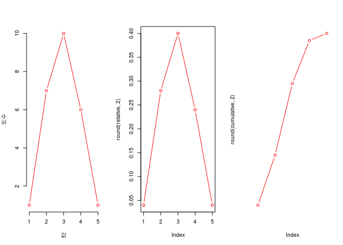

``` r
(coin <- c(2, 2, 0, 1, 1, 1, 2, 3, 1, 2, 2, 3, 3, 4, 1, 3, 2, 3, 3, 1, 2, 2, 1, 2, 2))
```

    ##  [1] 2 2 0 1 1 1 2 3 1 2 2 3 3 4 1 3 2 3 3 1 2 2 1 2 2

``` r
# 도수, 상대도수, 누적 상대도수를 구하고, 그래프로 표현해보시오 

length(coin)  # 시행횟수 25번
```

    ## [1] 25

``` r
# 도수
table(coin)
```

    ## coin
    ##  0  1  2  3  4 
    ##  1  7 10  6  1

``` r
barplot(table(coin))
```


``` r
# 상대도수
(rounded.relfreq <- table(round(prop.table(coin), 4)))
```

    ## 
    ##      0 0.0204 0.0408 0.0612 0.0816 
    ##      1      7     10      6      1

``` r
barplot(rounded.relfreq)
```


``` r
# 누적 상대도수
#(sorted.relfreq <- sort(rounded.relfreq, decreasing = F))
#(sorted.relfreq <- sort(round(prop.table(coin), 4), decreasing = F))
#barplot(sorted.relfreq)

(cumul <- (cumsum(rounded.relfreq)))
```

    ##      0 0.0204 0.0408 0.0612 0.0816 
    ##      1      8     18     24     25

``` r
barplot(cumul)
```


``` r
(coin <- c(2, 2, 0, 1, 1, 1, 2, 3, 1, 2, 2, 3, 3, 4, 1, 3, 2, 3, 3, 1, 2, 2, 1, 2, 2))
```

    ##  [1] 2 2 0 1 1 1 2 3 1 2 2 3 3 4 1 3 2 3 3 1 2 2 1 2 2

``` r
frequency <- rep(0, 5)
for(i in 1:5){
  frequency[i] <- length(coin[coin == i - 1])
}
frequency
```

    ## [1]  1  7 10  6  1

``` r
coin[coin == 1]
```

    ## [1] 1 1 1 1 1 1 1

``` r
(relative = frequency / length(coin))
```

    ## [1] 0.04 0.28 0.40 0.24 0.04

``` r
round(relative, 2)
```

    ## [1] 0.04 0.28 0.40 0.24 0.04

``` r
cumulative = cumsum(relative)
round(cumulative, 2)
```

    ## [1] 0.04 0.32 0.72 0.96 1.00

``` r
result = data.frame("도수" = frequency, "상대도수" = round(relative, 2), "누적상대도수" = round(cumulative, 2))
rownames(result) <- c(0, 1, 2, 3, 4)
result
```

    ##   도수 상대도수 누적상대도수
    ## 0    1     0.04         0.04
    ## 1    7     0.28         0.32
    ## 2   10     0.40         0.72
    ## 3    6     0.24         0.96
    ## 4    1     0.04         1.00

``` r
plot(result$"도수", type = "b", col = "red", main = "도수분포표", frame.plot = F, panel.first = T)
```


``` r
opar <- par(mfrow = c(1, 3))
plot(frequency, xlab = "값", ylab = "도수", type = "b", col = "red", frame.plot = F)
plot(round(relative, 2), type = "b", pch = 23, col = "red")
plot(round(cumulative, 2), type = "b", col = "red", axes = F)
```



``` r
barplot(frequency, xlab = "값", ylab = "도수", col = "red")
barplot(round(relative, 2), xlab = "값", ylab = "도수", col = "red")
barplot(round(cumulative, 2), xlab = "값", ylab = "도수", col = "red")
```


``` r
par(opar)
```

``` r
(coin <- c(2, 2, 0, 1, 1, 1, 2, 3, 1, 2, 2, 3, 3, 4, 1, 3, 2, 3, 3, 1, 2, 2, 1, 2, 2))
```

    ##  [1] 2 2 0 1 1 1 2 3 1 2 2 3 3 4 1 3 2 3 3 1 2 2 1 2 2

``` r
library(ggplot2)
#install.packages("grid", repos="http://cran.nexr.com/")
#library(grid)
q = table(coin)
newcoin = data.frame(q)
a <- ggplot(as.data.frame(coin), aes(coin)) + geom_bar(stat = "count")

# 상대도수 구하기
newcoin$relfreq = (newcoin$Freq) / length(coin)

# 누적도수 구하기
newcoin$cum = cumsum(newcoin$Freq)

# multiplot <- function(..., plotList=NULL, file, cols=1, layout=NULL){
#   require(grid)
#   plots <- c(list(...), plotlist)
#   numPlots = length(plots)
#   if(is.null(layout)){
#     layout <- matrix(seq(1, cols * ceiling(numPlots / cols)), ncol = ncols, nrow = ceiling(numPlots / cols))
#   }
#   
#   if(numPlots == 1){
#     print(Plots[[1]])
#   }else{
#     grid.newpage()
#     pushViewport(viewport(layout = grid.layout(nrow(layout), ncol(layout))))
#     for(i in 1:numPlots){
#       matchidx <- as.data.frame(which(layout == i, arr.ind = TRUE))
#       print(plots[[i]], vp = viewport(layout.pos.row = matchidx$row, layout.pos.col = match$col))
#     }
#   }
# }

multiplot <- function(..., plotlist=NULL, cols) {
    require(grid)

    # Make a list from the ... arguments and plotlist
    plots <- c(list(...), plotlist)

    numPlots = length(plots)

    # Make the panel
    plotCols = cols                          # Number of columns of plots
    plotRows = ceiling(numPlots/plotCols) # Number of rows needed, calculated from # of cols

    # Set up the page
    grid.newpage()
    pushViewport(viewport(layout = grid.layout(plotRows, plotCols)))
    vplayout <- function(x, y)
        viewport(layout.pos.row = x, layout.pos.col = y)

    # Make each plot, in the correct location
    for (i in 1:numPlots) {
        curRow = ceiling(i/plotCols)
        curCol = (i-1) %% plotCols + 1
        print(plots[[i]], vp = vplayout(curRow, curCol ))
    }

}

#상대도수 그리기
b <- ggplot(newcoin, aes(coin, relfreq)) + geom_bar(stat = "identity")

# 누적도수 그리기
c <- ggplot(newcoin, aes(coin, cum)) + geom_bar(stat = "identity")

multiplot(a, b, c, cols = 3)
```

    ## Loading required package: grid


``` r
(coin <- c(2, 2, 0, 1, 1, 1, 2, 3, 1, 2, 2, 3, 3, 4, 1, 3, 2, 3, 3, 1, 2, 2, 1, 2, 2))
```

    ##  [1] 2 2 0 1 1 1 2 3 1 2 2 3 3 4 1 3 2 3 3 1 2 2 1 2 2

``` r
coin <- as.data.frame(table(coin))
coin$Freq
```

    ## [1]  1  7 10  6  1

``` r
coin
```

    ##   coin Freq
    ## 1    0    1
    ## 2    1    7
    ## 3    2   10
    ## 4    3    6
    ## 5    4    1

``` r
(coin <- c(2, 2, 0, 1, 1, 1, 2, 3, 1, 2, 2, 3, 3, 4, 1, 3, 2, 3, 3, 1, 2, 2, 1, 2, 2))
```

    ##  [1] 2 2 0 1 1 1 2 3 1 2 2 3 3 4 1 3 2 3 3 1 2 2 1 2 2

``` r
library(ggplot2)
(coin.num = sort(unique(coin)))
```

    ## [1] 0 1 2 3 4

``` r
(coin.freq = rep(0, 4))
```

    ## [1] 0 0 0 0

``` r
for(i in 1:length(coin.num)){
  coin.freq[i] <- length(coin[coin == i - 1])
}

coin.freq
```

    ## [1]  1  7 10  6  1

``` r
(coin.rel = round(coin.freq / length(coin), 2))
```

    ## [1] 0.04 0.28 0.40 0.24 0.04

``` r
(coin.cum = cumsum(coin.rel))
```

    ## [1] 0.04 0.32 0.72 0.96 1.00

``` r
(coin.freq <- data.frame(coin.num, coin.freq))
```

    ##   coin.num coin.freq
    ## 1        0         1
    ## 2        1         7
    ## 3        2        10
    ## 4        3         6
    ## 5        4         1

``` r
names(coin.freq)[2] <- paste("val")
coin.freq$type = rep("freq", length(coin.num))
coin.freq
```

    ##   coin.num val type
    ## 1        0   1 freq
    ## 2        1   7 freq
    ## 3        2  10 freq
    ## 4        3   6 freq
    ## 5        4   1 freq

``` r
coin.rel = data.frame(coin.num, coin.rel)
names(coin.rel)[2]  <- paste("val")
coin.rel$type = rep("rel", length(coin.num))
coin.rel
```

    ##   coin.num  val type
    ## 1        0 0.04  rel
    ## 2        1 0.28  rel
    ## 3        2 0.40  rel
    ## 4        3 0.24  rel
    ## 5        4 0.04  rel

``` r
coin.cum = data.frame(coin.num, coin.cum)
names(coin.cum)[2]  <- paste("val")
coin.cum$type = rep("cum", length(coin.num))
coin.cum
```

    ##   coin.num  val type
    ## 1        0 0.04  cum
    ## 2        1 0.32  cum
    ## 3        2 0.72  cum
    ## 4        3 0.96  cum
    ## 5        4 1.00  cum

``` r
coin.graph = rbind(coin.freq, coin.rel, coin.cum)
ggplot(coin.graph, aes(coin.num, val, group = type, col = type)) + geom_point() + geom_line()
```


``` r
coin.rel.graph = rbind(coin.rel, coin.cum)
ggplot(coin.rel.graph, aes(coin.num, val, group = type, col = type)) + geom_point() + geom_line()
```


