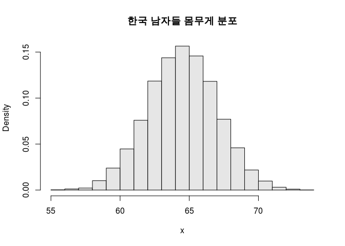
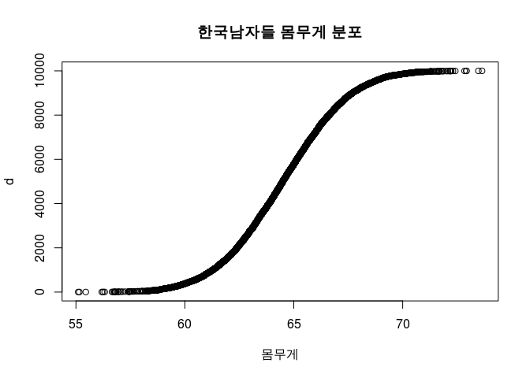
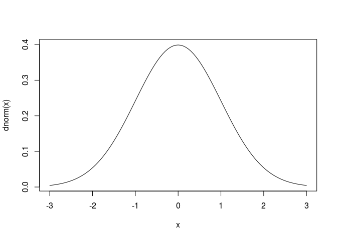

``` r
rnorm(1, 64.5, 2.5)
```

    ## [1] 66.79426

``` r
dnorm(64.5, 64.5, 2.5)
```

    ## [1] 0.1595769

``` r
#culumative probability / 표준 정규분포표
pnorm(64.5, 64.5, 2.5)
```

    ## [1] 0.5

``` r
pnorm(2.58)
```

    ## [1] 0.99506

``` r
pnorm(1.645)
```

    ## [1] 0.9500151

``` r
(pnorm(1.96) - 0.5) * 2
```

    ## [1] 0.9500042

``` r
# 푲표준표준 정표준 정귭표준 정규분표준 정규분퐆표준 정규분포푱표준 정규분포표엣표준 정규분포표에서표준 정규분포표에서  x=0가가 0일일땡일때의일때의 g함함수함수 값
dnorm(1.96, 0, 1)
```

    ## [1] 0.05844094

``` r
qnorm(0.975)
```

    ## [1] 1.959964

``` r
pnorm(1.96, 0, 1)
```

    ## [1] 0.9750021

``` r
pnorm(1.96)
```

    ## [1] 0.9750021

``` r
dnorm(1.95)
```

    ## [1] 0.05959471

``` r
dnorm(1.955)
```

    ## [1] 0.05901574

``` r
dnorm(1.96)
```

    ## [1] 0.05844094

``` r
a <- seq(0.00, 1.96, by = 0.01)
cumulative_prop = 0
for(i in a){
  cumulative_prop = cumulative_prop + dnorm(i)
  #print(dnorm(i))
}

# pnorm = z값에 대한 누적확률
# dnorm = z값에 대한 함수값
# qnorm = 확률값에 대한 z값
cumulative_prop
```

    ## [1] 47.72881

``` r
x <- rnorm(10000, 64.5, 2.5)
x <- sort(x)
#d <- dnorm(x, 64.5, 2.5)
d <- seq(-5000:4999)
hist(x, probability = TRUE, col = gray(.9), main = "한국 남자들 몸무게 분포")
```



``` r
plot(x, d, main = "한국남자들 몸무게 분포", xlab = "몸무게")
```



``` r
curve(dnorm(x), -3, 3)
```



``` r
# X ~(300, 50^2)인 정규분포에서 P(X >= 370)을 구하여라
1- pnorm(370, 300, 50)
```

    ## [1] 0.08075666

``` r
# 백열전구의 수명이 1500시간의 평균값과 75시간의 표준편차로 정규적으로 분포되어 있다

# 백열전구가 1410시간보다 덜 갈 확률은 얼마인가
pnorm(1410, 1500, 75)  # 0.1150697
```

    ## [1] 0.1150697

``` r
# 백열전구의 수명이 1563시간과 1648시간 사이일 확률은 얼마인가
pnorm(1648, 1500, 75) - pnorm(1563, 1500, 75)  # 0.1762254
```

    ## [1] 0.1762254
