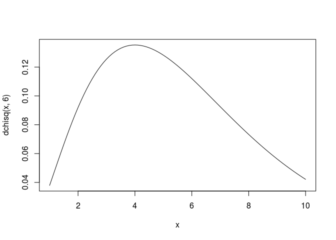

``` r
x <- seq(1, 10, .1)
plot(x, dchisq(x, 6), type = "l")
```



``` r
#귀무가설: 기대치와 관찰치는 차이가 없다 = 맥주종류에 따른 선호도는 차이가 없다.
#대립가설: 기대치와 관찰치는 차이가 있다 = 맥주종류에 따른 선호도는 차이가 있다.
data <- textConnection(
  "맥주종류 관측도수
  1 12
  2 30
  3 15
  4 7
  5 16")
x <- read.table(data, header = T)
x
```

    ##   맥주종류 관측도수
    ## 1        1       12
    ## 2        2       30
    ## 3        3       15
    ## 4        4        7
    ## 5        5       16

``` r
#chisq.test(x$맥주종류)
chisq.test(x$관측도수)
```

    ## 
    ##  Chi-squared test for given probabilities
    ## 
    ## data:  x$관측도수
    ## X-squared = 18.375, df = 4, p-value = 0.001042

``` r
install.packages("MASS", repos="http://cran.nexr.com/")
```

    ## Installing package into '/home/jw/R/x86_64-pc-linux-gnu-library/3.3'
    ## (as 'lib' is unspecified)

``` r
library(MASS)
str(survey)
```

    ## 'data.frame':    237 obs. of  12 variables:
    ##  $ Sex   : Factor w/ 2 levels "Female","Male": 1 2 2 2 2 1 2 1 2 2 ...
    ##  $ Wr.Hnd: num  18.5 19.5 18 18.8 20 18 17.7 17 20 18.5 ...
    ##  $ NW.Hnd: num  18 20.5 13.3 18.9 20 17.7 17.7 17.3 19.5 18.5 ...
    ##  $ W.Hnd : Factor w/ 2 levels "Left","Right": 2 1 2 2 2 2 2 2 2 2 ...
    ##  $ Fold  : Factor w/ 3 levels "L on R","Neither",..: 3 3 1 3 2 1 1 3 3 3 ...
    ##  $ Pulse : int  92 104 87 NA 35 64 83 74 72 90 ...
    ##  $ Clap  : Factor w/ 3 levels "Left","Neither",..: 1 1 2 2 3 3 3 3 3 3 ...
    ##  $ Exer  : Factor w/ 3 levels "Freq","None",..: 3 2 2 2 3 3 1 1 3 3 ...
    ##  $ Smoke : Factor w/ 4 levels "Heavy","Never",..: 2 4 3 2 2 2 2 2 2 2 ...
    ##  $ Height: num  173 178 NA 160 165 ...
    ##  $ M.I   : Factor w/ 2 levels "Imperial","Metric": 2 1 NA 2 2 1 1 2 2 2 ...
    ##  $ Age   : num  18.2 17.6 16.9 20.3 23.7 ...

``` r
head(survey[c("Sex", "Exer")])
```

    ##      Sex Exer
    ## 1 Female Some
    ## 2   Male None
    ## 3   Male None
    ## 4   Male None
    ## 5   Male Some
    ## 6 Female Some

``` r
#교차분석표
xtabs(~ Sex+Exer, data = survey)
```

    ##         Exer
    ## Sex      Freq None Some
    ##   Female   49   11   58
    ##   Male     65   13   40

``` r
chisq.test(xtabs(~ Sex+Exer, data = survey))
```

    ## 
    ##  Pearson's Chi-squared test
    ## 
    ## data:  xtabs(~Sex + Exer, data = survey)
    ## X-squared = 5.7184, df = 2, p-value = 0.05731

``` r
survey$Exer
```

    ##   [1] Some None None None Some Some Freq Freq Some Some Freq Freq Some Some
    ##  [15] Some Freq Freq Some Some Freq Freq Freq Freq Some Some Some Some Freq
    ##  [29] Freq Some None Freq Freq Some Some Freq Some Freq Some Freq Some Some
    ##  [43] Some Some Freq Freq Freq None Some None Freq Freq Some Freq Freq Freq
    ##  [57] None Freq Freq Freq Freq Freq Freq None Freq Freq Freq Freq Some None
    ##  [71] Freq Freq Some Freq Some Freq Some Freq Some Freq Some Freq Freq Some
    ##  [85] Freq Some Some Freq Freq Some Some Some Some Some Freq Some Freq Freq
    ##  [99] Freq Freq Some None Some Freq Some Some Freq Freq Freq Some Freq None
    ## [113] Freq Freq Freq None Some Some Some Freq Freq Freq Freq Freq Freq Freq
    ## [127] Freq Freq Freq Some Freq Some Some Freq Some Some Freq Freq Freq None
    ## [141] Some None Freq Some Freq Some Freq Freq Freq Freq Freq Freq Some Freq
    ## [155] None Freq Freq Some None Freq None Some Some Freq Some Some Some Some
    ## [169] Freq Freq Some Some Some Freq Freq Freq Freq Freq Freq Some Freq Freq
    ## [183] Some Freq Some Some Some None Freq Freq Some Some None Some None Some
    ## [197] Freq Freq Some Some Some Freq Some None Some Freq Some Some None Freq
    ## [211] Some Some Freq Some Some Some None Freq Freq Freq None Freq Some Freq
    ## [225] Some Some Some Freq Freq Freq Some Some Some Some Some Some Freq
    ## Levels: Freq None Some

``` r
xt <- xtabs(~ Sex+Exer, data = survey)
class(xt)
```

    ## [1] "xtabs" "table"

``` r
mode(xt)
```

    ## [1] "numeric"

``` r
margin.table(xt, 1) # 행의 주변합
```

    ## Sex
    ## Female   Male 
    ##    118    118

``` r
margin.table(xt, 2) # 열의 주변합
```

    ## Exer
    ## Freq None Some 
    ##  114   24   98

``` r
margin.table(xt)
```

    ## [1] 236

``` r
class(xt)
```

    ## [1] "xtabs" "table"

``` r
mode(xt)
```

    ## [1] "numeric"

``` r
rowhap <- prop.table(xt, 1)
prop.table(xt, 2)
```

    ##         Exer
    ## Sex           Freq      None      Some
    ##   Female 0.4298246 0.4583333 0.5918367
    ##   Male   0.5701754 0.5416667 0.4081633

``` r
prop.table(xt)
```

    ##         Exer
    ## Sex            Freq       None       Some
    ##   Female 0.20762712 0.04661017 0.24576271
    ##   Male   0.27542373 0.05508475 0.16949153

``` r
margin.table(rowhap, 1)
```

    ## Sex
    ## Female   Male 
    ##      1      1

``` r
# 글씨를 왼손으로 쓰는 사람과 오른손으로 쓰는 사람의 비율이 30:70인지 확인하고 싶다.
table(survey$W.Hnd)
```

    ## 
    ##  Left Right 
    ##    18   218

``` r
chisq.test(table(survey$W.Hnd), p = c(.3, .7))
```

    ## 
    ##  Chi-squared test for given probabilities
    ## 
    ## data:  table(survey$W.Hnd)
    ## X-squared = 56.252, df = 1, p-value = 6.376e-14

``` r
#chisq.test(table(survey$W.Hnd))
#chisq.test(xtabs(~ W.Hnd, data = survey))
```

``` r
# 귀무가설: 글자를 쓰는 손과 박수 칠 때 오는 손이 독립이다.
# 대립가설: 글자를 쓰는 손과 박수 칠 때 위에 오는 손이 관계가 있다.

# Chi-squared approximation may be incorrect
# 표본수가 적거나 표본이 분할표의 특정 셀에 지나치게 몰려 있을 경우 발생

xtabs(~W.Hnd+Clap, data = survey)
```

    ##        Clap
    ## W.Hnd   Left Neither Right
    ##   Left     9       5     4
    ##   Right   29      45   143

``` r
chisq.test(xtabs(~W.Hnd + Clap, data = survey))
```

    ## Warning in chisq.test(xtabs(~W.Hnd + Clap, data = survey)): Chi-squared
    ## approximation may be incorrect

    ## 
    ##  Pearson's Chi-squared test
    ## 
    ## data:  xtabs(~W.Hnd + Clap, data = survey)
    ## X-squared = 19.252, df = 2, p-value = 6.598e-05

``` r
fisher.test(xtabs(~W.Hnd + Clap, data = survey))
```

    ## 
    ##  Fisher's Exact Test for Count Data
    ## 
    ## data:  xtabs(~W.Hnd + Clap, data = survey)
    ## p-value = 0.0001413
    ## alternative hypothesis: two.sided

``` r
# 이항분포
# binom.test(x, n, p = 0.5, alternative = c("two.sided", "less", "greater"), conf.level = 0.95)

binom.test(c(125, 9), p = 0.7)
```

    ## 
    ##  Exact binomial test
    ## 
    ## data:  c(125, 9)
    ## number of successes = 125, number of trials = 134, p-value =
    ## 4.204e-11
    ## alternative hypothesis: true probability of success is not equal to 0.7
    ## 95 percent confidence interval:
    ##  0.8763305 0.9688306
    ## sample estimates:
    ## probability of success 
    ##              0.9328358

``` r
binom.test(125, 134, p = 0.7)
```

    ## 
    ##  Exact binomial test
    ## 
    ## data:  125 and 134
    ## number of successes = 125, number of trials = 134, p-value =
    ## 4.204e-11
    ## alternative hypothesis: true probability of success is not equal to 0.7
    ## 95 percent confidence interval:
    ##  0.8763305 0.9688306
    ## sample estimates:
    ## probability of success 
    ##              0.9328358

``` r
binom.test(c(136, 14), 150, p = 0.8)
```

    ## 
    ##  Exact binomial test
    ## 
    ## data:  c(136, 14)
    ## number of successes = 136, number of trials = 150, p-value =
    ## 0.0006735
    ## alternative hypothesis: true probability of success is not equal to 0.8
    ## 95 percent confidence interval:
    ##  0.8483615 0.9480298
    ## sample estimates:
    ## probability of success 
    ##              0.9066667

``` r
binom.test(c(136, 14), p = 0.8, alternative = "two.sided", conf.level = 0.95)
```

    ## 
    ##  Exact binomial test
    ## 
    ## data:  c(136, 14)
    ## number of successes = 136, number of trials = 150, p-value =
    ## 0.0006735
    ## alternative hypothesis: true probability of success is not equal to 0.8
    ## 95 percent confidence interval:
    ##  0.8483615 0.9480298
    ## sample estimates:
    ## probability of success 
    ##              0.9066667

``` r
# 단축 검증
binom.test(c(136, 14), p = 0.8, alternative = "greater", conf.level = 0.95)
```

    ## 
    ##  Exact binomial test
    ## 
    ## data:  c(136, 14)
    ## number of successes = 136, number of trials = 150, p-value =
    ## 0.0003179
    ## alternative hypothesis: true probability of success is greater than 0.8
    ## 95 percent confidence interval:
    ##  0.8579426 1.0000000
    ## sample estimates:
    ## probability of success 
    ##              0.9066667

``` r
c(125, 9)
```

    ## [1] 125   9

``` r
# 두 집단 비율 검정: prop.test()
# 귀무가설: PT교육(방법1)과 코딩교육(방법2) 간에는 만족도의 차이가 없다.
# 대립가설: 교육방법에 따라 만족도의 차이가 있다.(양측검정일 경우에)
# 결론: 교육방법에 따라 만족도의 차이가 존재한다.
prop.test(c(105, 130), c(140, 140))
```

    ## 
    ##  2-sample test for equality of proportions with continuity
    ##  correction
    ## 
    ## data:  c(105, 130) out of c(140, 140)
    ## X-squared = 15.251, df = 1, p-value = 9.412e-05
    ## alternative hypothesis: two.sided
    ## 95 percent confidence interval:
    ##  -0.26916933 -0.08797353
    ## sample estimates:
    ##    prop 1    prop 2 
    ## 0.7500000 0.9285714

``` r
prop.test(c(105, 130), c(140, 140), alternative = "two.sided", conf.level = 0.95)
```

    ## 
    ##  2-sample test for equality of proportions with continuity
    ##  correction
    ## 
    ## data:  c(105, 130) out of c(140, 140)
    ## X-squared = 15.251, df = 1, p-value = 9.412e-05
    ## alternative hypothesis: two.sided
    ## 95 percent confidence interval:
    ##  -0.26916933 -0.08797353
    ## sample estimates:
    ##    prop 1    prop 2 
    ## 0.7500000 0.9285714

``` r
# 단측검정
# 대립가설: 방법1이 방법2보다 만족도가 더 높다?
prop.test(c(105, 130), c(140, 140), alternative = "greater", conf.level = 0.95)
```

    ## 
    ##  2-sample test for equality of proportions with continuity
    ##  correction
    ## 
    ## data:  c(105, 130) out of c(140, 140)
    ## X-squared = 15.251, df = 1, p-value = 1
    ## alternative hypothesis: greater
    ## 95 percent confidence interval:
    ##  -0.255752  1.000000
    ## sample estimates:
    ##    prop 1    prop 2 
    ## 0.7500000 0.9285714

``` r
prop.test(c(105, 130), c(140, 140), alternative = "less", conf.level = 0.95)
```

    ## 
    ##  2-sample test for equality of proportions with continuity
    ##  correction
    ## 
    ## data:  c(105, 130) out of c(140, 140)
    ## X-squared = 15.251, df = 1, p-value = 4.706e-05
    ## alternative hypothesis: less
    ## 95 percent confidence interval:
    ##  -1.0000000 -0.1013909
    ## sample estimates:
    ##    prop 1    prop 2 
    ## 0.7500000 0.9285714

``` r
data <- textConnection(
  "만족 불만족
  105 35
  130 10
  ")
x <- read.table(data, header = T)
x
```

    ##   만족 불만족
    ## 1  105     35
    ## 2  130     10

``` r
chisq.test(x$만족)
```

    ## 
    ##  Chi-squared test for given probabilities
    ## 
    ## data:  x$만족
    ## X-squared = 2.6596, df = 1, p-value = 0.1029

``` r
# 맥나마 검정
# 사건 전후의 성향 변화를 알아보는 경우 수행
# 벌금 부과하기 시작한 후 안전벨트 착용자 수의 변화
# 선거 유세를 하고 난 후 지지율 변화
# mcnemar.test()

#performance <- matrix(c(794, 86, 150, 570), nrow = 2, dimnames = list("찬반  " = c("찬성", "반대"), "시행순서" = c("1차", "2차")))
#performance
# mcnemar.test(performance)
# 대립가설 채택

######################################################################################################
## Presidential Approval Ratings.
##  Approval of the President's performance in office in two surveys,
##  one month apart, for a random sample of 1600 voting-age Americans.
Performance <-
matrix(c(794, 86, 150, 570),
       nrow = 2,
       dimnames = list("1st Survey" = c("Approve", "Disapprove"),
                       "2nd Survey" = c("Approve", "Disapprove")))
Performance
```

    ##             2nd Survey
    ## 1st Survey   Approve Disapprove
    ##   Approve        794        150
    ##   Disapprove      86        570

``` r
mcnemar.test(Performance)
```

    ## 
    ##  McNemar's Chi-squared test with continuity correction
    ## 
    ## data:  Performance
    ## McNemar's chi-squared = 16.818, df = 1, p-value = 4.115e-05

``` r
margin.table(Performance, 1)
```

    ## 1st Survey
    ##    Approve Disapprove 
    ##        944        656

``` r
margin.table(Performance, 2)
```

    ## 2nd Survey
    ##    Approve Disapprove 
    ##        880        720

``` r
## => significant change (in fact, drop) in approval ratings
```

``` r
# SHAPRIO TEST (정규성 검정)
# 정규성을 만족하면 그 다음은 t.test(모수) 혹은 wilcoxon.test(비모수)

# 귀무가설: 데이터가 정규분포를 따른다
# 대립가설: 데이터가 정규분포를 따르지 않는다.
shapiro.test(rnorm(1000))
```

    ## 
    ##  Shapiro-Wilk normality test
    ## 
    ## data:  rnorm(1000)
    ## W = 0.99763, p-value = 0.1604

``` r
# p-value가 0.05보다 크기 때문에 정규분포를 따른다고 할 수 있다.
# 데이터가 정규분포를 따른다는 귀무가설을 기각할 수 없다.

# 균일분포에서도 정규분포

set.seed(1000)
x <- runif(50, min = 2, max = 4)
shapiro.test(x)
```

    ## 
    ##  Shapiro-Wilk normality test
    ## 
    ## data:  x
    ## W = 0.94204, p-value = 0.01623

``` r
# 균등분포는 표본에 따라 정규성을 만족하기도 하고, 정규성을 만족하지 않기도 한다.
```

``` r
DF <- data.frame ( x = runif (260000) , y = rep ( LETTERS , each =10000) )
head(DF)
```

    ##           x y
    ## 1 0.7267993 A
    ## 2 0.6820559 A
    ## 3 0.0372245 A
    ## 4 0.5181039 A
    ## 5 0.6311656 A
    ## 6 0.6853221 A

``` r
# 단일 집단 평균 검정 - 가설 검정

# 양측검정
# 귀무가설: 표본평균은 모집단평균과 동일하다.
# 대립가설: 표본평균은 모집단평균과 동일하지 않다.
t.test(x , mu = 5.2, alter = "two.side", conf.level = 0.95)
```

    ## 
    ##  One Sample t-test
    ## 
    ## data:  x
    ## t = -28.678, df = 49, p-value < 2.2e-16
    ## alternative hypothesis: true mean is not equal to 5.2
    ## 95 percent confidence interval:
    ##  2.807704 3.121019
    ## sample estimates:
    ## mean of x 
    ##  2.964362

``` r
# 단측검정
result <- t.test(x, mu = 5.2, alter = "greater", conf.level = 0.95)
result
```

    ## 
    ##  One Sample t-test
    ## 
    ## data:  x
    ## t = -28.678, df = 49, p-value = 1
    ## alternative hypothesis: true mean is greater than 5.2
    ## 95 percent confidence interval:
    ##  2.833665      Inf
    ## sample estimates:
    ## mean of x 
    ##  2.964362

``` r
result$p.value
```

    ## [1] 1

``` r
# 귀무가설: a와 모집단평균은 동일하다.
a = c(65, 78, 88, 55, 48, 95, 66, 57, 79, 82)
mean(a)
```

    ## [1] 71.3

``` r
t.test(a, mu = 88, conf.level = 0.95)
```

    ## 
    ##  One Sample t-test
    ## 
    ## data:  a
    ## t = -3.4247, df = 9, p-value = 0.007572
    ## alternative hypothesis: true mean is not equal to 88
    ## 95 percent confidence interval:
    ##  60.26891 82.33109
    ## sample estimates:
    ## mean of x 
    ##      71.3

``` r
require(graphics)

# 두 표본 간의 평균 비교
# 귀무가설: 두 표본의 평균은 동일하다
# 대립가설: 두 표본의 평균은 동일하지 않다.
t.test(1:10, y = c(7:20))      # P = .00001855
```

    ## 
    ##  Welch Two Sample t-test
    ## 
    ## data:  1:10 and c(7:20)
    ## t = -5.4349, df = 21.982, p-value = 1.855e-05
    ## alternative hypothesis: true difference in means is not equal to 0
    ## 95 percent confidence interval:
    ##  -11.052802  -4.947198
    ## sample estimates:
    ## mean of x mean of y 
    ##       5.5      13.5

``` r
t.test(1:10, y = c(7:20, 200)) # P = .1245    -- NOT significant anymore
```

    ## 
    ##  Welch Two Sample t-test
    ## 
    ## data:  1:10 and c(7:20, 200)
    ## t = -1.6329, df = 14.165, p-value = 0.1245
    ## alternative hypothesis: true difference in means is not equal to 0
    ## 95 percent confidence interval:
    ##  -47.242900   6.376233
    ## sample estimates:
    ## mean of x mean of y 
    ##   5.50000  25.93333

``` r
t.test(1:10, y = 1:10)
```

    ## 
    ##  Welch Two Sample t-test
    ## 
    ## data:  1:10 and 1:10
    ## t = 0, df = 18, p-value = 1
    ## alternative hypothesis: true difference in means is not equal to 0
    ## 95 percent confidence interval:
    ##  -2.844662  2.844662
    ## sample estimates:
    ## mean of x mean of y 
    ##       5.5       5.5

``` r
## Classical example: Student's sleep data
plot(extra ~ group, data = sleep)
```


``` r
## Traditional interface
with(sleep, t.test(extra[group == 1], extra[group == 2]))
```

    ## 
    ##  Welch Two Sample t-test
    ## 
    ## data:  extra[group == 1] and extra[group == 2]
    ## t = -1.8608, df = 17.776, p-value = 0.07939
    ## alternative hypothesis: true difference in means is not equal to 0
    ## 95 percent confidence interval:
    ##  -3.3654832  0.2054832
    ## sample estimates:
    ## mean of x mean of y 
    ##      0.75      2.33

``` r
## Formula interface
t.test(extra ~ group, data = sleep)
```

    ## 
    ##  Welch Two Sample t-test
    ## 
    ## data:  extra by group
    ## t = -1.8608, df = 17.776, p-value = 0.07939
    ## alternative hypothesis: true difference in means is not equal to 0
    ## 95 percent confidence interval:
    ##  -3.3654832  0.2054832
    ## sample estimates:
    ## mean in group 1 mean in group 2 
    ##            0.75            2.33

``` r
sleep1 <- with(sleep, extra[group == 2] - extra[group == 1])
summary(sleep1)
```

    ##    Min. 1st Qu.  Median    Mean 3rd Qu.    Max. 
    ##    0.00    1.05    1.30    1.58    1.70    4.60

``` r
require(stats)
stripchart(sleep1, method = "stack", xlab = "hours",
           main = "Sleep prolongation (n = 10)")
boxplot(sleep1, horizontal = TRUE, add = TRUE,
        at = .6, pars = list(boxwex = 0.5, staplewex = 0.25))
```


``` r
x <- 1:10
y <- c(7:20)
z <- c(7:20, 200)
# 귀무가설: 2개의 표본의 분산이 동일하다.(다르다고 할 수 없다.)
# 대립가설: 2개의 표본의 분산이 동일하지 않다.
var.test(x, y)
```

    ## 
    ##  F test to compare two variances
    ## 
    ## data:  x and y
    ## F = 0.52381, num df = 9, denom df = 13, p-value = 0.3343
    ## alternative hypothesis: true ratio of variances is not equal to 1
    ## 95 percent confidence interval:
    ##  0.1581535 2.0065024
    ## sample estimates:
    ## ratio of variances 
    ##          0.5238095

``` r
var.test(x, z)
```

    ## 
    ##  F test to compare two variances
    ## 
    ## data:  x and z
    ## F = 0.0039257, num df = 9, denom df = 14, p-value = 1.257e-09
    ## alternative hypothesis: true ratio of variances is not equal to 1
    ## 95 percent confidence interval:
    ##  0.001223212 0.014909452
    ## sample estimates:
    ## ratio of variances 
    ##        0.003925655

``` r
t.test(x, y)
```

    ## 
    ##  Welch Two Sample t-test
    ## 
    ## data:  x and y
    ## t = -5.4349, df = 21.982, p-value = 1.855e-05
    ## alternative hypothesis: true difference in means is not equal to 0
    ## 95 percent confidence interval:
    ##  -11.052802  -4.947198
    ## sample estimates:
    ## mean of x mean of y 
    ##       5.5      13.5

``` r
t.test(x, z)
```

    ## 
    ##  Welch Two Sample t-test
    ## 
    ## data:  x and z
    ## t = -1.6329, df = 14.165, p-value = 0.1245
    ## alternative hypothesis: true difference in means is not equal to 0
    ## 95 percent confidence interval:
    ##  -47.242900   6.376233
    ## sample estimates:
    ## mean of x mean of y 
    ##   5.50000  25.93333
