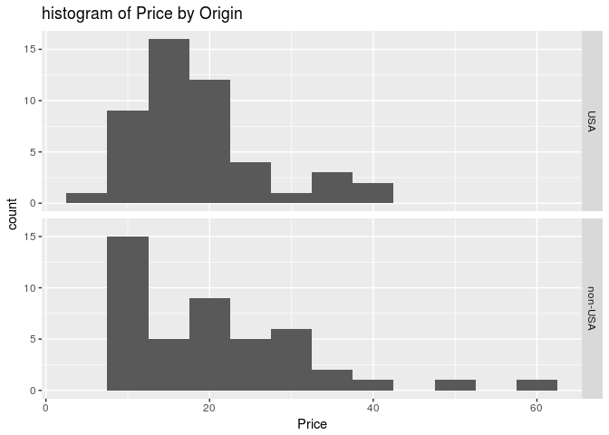

``` r
library(MASS)
str(Cars93)
```

    ## 'data.frame':    93 obs. of  27 variables:
    ##  $ Manufacturer      : Factor w/ 32 levels "Acura","Audi",..: 1 1 2 2 3 4 4 4 4 5 ...
    ##  $ Model             : Factor w/ 93 levels "100","190E","240",..: 49 56 9 1 6 24 54 74 73 35 ...
    ##  $ Type              : Factor w/ 6 levels "Compact","Large",..: 4 3 1 3 3 3 2 2 3 2 ...
    ##  $ Min.Price         : num  12.9 29.2 25.9 30.8 23.7 14.2 19.9 22.6 26.3 33 ...
    ##  $ Price             : num  15.9 33.9 29.1 37.7 30 15.7 20.8 23.7 26.3 34.7 ...
    ##  $ Max.Price         : num  18.8 38.7 32.3 44.6 36.2 17.3 21.7 24.9 26.3 36.3 ...
    ##  $ MPG.city          : int  25 18 20 19 22 22 19 16 19 16 ...
    ##  $ MPG.highway       : int  31 25 26 26 30 31 28 25 27 25 ...
    ##  $ AirBags           : Factor w/ 3 levels "Driver & Passenger",..: 3 1 2 1 2 2 2 2 2 2 ...
    ##  $ DriveTrain        : Factor w/ 3 levels "4WD","Front",..: 2 2 2 2 3 2 2 3 2 2 ...
    ##  $ Cylinders         : Factor w/ 6 levels "3","4","5","6",..: 2 4 4 4 2 2 4 4 4 5 ...
    ##  $ EngineSize        : num  1.8 3.2 2.8 2.8 3.5 2.2 3.8 5.7 3.8 4.9 ...
    ##  $ Horsepower        : int  140 200 172 172 208 110 170 180 170 200 ...
    ##  $ RPM               : int  6300 5500 5500 5500 5700 5200 4800 4000 4800 4100 ...
    ##  $ Rev.per.mile      : int  2890 2335 2280 2535 2545 2565 1570 1320 1690 1510 ...
    ##  $ Man.trans.avail   : Factor w/ 2 levels "No","Yes": 2 2 2 2 2 1 1 1 1 1 ...
    ##  $ Fuel.tank.capacity: num  13.2 18 16.9 21.1 21.1 16.4 18 23 18.8 18 ...
    ##  $ Passengers        : int  5 5 5 6 4 6 6 6 5 6 ...
    ##  $ Length            : int  177 195 180 193 186 189 200 216 198 206 ...
    ##  $ Wheelbase         : int  102 115 102 106 109 105 111 116 108 114 ...
    ##  $ Width             : int  68 71 67 70 69 69 74 78 73 73 ...
    ##  $ Turn.circle       : int  37 38 37 37 39 41 42 45 41 43 ...
    ##  $ Rear.seat.room    : num  26.5 30 28 31 27 28 30.5 30.5 26.5 35 ...
    ##  $ Luggage.room      : int  11 15 14 17 13 16 17 21 14 18 ...
    ##  $ Weight            : int  2705 3560 3375 3405 3640 2880 3470 4105 3495 3620 ...
    ##  $ Origin            : Factor w/ 2 levels "USA","non-USA": 2 2 2 2 2 1 1 1 1 1 ...
    ##  $ Make              : Factor w/ 93 levels "Acura Integra",..: 1 2 4 3 5 6 7 9 8 10 ...

``` r
summary(Cars93)
```

    ##     Manufacturer     Model         Type      Min.Price         Price      
    ##  Chevrolet: 8    100    : 1   Compact:16   Min.   : 6.70   Min.   : 7.40  
    ##  Ford     : 8    190E   : 1   Large  :11   1st Qu.:10.80   1st Qu.:12.20  
    ##  Dodge    : 6    240    : 1   Midsize:22   Median :14.70   Median :17.70  
    ##  Mazda    : 5    300E   : 1   Small  :21   Mean   :17.13   Mean   :19.51  
    ##  Pontiac  : 5    323    : 1   Sporty :14   3rd Qu.:20.30   3rd Qu.:23.30  
    ##  Buick    : 4    535i   : 1   Van    : 9   Max.   :45.40   Max.   :61.90  
    ##  (Other)  :57    (Other):87                                               
    ##    Max.Price       MPG.city      MPG.highway                  AirBags  
    ##  Min.   : 7.9   Min.   :15.00   Min.   :20.00   Driver & Passenger:16  
    ##  1st Qu.:14.7   1st Qu.:18.00   1st Qu.:26.00   Driver only       :43  
    ##  Median :19.6   Median :21.00   Median :28.00   None              :34  
    ##  Mean   :21.9   Mean   :22.37   Mean   :29.09                          
    ##  3rd Qu.:25.3   3rd Qu.:25.00   3rd Qu.:31.00                          
    ##  Max.   :80.0   Max.   :46.00   Max.   :50.00                          
    ##                                                                        
    ##  DriveTrain  Cylinders    EngineSize      Horsepower         RPM      
    ##  4WD  :10   3     : 3   Min.   :1.000   Min.   : 55.0   Min.   :3800  
    ##  Front:67   4     :49   1st Qu.:1.800   1st Qu.:103.0   1st Qu.:4800  
    ##  Rear :16   5     : 2   Median :2.400   Median :140.0   Median :5200  
    ##             6     :31   Mean   :2.668   Mean   :143.8   Mean   :5281  
    ##             8     : 7   3rd Qu.:3.300   3rd Qu.:170.0   3rd Qu.:5750  
    ##             rotary: 1   Max.   :5.700   Max.   :300.0   Max.   :6500  
    ##                                                                       
    ##   Rev.per.mile  Man.trans.avail Fuel.tank.capacity   Passengers   
    ##  Min.   :1320   No :32          Min.   : 9.20      Min.   :2.000  
    ##  1st Qu.:1985   Yes:61          1st Qu.:14.50      1st Qu.:4.000  
    ##  Median :2340                   Median :16.40      Median :5.000  
    ##  Mean   :2332                   Mean   :16.66      Mean   :5.086  
    ##  3rd Qu.:2565                   3rd Qu.:18.80      3rd Qu.:6.000  
    ##  Max.   :3755                   Max.   :27.00      Max.   :8.000  
    ##                                                                   
    ##      Length        Wheelbase         Width        Turn.circle   
    ##  Min.   :141.0   Min.   : 90.0   Min.   :60.00   Min.   :32.00  
    ##  1st Qu.:174.0   1st Qu.: 98.0   1st Qu.:67.00   1st Qu.:37.00  
    ##  Median :183.0   Median :103.0   Median :69.00   Median :39.00  
    ##  Mean   :183.2   Mean   :103.9   Mean   :69.38   Mean   :38.96  
    ##  3rd Qu.:192.0   3rd Qu.:110.0   3rd Qu.:72.00   3rd Qu.:41.00  
    ##  Max.   :219.0   Max.   :119.0   Max.   :78.00   Max.   :45.00  
    ##                                                                 
    ##  Rear.seat.room   Luggage.room       Weight         Origin  
    ##  Min.   :19.00   Min.   : 6.00   Min.   :1695   USA    :48  
    ##  1st Qu.:26.00   1st Qu.:12.00   1st Qu.:2620   non-USA:45  
    ##  Median :27.50   Median :14.00   Median :3040               
    ##  Mean   :27.83   Mean   :13.89   Mean   :3073               
    ##  3rd Qu.:30.00   3rd Qu.:15.00   3rd Qu.:3525               
    ##  Max.   :36.00   Max.   :22.00   Max.   :4105               
    ##  NA's   :2       NA's   :11                                 
    ##             Make   
    ##  Acura Integra: 1  
    ##  Acura Legend : 1  
    ##  Audi 100     : 1  
    ##  Audi 90      : 1  
    ##  BMW 535i     : 1  
    ##  Buick Century: 1  
    ##  (Other)      :87

``` r
t.test(Price ~ Origin, data = Cars93)
```

    ## 
    ##  Welch Two Sample t-test
    ## 
    ## data:  Price by Origin
    ## t = -0.95449, df = 77.667, p-value = 0.3428
    ## alternative hypothesis: true difference in means is not equal to 0
    ## 95 percent confidence interval:
    ##  -5.974255  2.102311
    ## sample estimates:
    ##     mean in group USA mean in group non-USA 
    ##              18.57292              20.50889

``` r
# 귀무가설을 기각하지 못함
# USA차량과 non-USA차량의 가격 모평균 간에는 차이가 없다
```

``` r
#Cars93[Cars93$Price, Cars93$Origin]
a <- subset(Cars93, select = c(Price, Origin))
head(a)
```

    ##   Price  Origin
    ## 1  15.9 non-USA
    ## 2  33.9 non-USA
    ## 3  29.1 non-USA
    ## 4  37.7 non-USA
    ## 5  30.0 non-USA
    ## 6  15.7     USA

``` r
write.csv(a, "/home/jw/aaa.csv")
####################################################################################

usacar <- subset(Cars93, select = c(Price, Origin), subset = (Origin == "USA"))
# USA 48개
mean(usacar$Price)  # 18.57292
```

    ## [1] 18.57292

``` r
sd(usacar$Price)  # 7.816914
```

    ## [1] 7.816914

``` r
var(usacar$Price)  # 61.10414
```

    ## [1] 61.10414

``` r
nonusacar <- subset(Cars93, select = c(Price, Origin), subset = (Origin == "non-USA"))
# non-USA 45개
mean(nonusacar$Price)  # 20.50889
```

    ## [1] 20.50889

``` r
sd(nonusacar$Price)  # 11.30675
```

    ## [1] 11.30675

``` r
var(nonusacar$Price)  # 127.8426
```

    ## [1] 127.8426

``` r
t.test(usacar$Price, nonusacar$Price)
```

    ## 
    ##  Welch Two Sample t-test
    ## 
    ## data:  usacar$Price and nonusacar$Price
    ## t = -0.95449, df = 77.667, p-value = 0.3428
    ## alternative hypothesis: true difference in means is not equal to 0
    ## 95 percent confidence interval:
    ##  -5.974255  2.102311
    ## sample estimates:
    ## mean of x mean of y 
    ##  18.57292  20.50889

``` r
table(Cars93$Origin)
```

    ## 
    ##     USA non-USA 
    ##      48      45

``` r
with(Cars93, tapply(Price, Origin, summary))
```

    ## $USA
    ##    Min. 1st Qu.  Median    Mean 3rd Qu.    Max. 
    ##    7.40   13.48   16.30   18.57   20.72   40.10 
    ## 
    ## $`non-USA`
    ##    Min. 1st Qu.  Median    Mean 3rd Qu.    Max. 
    ##    8.00   11.60   19.10   20.51   26.70   61.90

``` r
boxplot(Price ~ Origin, data = Cars93, main = "Boxplot of Price by Origin", xlab = "Origin", ylab = "Price")
```


``` r
library(ggplot2)
ggplot(Cars93, aes(x = Price)) + geom_histogram(binwidth = 5) + facet_grid(Origin ~ .) + ggtitle("histogram of Price by Origin")
```



``` r
var.test(Price ~ Origin, data = Cars93)
```

    ## 
    ##  F test to compare two variances
    ## 
    ## data:  Price by Origin
    ## F = 0.47796, num df = 47, denom df = 44, p-value = 0.01387
    ## alternative hypothesis: true ratio of variances is not equal to 1
    ## 95 percent confidence interval:
    ##  0.2645004 0.8587304
    ## sample estimates:
    ## ratio of variances 
    ##          0.4779637

``` r
# 귀무가설: 두 분산이 동일하다
# 대립가설: 두 분산이 다르다
# 귀무가설을 기각하므로 t.test시 옵션으로 var.equal = False를 해준다(하지 않아도 상관X)
t.test(Price ~ Origin, data = Cars93, var.equal = FALSE)
```

    ## 
    ##  Welch Two Sample t-test
    ## 
    ## data:  Price by Origin
    ## t = -0.95449, df = 77.667, p-value = 0.3428
    ## alternative hypothesis: true difference in means is not equal to 0
    ## 95 percent confidence interval:
    ##  -5.974255  2.102311
    ## sample estimates:
    ##     mean in group USA mean in group non-USA 
    ##              18.57292              20.50889

``` r
a <- with(Cars93, tapply(Price, Origin, var))
a <- as.vector(a)
#Fvalue <- a["non-USA"] / a["USA"]
Fvalue <- a[1] / a[2]
Fvalue
```

    ## [1] 0.4779637

``` r
# wilcox test
x1 <- c(51.4, 52, 45.5, 54.5, 52.3, 50.9, 52.7, 50.3, 53.8, 53.1)
x2 <- c(50.1, 51.5, 45.9, 53.1, 51.8, 50.3, 52, 49.9, 52.5, 53)

wilcox.test(x1, x2, alternative = c("greater"), paired = TRUE, conf.level = 0.95)
```

    ## Warning in wilcox.test.default(x1, x2, alternative = c("greater"), paired =
    ## TRUE, : cannot compute exact p-value with ties

    ## 
    ##  Wilcoxon signed rank test with continuity correction
    ## 
    ## data:  x1 and x2
    ## V = 52.5, p-value = 0.006172
    ## alternative hypothesis: true location shift is greater than 0
