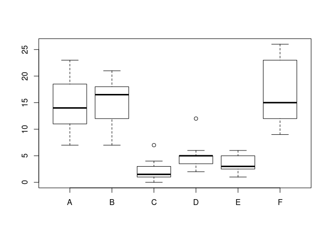
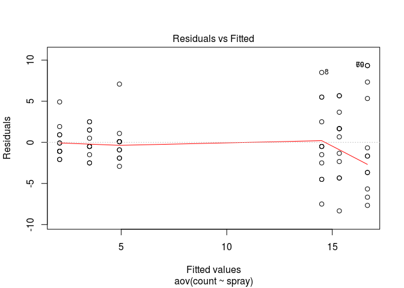
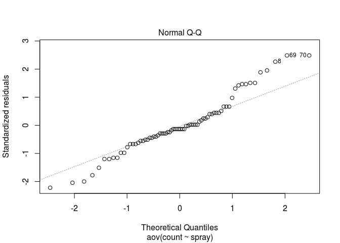
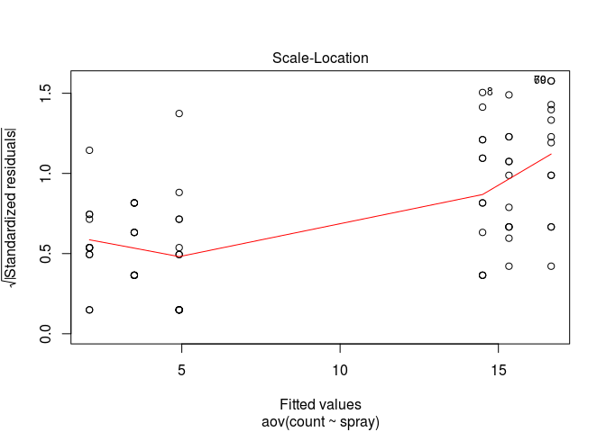
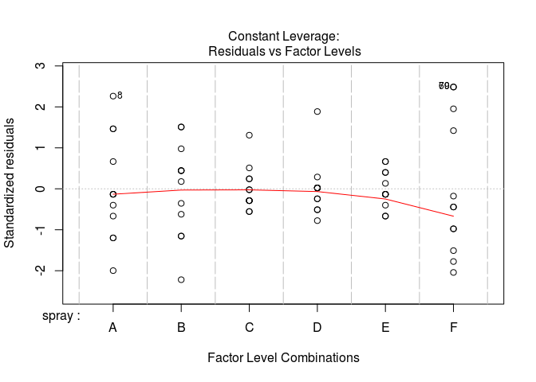
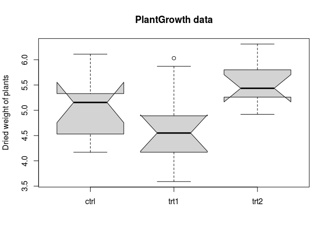

``` r
#rm(list = ls())
attach(InsectSprays)
#detach(InsectSprays)
data(InsectSprays)
str(InsectSprays)
```

    ## 'data.frame':    72 obs. of  2 variables:
    ##  $ count: num  10 7 20 14 14 12 10 23 17 20 ...
    ##  $ spray: Factor w/ 6 levels "A","B","C","D",..: 1 1 1 1 1 1 1 1 1 1 ...

``` r
InsectSprays
```

    ##    count spray
    ## 1     10     A
    ## 2      7     A
    ## 3     20     A
    ## 4     14     A
    ## 5     14     A
    ## 6     12     A
    ## 7     10     A
    ## 8     23     A
    ## 9     17     A
    ## 10    20     A
    ## 11    14     A
    ## 12    13     A
    ## 13    11     B
    ## 14    17     B
    ## 15    21     B
    ## 16    11     B
    ## 17    16     B
    ## 18    14     B
    ## 19    17     B
    ## 20    17     B
    ## 21    19     B
    ## 22    21     B
    ## 23     7     B
    ## 24    13     B
    ## 25     0     C
    ## 26     1     C
    ## 27     7     C
    ## 28     2     C
    ## 29     3     C
    ## 30     1     C
    ## 31     2     C
    ## 32     1     C
    ## 33     3     C
    ## 34     0     C
    ## 35     1     C
    ## 36     4     C
    ## 37     3     D
    ## 38     5     D
    ## 39    12     D
    ## 40     6     D
    ## 41     4     D
    ## 42     3     D
    ## 43     5     D
    ## 44     5     D
    ## 45     5     D
    ## 46     5     D
    ## 47     2     D
    ## 48     4     D
    ## 49     3     E
    ## 50     5     E
    ## 51     3     E
    ## 52     5     E
    ## 53     3     E
    ## 54     6     E
    ## 55     1     E
    ## 56     1     E
    ## 57     3     E
    ## 58     2     E
    ## 59     6     E
    ## 60     4     E
    ## 61    11     F
    ## 62     9     F
    ## 63    15     F
    ## 64    22     F
    ## 65    15     F
    ## 66    16     F
    ## 67    13     F
    ## 68    10     F
    ## 69    26     F
    ## 70    26     F
    ## 71    24     F
    ## 72    13     F

``` r
mean(count[spray=="A"])
```

    ## [1] 14.5

``` r
tapply(count, spray, mean)
```

    ##         A         B         C         D         E         F 
    ## 14.500000 15.333333  2.083333  4.916667  3.500000 16.666667

``` r
tapply(count, spray, var)
```

    ##         A         B         C         D         E         F 
    ## 22.272727 18.242424  3.901515  6.265152  3.000000 38.606061

``` r
tapply(count, spray, length)
```

    ##  A  B  C  D  E  F 
    ## 12 12 12 12 12 12

``` r
boxplot(count ~ spray)
```



``` r
Photoperiod <- ordered(spray, levels = c("F", "B", "C", "D", "E", "A"))
tapply(count, Photoperiod, mean)
```

    ##         F         B         C         D         E         A 
    ## 16.666667 15.333333  2.083333  4.916667  3.500000 14.500000

``` r
oneway.test(count ~ spray)
```

    ## 
    ##  One-way analysis of means (not assuming equal variances)
    ## 
    ## data:  count and spray
    ## F = 36.065, num df = 5.000, denom df = 30.043, p-value = 7.999e-12

``` r
aov.out = aov(count ~ spray, data = InsectSprays)
summary(aov.out)
```

    ##             Df Sum Sq Mean Sq F value Pr(>F)    
    ## spray        5   2669   533.8    34.7 <2e-16 ***
    ## Residuals   66   1015    15.4                   
    ## ---
    ## Signif. codes:  0 '***' 0.001 '**' 0.01 '*' 0.05 '.' 0.1 ' ' 1

``` r
# 사후 검정
TukeyHSD(aov.out)
```

    ##   Tukey multiple comparisons of means
    ##     95% family-wise confidence level
    ## 
    ## Fit: aov(formula = count ~ spray, data = InsectSprays)
    ## 
    ## $spray
    ##            diff        lwr       upr     p adj
    ## B-A   0.8333333  -3.866075  5.532742 0.9951810
    ## C-A -12.4166667 -17.116075 -7.717258 0.0000000
    ## D-A  -9.5833333 -14.282742 -4.883925 0.0000014
    ## E-A -11.0000000 -15.699409 -6.300591 0.0000000
    ## F-A   2.1666667  -2.532742  6.866075 0.7542147
    ## C-B -13.2500000 -17.949409 -8.550591 0.0000000
    ## D-B -10.4166667 -15.116075 -5.717258 0.0000002
    ## E-B -11.8333333 -16.532742 -7.133925 0.0000000
    ## F-B   1.3333333  -3.366075  6.032742 0.9603075
    ## D-C   2.8333333  -1.866075  7.532742 0.4920707
    ## E-C   1.4166667  -3.282742  6.116075 0.9488669
    ## F-C  14.5833333   9.883925 19.282742 0.0000000
    ## E-D  -1.4166667  -6.116075  3.282742 0.9488669
    ## F-D  11.7500000   7.050591 16.449409 0.0000000
    ## F-E  13.1666667   8.467258 17.866075 0.0000000

``` r
# 귀무가설: 두 스프레이 성능에 차이가 없다
# 대립가설: 두 스프레이 성능에 차이가 있다.
```

``` r
summary.lm(aov.out)
```

    ## 
    ## Call:
    ## aov(formula = count ~ spray, data = InsectSprays)
    ## 
    ## Residuals:
    ##    Min     1Q Median     3Q    Max 
    ## -8.333 -1.958 -0.500  1.667  9.333 
    ## 
    ## Coefficients:
    ##             Estimate Std. Error t value Pr(>|t|)    
    ## (Intercept)  14.5000     1.1322  12.807  < 2e-16 ***
    ## sprayB        0.8333     1.6011   0.520    0.604    
    ## sprayC      -12.4167     1.6011  -7.755 7.27e-11 ***
    ## sprayD       -9.5833     1.6011  -5.985 9.82e-08 ***
    ## sprayE      -11.0000     1.6011  -6.870 2.75e-09 ***
    ## sprayF        2.1667     1.6011   1.353    0.181    
    ## ---
    ## Signif. codes:  0 '***' 0.001 '**' 0.01 '*' 0.05 '.' 0.1 ' ' 1
    ## 
    ## Residual standard error: 3.922 on 66 degrees of freedom
    ## Multiple R-squared:  0.7244, Adjusted R-squared:  0.7036 
    ## F-statistic:  34.7 on 5 and 66 DF,  p-value: < 2.2e-16

``` r
plot(aov.out)
```



``` r
bartlett.test(count ~ spray, data = InsectSprays)
```

    ## 
    ##  Bartlett test of homogeneity of variances
    ## 
    ## data:  count by spray
    ## Bartlett's K-squared = 25.96, df = 5, p-value = 9.085e-05

``` r
# 등분산성 검정의 하나
# 귀무가설: 종속변수의 분산은 모든 집단에서 서로 같다
# 대립가설: 종속변수의 분산은 모든 집단에서 서로 같지 않다.
# 
```

``` r
# 비모수적 방법(anova test와 반대)
kruskal.test(count ~ spray, data = InsectSprays)
```

    ## 
    ##  Kruskal-Wallis rank sum test
    ## 
    ## data:  count by spray
    ## Kruskal-Wallis chi-squared = 54.691, df = 5, p-value = 1.511e-10

``` r
# 대립가설: 스프레이간의 성능차이가 있다.
```

``` r
### 분산 분석
str(PlantGrowth)
```

    ## 'data.frame':    30 obs. of  2 variables:
    ##  $ weight: num  4.17 5.58 5.18 6.11 4.5 4.61 5.17 4.53 5.33 5.14 ...
    ##  $ group : Factor w/ 3 levels "ctrl","trt1",..: 1 1 1 1 1 1 1 1 1 1 ...

``` r
PlantGrowth
```

    ##    weight group
    ## 1    4.17  ctrl
    ## 2    5.58  ctrl
    ## 3    5.18  ctrl
    ## 4    6.11  ctrl
    ## 5    4.50  ctrl
    ## 6    4.61  ctrl
    ## 7    5.17  ctrl
    ## 8    4.53  ctrl
    ## 9    5.33  ctrl
    ## 10   5.14  ctrl
    ## 11   4.81  trt1
    ## 12   4.17  trt1
    ## 13   4.41  trt1
    ## 14   3.59  trt1
    ## 15   5.87  trt1
    ## 16   3.83  trt1
    ## 17   6.03  trt1
    ## 18   4.89  trt1
    ## 19   4.32  trt1
    ## 20   4.69  trt1
    ## 21   6.31  trt2
    ## 22   5.12  trt2
    ## 23   5.54  trt2
    ## 24   5.50  trt2
    ## 25   5.37  trt2
    ## 26   5.29  trt2
    ## 27   4.92  trt2
    ## 28   6.15  trt2
    ## 29   5.80  trt2
    ## 30   5.26  trt2

``` r
####### 원 데이터 csv로 출력 #############
write.table(PlantGrowth, "/home/jw/aov.csv")

# 일원배치 분산분석 (oneway Analysis Of Variance : ANOVA)
# ->여러 독립표본 평균을 비교할 때 사용한다.

# 분산분석에서 귀무가설은 다음과 같다.
# H0 : 모든 집단의 평균은 다 같다.
# 
# 따라서, 대립가설은 다음과 같이 된다.
# H1 : 집단의 평균이 다 같지는 않다(집단 중 적어도 어느 하나의 평균이 다르다)

############ 등분산성(동질성) 검정 #####################
bartlett.test(weight ~ group, data = PlantGrowth)  # p-value = 0.2371
```

    ## 
    ##  Bartlett test of homogeneity of variances
    ## 
    ## data:  weight by group
    ## Bartlett's K-squared = 2.8786, df = 2, p-value = 0.2371

``` r
with(PlantGrowth, var.test(weight, group))  # p-value = 0.3675
```

    ## Warning in var(y): Calling var(x) on a factor x is deprecated and will become an error.
    ##   Use something like 'all(duplicated(x)[-1L])' to test for a constant vector.

    ## 
    ##  F test to compare two variances
    ## 
    ## data:  weight and group
    ## F = 0.71292, num df = 29, denom df = 29, p-value = 0.3675
    ## alternative hypothesis: true ratio of variances is not equal to 1
    ## 95 percent confidence interval:
    ##  0.3393255 1.4978451
    ## sample estimates:
    ## ratio of variances 
    ##          0.7129215

``` r
attach(PlantGrowth); var.test(weight, group)
```

    ## Warning in var(y): Calling var(x) on a factor x is deprecated and will become an error.
    ##   Use something like 'all(duplicated(x)[-1L])' to test for a constant vector.

    ## 
    ##  F test to compare two variances
    ## 
    ## data:  weight and group
    ## F = 0.71292, num df = 29, denom df = 29, p-value = 0.3675
    ## alternative hypothesis: true ratio of variances is not equal to 1
    ## 95 percent confidence interval:
    ##  0.3393255 1.4978451
    ## sample estimates:
    ## ratio of variances 
    ##          0.7129215

``` r
# 귀무가설인 '종속변수의 분산은 모든 집단에서 서로 같다'를 기각하지 못한다
# 즉, 등분산성을 만족한다

######### 집단 간 평균 비교 ###############
#tapply(group, weight, mean)
tapply(weight, group, mean)
```

    ##  ctrl  trt1  trt2 
    ## 5.032 4.661 5.526

``` r
#  ctrl  trt1  trt2 
#  5.032 4.661 5.526 

boxplot(weight ~ group, data = PlantGrowth, main = "PlantGrowth data",
        ylab = "Dried weight of plants", col = "lightgray",
        notch = TRUE, varwidth = TRUE)
```

    ## Warning in bxp(structure(list(stats = structure(c(4.17, 4.53, 5.155,
    ## 5.33, : some notches went outside hinges ('box'): maybe set notch=FALSE



``` r
######## 검정하기 #####
# 방법1
oneway.test(weight ~ group, data = PlantGrowth)
```

    ## 
    ##  One-way analysis of means (not assuming equal variances)
    ## 
    ## data:  weight and group
    ## F = 5.181, num df = 2.000, denom df = 17.128, p-value = 0.01739

``` r
  # p-value = 0.01739 
  # 투여한 약의 종류가 식물의 무게에 영향을 끼친다.

# 방법2
aov.out1 = aov(weight ~ group, data = PlantGrowth)
summary(aov.out1)
```

    ##             Df Sum Sq Mean Sq F value Pr(>F)  
    ## group        2  3.766  1.8832   4.846 0.0159 *
    ## Residuals   27 10.492  0.3886                 
    ## ---
    ## Signif. codes:  0 '***' 0.001 '**' 0.01 '*' 0.05 '.' 0.1 ' ' 1

``` r
# group p-value 0.0159

summary.lm(aov.out1)
```

    ## 
    ## Call:
    ## aov(formula = weight ~ group, data = PlantGrowth)
    ## 
    ## Residuals:
    ##     Min      1Q  Median      3Q     Max 
    ## -1.0710 -0.4180 -0.0060  0.2627  1.3690 
    ## 
    ## Coefficients:
    ##             Estimate Std. Error t value Pr(>|t|)    
    ## (Intercept)   5.0320     0.1971  25.527   <2e-16 ***
    ## grouptrt1    -0.3710     0.2788  -1.331   0.1944    
    ## grouptrt2     0.4940     0.2788   1.772   0.0877 .  
    ## ---
    ## Signif. codes:  0 '***' 0.001 '**' 0.01 '*' 0.05 '.' 0.1 ' ' 1
    ## 
    ## Residual standard error: 0.6234 on 27 degrees of freedom
    ## Multiple R-squared:  0.2641, Adjusted R-squared:  0.2096 
    ## F-statistic: 4.846 on 2 and 27 DF,  p-value: 0.01591

``` r
# p-value
# grouptrt1   0.1944    
# grouptrt2   0.0877 .
# Adjusted R-squared:  0.2096 

anova(lm(weight ~ group, data = PlantGrowth))
```

    ## Analysis of Variance Table
    ## 
    ## Response: weight
    ##           Df  Sum Sq Mean Sq F value  Pr(>F)  
    ## group      2  3.7663  1.8832  4.8461 0.01591 *
    ## Residuals 27 10.4921  0.3886                  
    ## ---
    ## Signif. codes:  0 '***' 0.001 '**' 0.01 '*' 0.05 '.' 0.1 ' ' 1

``` r
# group p-value 0.0159
```
