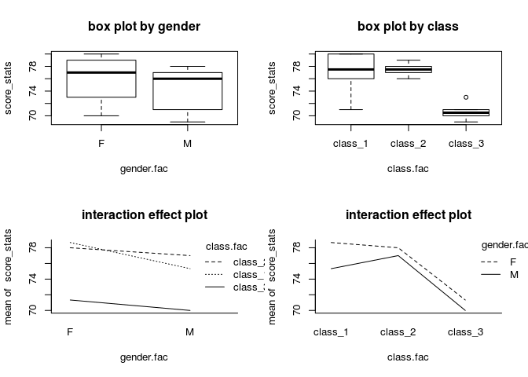
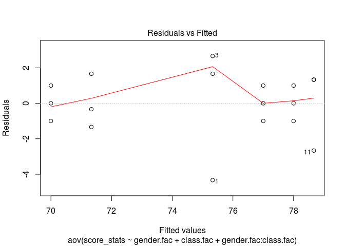
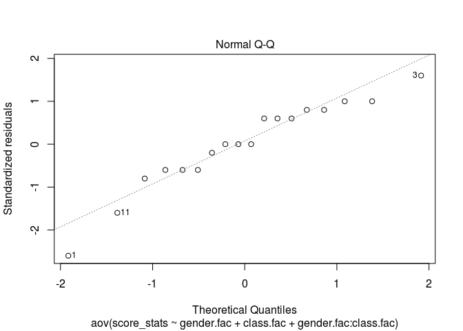
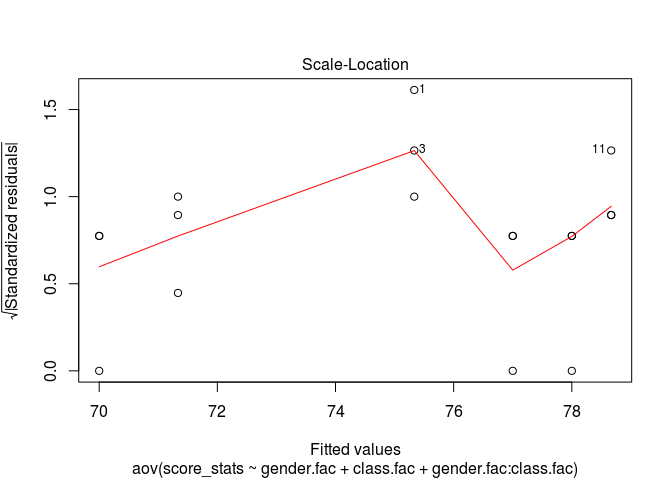
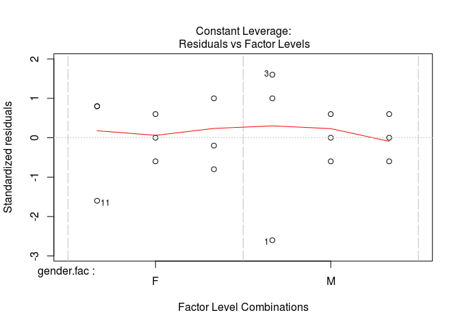

``` r
# 이원배치 분산분석
```

``` r
gender.fac <- as.factor(c(rep("M", 9), rep("F", 9)))
class <- c("class_1", "class_1", "class_1", "class_2", "class_2", "class_2", "class_3", "class_3", "class_3")
class.fac <- as.factor(c(rep(class, 2)))
score_stats <- c(71, 77, 78, 76, 77, 78, 71, 70, 69, 80, 76, 80, 79, 78, 77, 73, 71, 70)
```

``` r
# 테이블
score.df <- data.frame(gender.fac, class.fac, score_stats)
score.df
```

    ##    gender.fac class.fac score_stats
    ## 1           M   class_1          71
    ## 2           M   class_1          77
    ## 3           M   class_1          78
    ## 4           M   class_2          76
    ## 5           M   class_2          77
    ## 6           M   class_2          78
    ## 7           M   class_3          71
    ## 8           M   class_3          70
    ## 9           M   class_3          69
    ## 10          F   class_1          80
    ## 11          F   class_1          76
    ## 12          F   class_1          80
    ## 13          F   class_2          79
    ## 14          F   class_2          78
    ## 15          F   class_2          77
    ## 16          F   class_3          73
    ## 17          F   class_3          71
    ## 18          F   class_3          70

``` r
write.table(score.df, "/home/jw/twowayanova.csv")
```

``` r
install.packages("doBy", repos="http://cran.nexr.com/")
```

    ## Installing package into '/home/jw/R/x86_64-pc-linux-gnu-library/3.3'
    ## (as 'lib' is unspecified)

``` r
library(doBy)
```

``` r
summaryBy(score_stats ~ gender.fac, data = score.df, FUN = c(mean, sd, min, max))
```

    ##   gender.fac score_stats.mean score_stats.sd score_stats.min
    ## 1          F         76.00000       3.807887              70
    ## 2          M         74.11111       3.756476              69
    ##   score_stats.max
    ## 1              80
    ## 2              78

``` r
summaryBy(score_stats ~ class.fac, data = score.df, FUN = c(mean, sd, min, max))
```

    ##   class.fac score_stats.mean score_stats.sd score_stats.min
    ## 1   class_1         77.00000       3.346640              71
    ## 2   class_2         77.50000       1.048809              76
    ## 3   class_3         70.66667       1.366260              69
    ##   score_stats.max
    ## 1              80
    ## 2              79
    ## 3              73

``` r
summary(score_stats, data = score.df)
```

    ##    Min. 1st Qu.  Median    Mean 3rd Qu.    Max. 
    ##   69.00   71.00   76.50   75.06   78.00   80.00

``` r
par(mfrow = c(2, 2))
plot(score_stats ~ gender.fac, main = "box plot by gender")
plot(score_stats ~ class.fac, main = "box plot by class")
interaction.plot(gender.fac, class.fac, score_stats, bty = 'l', main = "interaction effect plot")
interaction.plot(class.fac, gender.fac, score_stats, bty = 'l', main = "interaction effect plot")
```



``` r
# two-way ANOVA : aov() # replicates, interaction effect
aov_model = aov(score_stats ~ gender.fac + class.fac + gender.fac:class.fac)
summary(aov_model)
```

    ##                      Df Sum Sq Mean Sq F value   Pr(>F)    
    ## gender.fac            1  16.06   16.06   3.853 0.073249 .  
    ## class.fac             2 174.11   87.06  20.893 0.000123 ***
    ## gender.fac:class.fac  2   4.78    2.39   0.573 0.578354    
    ## Residuals            12  50.00    4.17                     
    ## ---
    ## Signif. codes:  0 '***' 0.001 '**' 0.01 '*' 0.05 '.' 0.1 ' ' 1

``` r
TukeyHSD(aov_model)
```

    ##   Tukey multiple comparisons of means
    ##     95% family-wise confidence level
    ## 
    ## Fit: aov(formula = score_stats ~ gender.fac + class.fac + gender.fac:class.fac)
    ## 
    ## $gender.fac
    ##          diff       lwr       upr    p adj
    ## M-F -1.888889 -3.985452 0.2076747 0.073249
    ## 
    ## $class.fac
    ##                      diff       lwr       upr     p adj
    ## class_2-class_1  0.500000 -2.644107  3.644107 0.9063000
    ## class_3-class_1 -6.333333 -9.477441 -3.189226 0.0004531
    ## class_3-class_2 -6.833333 -9.977441 -3.689226 0.0002319
    ## 
    ## $`gender.fac:class.fac`
    ##                           diff        lwr         upr     p adj
    ## M:class_1-F:class_1 -3.3333333  -8.931535  2.26486811 0.3954897
    ## F:class_2-F:class_1 -0.6666667  -6.264868  4.93153478 0.9983200
    ## M:class_2-F:class_1 -1.6666667  -7.264868  3.93153478 0.9092666
    ## F:class_3-F:class_1 -7.3333333 -12.931535 -1.73513189 0.0086645
    ## M:class_3-F:class_1 -8.6666667 -14.264868 -3.06846522 0.0023477
    ## F:class_2-M:class_1  2.6666667  -2.931535  8.26486811 0.6134387
    ## M:class_2-M:class_1  1.6666667  -3.931535  7.26486811 0.9092666
    ## F:class_3-M:class_1 -4.0000000  -9.598201  1.59820145 0.2299981
    ## M:class_3-M:class_1 -5.3333333 -10.931535  0.26486811 0.0651685
    ## M:class_2-F:class_2 -1.0000000  -6.598201  4.59820145 0.9890142
    ## F:class_3-F:class_2 -6.6666667 -12.264868 -1.06846522 0.0169558
    ## M:class_3-F:class_2 -8.0000000 -13.598201 -2.40179855 0.0044764
    ## F:class_3-M:class_2 -5.6666667 -11.264868 -0.06846522 0.0466729
    ## M:class_3-M:class_2 -7.0000000 -12.598201 -1.40179855 0.0121083
    ## M:class_3-F:class_3 -1.3333333  -6.931535  4.26486811 0.9620999

``` r
plot(aov_model)
```



``` r
# duncan으로 사후 분석하기
install.packages("agricolae", repos="http://cran.nexr.com/")
```

    ## Installing package into '/home/jw/R/x86_64-pc-linux-gnu-library/3.3'
    ## (as 'lib' is unspecified)

``` r
library(agricolae)
duncan.test(aov_model, "group", alpha = 0.05, console = TRUE)
```

    ## Name:  group 
    ##  gender.fac class.fac

``` r
install.packages("laercio", repos="http://cran.nexr.com/")
```

    ## Installing package into '/home/jw/R/x86_64-pc-linux-gnu-library/3.3'
    ## (as 'lib' is unspecified)

``` r
library(laercio)
n <- rep(10, 3)
group <- rep(1:3, n)
y1 <- c(50.5, 52.1, 51.9, 52.4, 50.6, 51.4, 51.2, 52.2, 51.5, 50.8)
y2 <- c(47.5, 47.7, 46.6, 47.1, 47.2, 47.8, 45.2, 47.4, 45.0, 47.9)
y3 <- c(46.0, 47.1, 45.6, 47.1, 47.2, 46.4, 45.9, 47.1, 44.9, 46.2)
y <- c(y1, y2, y3) 


group_df <- data.frame(y, group)
aov_model <- aov(y ~ group, data = group_df)
LDuncan(aov_model, "group")
```

    ## 
    ##  DUNCAN TEST TO COMPARE MEANS 
    ##  
    ##  Confidence Level:  0.95 
    ##  Dependent Variable:  y
    ##  Variation Coefficient:  2.631346 % 
    ##  
    ## 
    ##  Independent Variable:  group 
    ##   Factors Means   
    ##   1       51.46 a 
    ##   2       46.94  b
    ##   3       46.35  b
