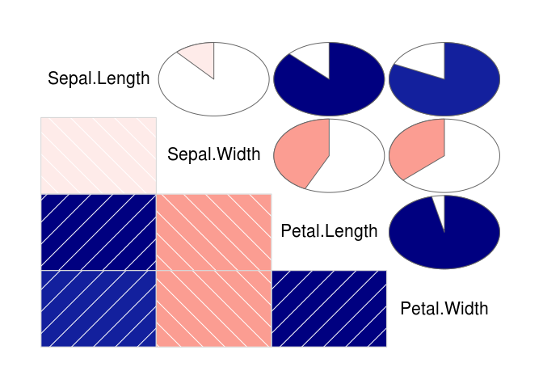

Pearson의 상관계수: 보통의 상관관계계수 (연속형 변수) Spearman의 순위상관계수: 두 값의 순위를 이용해 계산 (이산형 자료) Kendall: 부합쌍 / 비부합쌍의 비율

상관분석의 가정 -선형성 -등분산성 -정규성 -독립성

``` r
cor.test(1:5, 2:6)
```

    ## 
    ##  Pearson's product-moment correlation
    ## 
    ## data:  1:5 and 2:6
    ## t = 82191000, df = 3, p-value < 2.2e-16
    ## alternative hypothesis: true correlation is not equal to 0
    ## 95 percent confidence interval:
    ##  1 1
    ## sample estimates:
    ## cor 
    ##   1

``` r
plot(1:5, 2:6)
```


``` r
cor.test(1:5, c(3,3,3,3,3))
```

    ## Warning in cor(x, y): the standard deviation is zero

    ## 
    ##  Pearson's product-moment correlation
    ## 
    ## data:  1:5 and c(3, 3, 3, 3, 3)
    ## t = NA, df = 3, p-value = NA
    ## alternative hypothesis: true correlation is not equal to 0
    ## 95 percent confidence interval:
    ##  NA NA
    ## sample estimates:
    ## cor 
    ##  NA

``` r
plot(1:5, 5:1)
```


``` r
cor.test(1:5, 5:1)
```

    ## 
    ##  Pearson's product-moment correlation
    ## 
    ## data:  1:5 and 5:1
    ## t = -82191000, df = 3, p-value < 2.2e-16
    ## alternative hypothesis: true correlation is not equal to 0
    ## 95 percent confidence interval:
    ##  -1 -1
    ## sample estimates:
    ## cor 
    ##  -1

``` r
# 상관분석의 그래프 분석
str(airquality)
```

    ## 'data.frame':    153 obs. of  6 variables:
    ##  $ Ozone  : int  41 36 12 18 NA 28 23 19 8 NA ...
    ##  $ Solar.R: int  190 118 149 313 NA NA 299 99 19 194 ...
    ##  $ Wind   : num  7.4 8 12.6 11.5 14.3 14.9 8.6 13.8 20.1 8.6 ...
    ##  $ Temp   : int  67 72 74 62 56 66 65 59 61 69 ...
    ##  $ Month  : int  5 5 5 5 5 5 5 5 5 5 ...
    ##  $ Day    : int  1 2 3 4 5 6 7 8 9 10 ...

``` r
airquality_1 <- airquality[ , c(1:4)]
sum(is.na(airquality_1$Ozone))
```

    ## [1] 37

``` r
cor(airquality_1)
```

    ##         Ozone Solar.R       Wind       Temp
    ## Ozone       1      NA         NA         NA
    ## Solar.R    NA       1         NA         NA
    ## Wind       NA      NA  1.0000000 -0.4579879
    ## Temp       NA      NA -0.4579879  1.0000000

``` r
airquality_2 <- na.omit(airquality_1)
(airquality_cor <- cor(airquality_2))
```

    ##              Ozone    Solar.R       Wind       Temp
    ## Ozone    1.0000000  0.3483417 -0.6124966  0.6985414
    ## Solar.R  0.3483417  1.0000000 -0.1271835  0.2940876
    ## Wind    -0.6124966 -0.1271835  1.0000000 -0.4971897
    ## Temp     0.6985414  0.2940876 -0.4971897  1.0000000

``` r
install.packages("corrplot", repos="http://cran.nexr.com/")
```

    ## Installing package into '/home/jw/R/x86_64-pc-linux-gnu-library/3.3'
    ## (as 'lib' is unspecified)

``` r
library(corrplot)
plot(airquality_2)
```


``` r
corrplot(airquality_cor, method = "circle")
```


``` r
corrplot(airquality_cor, method = "square")
```


``` r
corrplot(airquality_cor, method = "ellipse") # 가장 보기 좋음
```


``` r
corrplot(airquality_cor, method = "number")
```


``` r
corrplot(airquality_cor, method = "shade")
```


``` r
corrplot(airquality_cor, method = "pie")
```


``` r
install.packages("eiwild", repos="http://cran.nexr.com/")
```

    ## Installing package into '/home/jw/R/x86_64-pc-linux-gnu-library/3.3'
    ## (as 'lib' is unspecified)

``` r
library(eiwild)
data(topleveldat)
```

``` r
form <- cbind(CSU_2, SPD_2, LINK_2, GRUN_2) ~ cbind(CSU_1, SPD_1, Link_1)
set.seed(1234)
out1 <- indAggEi(form=form, aggr=aggr, indi=indi, IDCols=c("ID","ID"),
               sample=1000, thinning=2, burnin=100, verbose=100)
```

    ## Burnin start
    ## Burnin finished
    ## 100 von 1000
    ## 200 von 1000
    ## 300 von 1000
    ## 400 von 1000
    ## 500 von 1000
    ## 600 von 1000
    ## 700 von 1000
    ## 800 von 1000
    ## 900 von 1000
    ## 1000 von 1000

``` r
out2 <- indAggEi(form=form, aggr=aggr, indi=indi, IDCols=c("ID","ID"),
                 sample=1000, thinning=2, burnin=100, verbose=100)
```

    ## Burnin start
    ## Burnin finished
    ## 100 von 1000
    ## 200 von 1000
    ## 300 von 1000
    ## 400 von 1000
    ## 500 von 1000
    ## 600 von 1000
    ## 700 von 1000
    ## 800 von 1000
    ## 900 von 1000
    ## 1000 von 1000

``` r
out3 <- indAggEi(form=form, aggr=aggr, indi=indi, IDCols=c("ID","ID"),
                 sample=1000, thinning=2, burnin=100, verbose=100)
```

    ## Burnin start
    ## Burnin finished
    ## 100 von 1000
    ## 200 von 1000
    ## 300 von 1000
    ## 400 von 1000
    ## 500 von 1000
    ## 600 von 1000
    ## 700 von 1000
    ## 800 von 1000
    ## 900 von 1000
    ## 1000 von 1000

``` r
out4 <- indAggEi(form=form, aggr=aggr, indi=indi, IDCols=c("ID","ID"),
                 sample=1000, thinning=2, burnin=100, verbose=100)
```

    ## Burnin start
    ## Burnin finished
    ## 100 von 1000
    ## 200 von 1000
    ## 300 von 1000
    ## 400 von 1000
    ## 500 von 1000
    ## 600 von 1000
    ## 700 von 1000
    ## 800 von 1000
    ## 900 von 1000
    ## 1000 von 1000

``` r
eiList <- list(out1, out2, out3, out4)

comPlot(eiList, whichCell=1, whichPlot=1)
comPlot(eiList, whichCell="counts.CSU_1.CSU_2", whichPlot=1)
comPlot(eiList, whichCell=1, whichPlot=1, smooth=TRUE)
```


``` r
comPlot(eiList, whichCell=1, whichPlot=2)
```


``` r
comPlot(eiList, whichCell=1, whichPlot=3)
```


``` r
comPlot(eiList, whichCell=1, whichPlot=4)
comPlot(eiList, whichCell=1, whichPlot=4)
```


``` r
comPlot(eiList, 1, 3, whichParam="alphaDraws")
comPlot(eiList, "alpha.CSU_1.CSU_2", 3, whichParam="alphaDraws")
```


``` r
#cor(iris[ , 1:4]) # pearson 방법
cor(iris[ , 1:4], method = 'pearson')
```

    ##              Sepal.Length Sepal.Width Petal.Length Petal.Width
    ## Sepal.Length    1.0000000  -0.1175698    0.8717538   0.8179411
    ## Sepal.Width    -0.1175698   1.0000000   -0.4284401  -0.3661259
    ## Petal.Length    0.8717538  -0.4284401    1.0000000   0.9628654
    ## Petal.Width     0.8179411  -0.3661259    0.9628654   1.0000000

``` r
cor(iris[ , 1:4], method = 'spearman')
```

    ##              Sepal.Length Sepal.Width Petal.Length Petal.Width
    ## Sepal.Length    1.0000000  -0.1667777    0.8818981   0.8342888
    ## Sepal.Width    -0.1667777   1.0000000   -0.3096351  -0.2890317
    ## Petal.Length    0.8818981  -0.3096351    1.0000000   0.9376668
    ## Petal.Width     0.8342888  -0.2890317    0.9376668   1.0000000

``` r
cor(iris[ , 1:4], method = 'kendall')
```

    ##              Sepal.Length Sepal.Width Petal.Length Petal.Width
    ## Sepal.Length   1.00000000 -0.07699679    0.7185159   0.6553086
    ## Sepal.Width   -0.07699679  1.00000000   -0.1859944  -0.1571257
    ## Petal.Length   0.71851593 -0.18599442    1.0000000   0.8068907
    ## Petal.Width    0.65530856 -0.15712566    0.8068907   1.0000000

``` r
corrplot(cor(iris[ , 1:4]), method = 'ellipse')
```


``` r
symnum(cor(iris[ , 1:4]))
```

    ##              S.L S.W P.L P.W
    ## Sepal.Length 1              
    ## Sepal.Width      1          
    ## Petal.Length +   .   1      
    ## Petal.Width  +   .   B   1  
    ## attr(,"legend")
    ## [1] 0 ' ' 0.3 '.' 0.6 ',' 0.8 '+' 0.9 '*' 0.95 'B' 1

``` r
# B가 제일 큰 상관관계를 보이는 것
```

``` r
install.packages('corrgram', repos="http://cran.nexr.com/")
```

    ## Installing package into '/home/jw/R/x86_64-pc-linux-gnu-library/3.3'
    ## (as 'lib' is unspecified)

``` r
library(corrgram)
corrgram(iris, upper.pane = panel.conf)
```


``` r
corrgram(iris, upper.pane = panel.pie)
```



``` r
corrgram(iris, upper.pane = panel.shade)
```


``` r
corrgram(iris, upper.pane = panel.bar)
```


``` r
corrgram(iris, upper.pane = panel.cor)
```


``` r
corrgram(iris, upper.pane = panel.ellipse)
```


``` r
corrgram(iris, upper.pane = panel.pts)
```


``` r
cor.test(c(1, 2, 3, 4, 5), c(1, 0, 3, 4, 5), method = 'pearson')
```

    ## 
    ##  Pearson's product-moment correlation
    ## 
    ## data:  c(1, 2, 3, 4, 5) and c(1, 0, 3, 4, 5)
    ## t = 3.9279, df = 3, p-value = 0.02937
    ## alternative hypothesis: true correlation is not equal to 0
    ## 95 percent confidence interval:
    ##  0.1697938 0.9944622
    ## sample estimates:
    ##       cor 
    ## 0.9149914

``` r
cor.test(c(1, 2, 3, 4, 5), c(1, 0, 3, 4, 5), method = 'spearman')
```

    ## 
    ##  Spearman's rank correlation rho
    ## 
    ## data:  c(1, 2, 3, 4, 5) and c(1, 0, 3, 4, 5)
    ## S = 2, p-value = 0.08333
    ## alternative hypothesis: true rho is not equal to 0
    ## sample estimates:
    ## rho 
    ## 0.9

``` r
cor.test(c(1, 2, 3, 4, 5), c(1, 0, 3, 4, 5), method = 'kendall')
```

    ## 
    ##  Kendall's rank correlation tau
    ## 
    ## data:  c(1, 2, 3, 4, 5) and c(1, 0, 3, 4, 5)
    ## T = 9, p-value = 0.08333
    ## alternative hypothesis: true tau is not equal to 0
    ## sample estimates:
    ## tau 
    ## 0.8
