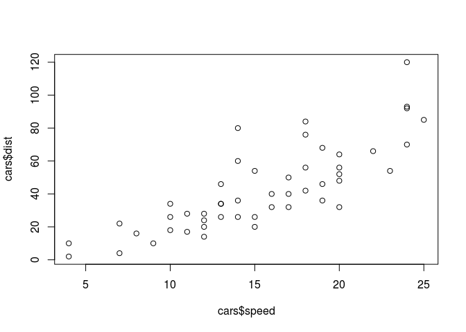
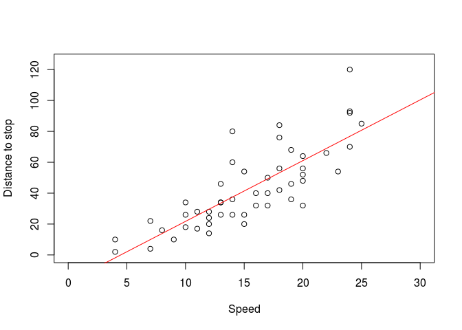
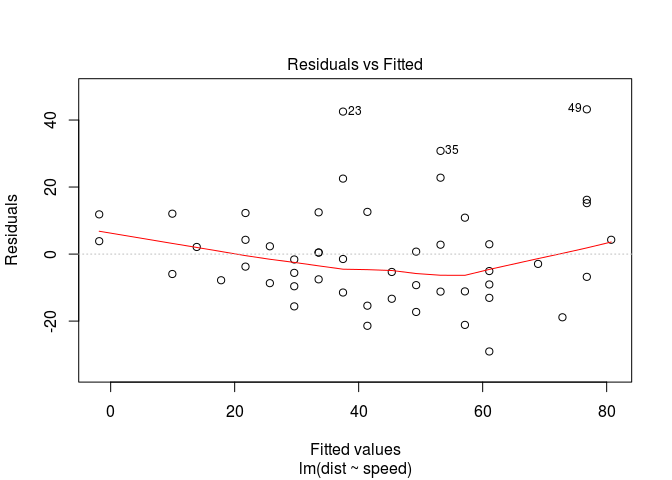
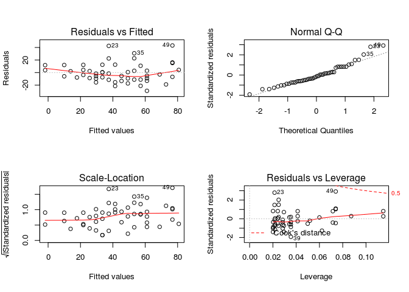

``` r
summary(cars)
```

    ##      speed           dist       
    ##  Min.   : 4.0   Min.   :  2.00  
    ##  1st Qu.:12.0   1st Qu.: 26.00  
    ##  Median :15.0   Median : 36.00  
    ##  Mean   :15.4   Mean   : 42.98  
    ##  3rd Qu.:19.0   3rd Qu.: 56.00  
    ##  Max.   :25.0   Max.   :120.00

``` r
plot(cars$speed, cars$dist)
```



``` r
res.lm <- lm(dist ~ speed, data = cars)
summary(res.lm)
```

    ## 
    ## Call:
    ## lm(formula = dist ~ speed, data = cars)
    ## 
    ## Residuals:
    ##     Min      1Q  Median      3Q     Max 
    ## -29.069  -9.525  -2.272   9.215  43.201 
    ## 
    ## Coefficients:
    ##             Estimate Std. Error t value Pr(>|t|)    
    ## (Intercept) -17.5791     6.7584  -2.601   0.0123 *  
    ## speed         3.9324     0.4155   9.464 1.49e-12 ***
    ## ---
    ## Signif. codes:  0 '***' 0.001 '**' 0.01 '*' 0.05 '.' 0.1 ' ' 1
    ## 
    ## Residual standard error: 15.38 on 48 degrees of freedom
    ## Multiple R-squared:  0.6511, Adjusted R-squared:  0.6438 
    ## F-statistic: 89.57 on 1 and 48 DF,  p-value: 1.49e-12

``` r
coef(res.lm)
```

    ## (Intercept)       speed 
    ##  -17.579095    3.932409

``` r
plot(cars$speed, cars$dist, xlab = "Speed", ylab = "Distance to stop", xlim = c(0, 30), ylim = c(0, 125))
abline(coef(res.lm), col = 2)
```



``` r
# 관측치 = 적합된 값 + 잔차

# 회귀식으로부터 얻어진 적합된 값
fitted(res.lm)[1:4]
```

    ##         1         2         3         4 
    ## -1.849460 -1.849460  9.947766  9.947766

``` r
# 잔차를 구하는 함수
residuals(res.lm)[1:4]
```

    ##         1         2         3         4 
    ##  3.849460 11.849460 -5.947766 12.052234

``` r
# 잔차 제곱을 구하는 함수
deviance(res.lm)
```

    ## [1] 11353.52

``` r
# 잔차 그래프
plot(res.lm, which = 1)
```



``` r
## 점들이 패턴없이 무작위로 퍼져 있어야 좋은 적합
```

``` r
install.packages('lmtest', repos="http://cran.nexr.com/")
```

    ## Installing package into '/home/jw/R/x86_64-pc-linux-gnu-library/3.3'
    ## (as 'lib' is unspecified)

``` r
library(lmtest)
```

    ## Loading required package: zoo

    ## 
    ## Attaching package: 'zoo'

    ## The following objects are masked from 'package:base':
    ## 
    ##     as.Date, as.Date.numeric

``` r
dwtest(res.lm)
```

    ## 
    ##  Durbin-Watson test
    ## 
    ## data:  res.lm
    ## DW = 1.6762, p-value = 0.09522
    ## alternative hypothesis: true autocorrelation is greater than 0

``` r
# 결과: p-value < 0.05일 때 자기상관이 유의미성을 가지게 됨
```

``` r
# 선형 모델을 사용한 예측
# predict(Generic Function)
# 내부적으로 호출되는 함수
# predict.lm
# predict.glm
# predict.nls

# 점추정
predict(res.lm, newdata = data.frame(speed = 3))
```

    ##         1 
    ## -5.781869

``` r
# 구간추정
predict(res.lm, newdata = data.frame(speed = 3), interval = 'confidence')
```

    ##         fit       lwr      upr
    ## 1 -5.781869 -17.02659 5.462853

``` r
# 특정 속도를 가진 경우의 차량인 경우, 오차항을 고려해 추정
predict(res.lm, newdata = data.frame(speed = 3), interval = 'prediction')
```

    ##         fit       lwr      upr
    ## 1 -5.781869 -38.68565 27.12192

``` r
par(mfrow = c(2, 2))
plot(res.lm)
```



``` r
# Residuals vs Fitted: 수평일 때 최적

# Scale - Location: x축=선형회귀 예측값, y축=표준화 잔차

# Residuals vs Leverage: Leverage는 설명변수(독립변수)가 얼마나 극단에 치우쳐 있는가를 보여줌
```
