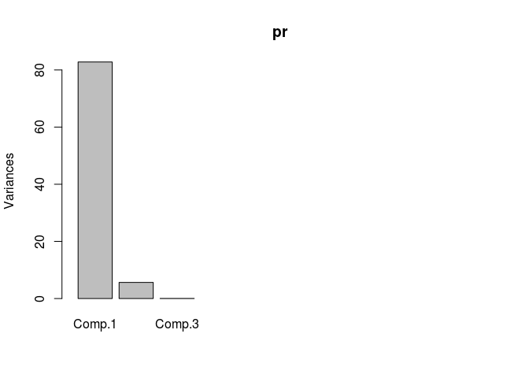
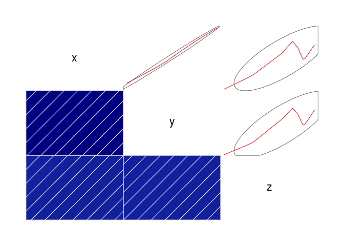
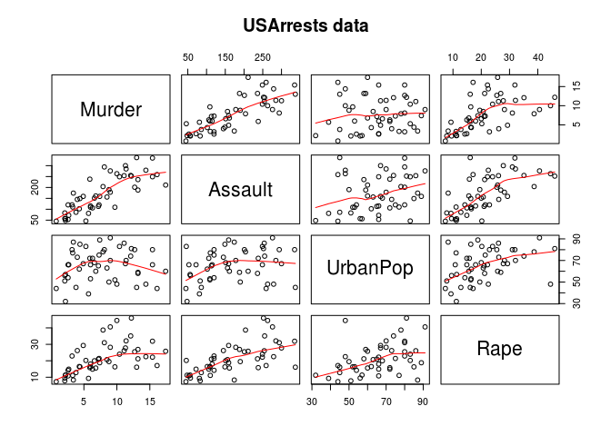
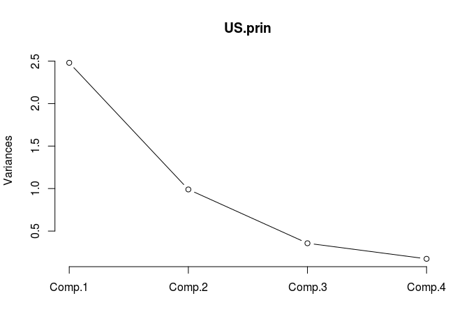
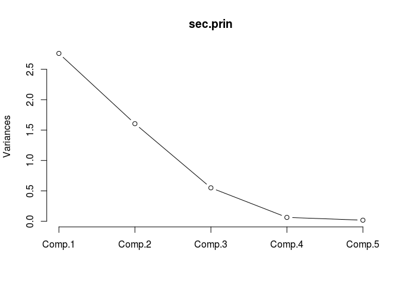
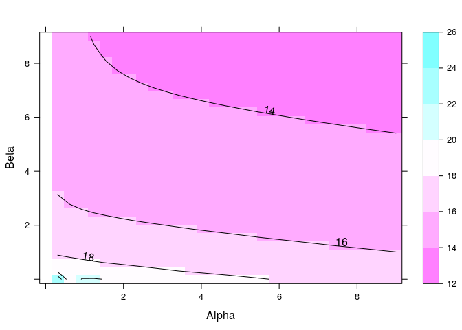
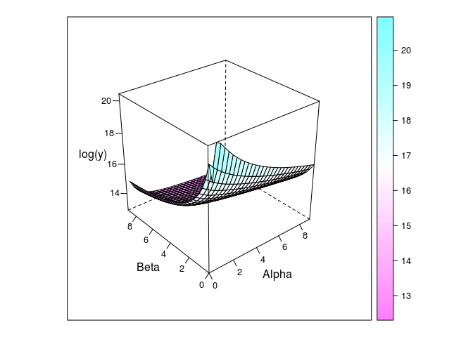
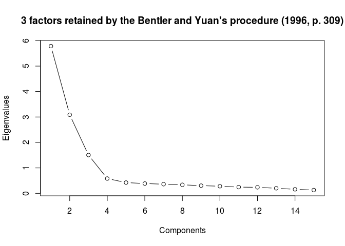

``` r
# 주성분 분석의 원리
x <- 1:10
y <- x + runif(10, min = -0.5, max = 0.5)
z <- x + y + runif(10, min = -10, max = 10)

(data <- data.frame(x, y, z))
```

    ##     x         y         z
    ## 1   1  1.445945 -6.165913
    ## 2   2  1.569201  2.381787
    ## 3   3  2.808175  1.106330
    ## 4   4  4.389840 17.782296
    ## 5   5  5.197641 17.860681
    ## 6   6  6.095026 10.914363
    ## 7   7  6.888832 15.659764
    ## 8   8  8.074685 20.568692
    ## 9   9  8.826212 14.032655
    ## 10 10 10.116529 17.171280

``` r
pr <- princomp(data)
summary(pr)
```

    ## Importance of components:
    ##                           Comp.1     Comp.2       Comp.3
    ## Standard deviation     9.0984610 2.37441715 0.1772974890
    ## Proportion of Variance 0.9359049 0.06373968 0.0003553866
    ## Cumulative Proportion  0.9359049 0.99964461 1.0000000000

``` r
screeplot(pr , type = c("barplot", "lines"), max(10, length(pr)))
```



``` r
cor.test(x, y)
```

    ## 
    ##  Pearson's product-moment correlation
    ## 
    ## data:  x and y
    ## t = 31.352, df = 8, p-value = 1.165e-09
    ## alternative hypothesis: true correlation is not equal to 0
    ## 95 percent confidence interval:
    ##  0.9823252 0.9990793
    ## sample estimates:
    ##       cor 
    ## 0.9959553

``` r
library(psych)
cor(data)
```

    ##           x         y         z
    ## x 1.0000000 0.9959553 0.7703768
    ## y 0.9959553 1.0000000 0.7834155
    ## z 0.7703768 0.7834155 1.0000000

``` r
library(corrgram)
corrgram(data, upper.pane = panel.ellipse)
```



``` r
library(datasets)
pairs(USArrests, panel = panel.smooth, main = "USArrests data")
```



``` r
US.prin <- princomp(USArrests, cor = TRUE)
summary(US.prin)
```

    ## Importance of components:
    ##                           Comp.1    Comp.2    Comp.3     Comp.4
    ## Standard deviation     1.5748783 0.9948694 0.5971291 0.41644938
    ## Proportion of Variance 0.6200604 0.2474413 0.0891408 0.04335752
    ## Cumulative Proportion  0.6200604 0.8675017 0.9566425 1.00000000

``` r
screeplot(US.prin, npcs = 4, type = 'lines')
```



``` r
loadings(US.prin)  # 네개의 변수가 주성분 comp1~4까지 기여하는 가중치 제시
```

    ## 
    ## Loadings:
    ##          Comp.1 Comp.2 Comp.3 Comp.4
    ## Murder   -0.536  0.418 -0.341  0.649
    ## Assault  -0.583  0.188 -0.268 -0.743
    ## UrbanPop -0.278 -0.873 -0.378  0.134
    ## Rape     -0.543 -0.167  0.818       
    ## 
    ##                Comp.1 Comp.2 Comp.3 Comp.4
    ## SS loadings      1.00   1.00   1.00   1.00
    ## Proportion Var   0.25   0.25   0.25   0.25
    ## Cumulative Var   0.25   0.50   0.75   1.00

``` r
US.prin$scores
```

    ##                     Comp.1      Comp.2      Comp.3       Comp.4
    ## Alabama        -0.98556588  1.13339238 -0.44426879  0.156267145
    ## Alaska         -1.95013775  1.07321326  2.04000333 -0.438583440
    ## Arizona        -1.76316354 -0.74595678  0.05478082 -0.834652924
    ## Arkansas        0.14142029  1.11979678  0.11457369 -0.182810896
    ## California     -2.52398013 -1.54293399  0.59855680 -0.341996478
    ## Colorado       -1.51456286 -0.98755509  1.09500699  0.001464887
    ## Connecticut     1.35864746 -1.08892789 -0.64325757 -0.118469414
    ## Delaware       -0.04770931 -0.32535892 -0.71863294 -0.881977637
    ## Florida        -3.01304227  0.03922851 -0.57682949 -0.096284752
    ## Georgia        -1.63928304  1.27894240 -0.34246008  1.076796812
    ## Hawaii          0.91265715 -1.57046001  0.05078189  0.902806864
    ## Idaho           1.63979985  0.21097292  0.25980134 -0.499104101
    ## Illinois       -1.37891072 -0.68184119 -0.67749564 -0.122021292
    ## Indiana         0.50546136 -0.15156254  0.22805484  0.424665700
    ## Iowa            2.25364607 -0.10405407  0.16456432  0.017555916
    ## Kansas          0.79688112 -0.27016470  0.02555331  0.206496428
    ## Kentucky        0.75085907  0.95844029 -0.02836942  0.670556671
    ## Louisiana      -1.56481798  0.87105466 -0.78348036  0.454728038
    ## Maine           2.39682949  0.37639158 -0.06568239 -0.330459817
    ## Maryland       -1.76336939  0.42765519 -0.15725013 -0.559069521
    ## Massachusetts   0.48616629 -1.47449650 -0.60949748 -0.179598963
    ## Michigan       -2.10844115 -0.15539682  0.38486858  0.102372019
    ## Minnesota       1.69268181 -0.63226125  0.15307043  0.067316885
    ## Mississippi    -0.99649446  2.39379599 -0.74080840  0.215508013
    ## Missouri       -0.69678733 -0.26335479  0.37744383  0.225824461
    ## Montana         1.18545191  0.53687437  0.24688932  0.123742227
    ## Nebraska        1.26563654 -0.19395373  0.17557391  0.015892888
    ## Nevada         -2.87439454 -0.77560020  1.16338049  0.314515476
    ## New Hampshire   2.38391541 -0.01808229  0.03685539 -0.033137338
    ## New Jersey     -0.18156611 -1.44950571 -0.76445355  0.243382700
    ## New Mexico     -1.98002375  0.14284878  0.18369218 -0.339533597
    ## New York       -1.68257738 -0.82318414 -0.64307509 -0.013484369
    ## North Carolina -1.12337861  2.22800338 -0.86357179 -0.954381667
    ## North Dakota    2.99222562  0.59911882  0.30127728 -0.253987327
    ## Ohio            0.22596542 -0.74223824 -0.03113912  0.473915911
    ## Oklahoma        0.31178286 -0.28785421 -0.01530979  0.010332321
    ## Oregon         -0.05912208 -0.54141145  0.93983298 -0.237780688
    ## Pennsylvania    0.88841582 -0.57110035 -0.40062871  0.359061124
    ## Rhode Island    0.86377206 -1.49197842 -1.36994570 -0.613569430
    ## South Carolina -1.32072380  1.93340466 -0.30053779 -0.131466685
    ## South Dakota    1.98777484  0.82334324  0.38929333 -0.109571764
    ## Tennessee      -0.99974168  0.86025130  0.18808295  0.652864291
    ## Texas          -1.35513821 -0.41248082 -0.49206886  0.643195491
    ## Utah            0.55056526 -1.47150461  0.29372804 -0.082314047
    ## Vermont         2.80141174  1.40228806  0.84126309 -0.144889914
    ## Virginia        0.09633491  0.19973529  0.01171254  0.211370813
    ## Washington      0.21690338 -0.97012418  0.62487094 -0.220847793
    ## West Virginia   2.10858541  1.42484670  0.10477467  0.131908831
    ## Wisconsin       2.07971417 -0.61126862 -0.13886500  0.184103743
    ## Wyoming         0.62942666  0.32101297 -0.24065923 -0.166651801

``` r
# 이메일로 받은 데이터
(securities <- read.csv('/home/jw/Documents/[RStudio] - acorn 수업/secu_com_finance_2007.csv', header = TRUE, fileEncoding = 'EUC-KR'))
```

    ##         company   V1    V2    V3     V4   V5
    ## 1        SK증권 2.43 11.10 18.46 441.67 0.90
    ## 2      교보증권 3.09  9.95 29.46 239.43 0.90
    ## 3      대신증권 2.22  6.86 28.62 249.36 0.69
    ## 4      대우증권 5.76 23.19 23.47 326.09 1.43
    ## 5      동부증권 1.60  5.64 25.64 289.98 1.42
    ## 6    메리츠증권 3.53 10.64 32.25 210.10 1.17
    ## 7  미래에셋증권 4.26 15.56 24.40 309.78 0.81
    ## 8      부국증권 3.86  5.50 70.74  41.36 0.81
    ## 9    브릿지증권 4.09  6.44 64.38  55.32 0.32
    ## 10     삼성증권 2.73 10.68 24.41 309.59 0.64
    ## 11     서울증권 2.03  4.50 42.53 135.12 0.59
    ## 12     신영증권 1.96  8.92 18.48 441.19 1.07
    ## 13     신흥증권 3.25  7.96 40.42 147.41 1.19
    ## 14 우리투자증권 2.01 10.28 17.46 472.78 1.25
    ## 15     유화증권 2.28  3.65 63.71  56.96 0.12
    ## 16     한양증권 4.51  7.50 63.52  57.44 0.80
    ## 17     한화증권 3.29 12.37 24.47 308.63 0.57
    ## 18     현대증권 1.73  7.57 19.59 410.45 1.19

``` r
sec.prin <- princomp(securities[2:6], cor = TRUE)
summary(sec.prin)
```

    ## Importance of components:
    ##                           Comp.1    Comp.2    Comp.3     Comp.4
    ## Standard deviation     1.6617648 1.2671437 0.7419994 0.25310701
    ## Proportion of Variance 0.5522924 0.3211306 0.1101126 0.01281263
    ## Cumulative Proportion  0.5522924 0.8734231 0.9835357 0.99634833
    ##                             Comp.5
    ## Standard deviation     0.135123510
    ## Proportion of Variance 0.003651673
    ## Cumulative Proportion  1.000000000

``` r
screeplot(sec.prin, npcs = 5, type = 'lines')
```



``` r
loadings(sec.prin)
```

    ## 
    ## Loadings:
    ##    Comp.1 Comp.2 Comp.3 Comp.4 Comp.5
    ## V1         0.780        -0.141  0.605
    ## V2  0.395  0.565 -0.295  0.118 -0.651
    ## V3 -0.570  0.162  0.241 -0.638 -0.429
    ## V4  0.560 -0.197 -0.257 -0.748  0.150
    ## V5  0.448         0.888              
    ## 
    ##                Comp.1 Comp.2 Comp.3 Comp.4 Comp.5
    ## SS loadings       1.0    1.0    1.0    1.0    1.0
    ## Proportion Var    0.2    0.2    0.2    0.2    0.2
    ## Cumulative Var    0.2    0.4    0.6    0.8    1.0

``` r
print(sec.prin)
```

    ## Call:
    ## princomp(x = securities[2:6], cor = TRUE)
    ## 
    ## Standard deviations:
    ##    Comp.1    Comp.2    Comp.3    Comp.4    Comp.5 
    ## 1.6617648 1.2671437 0.7419994 0.2531070 0.1351235 
    ## 
    ##  5  variables and  18 observations.

``` r
cor(securities[2:6])
```

    ##             V1         V2         V3         V4          V5
    ## V1  1.00000000  0.6165153  0.3239780 -0.3553930  0.01387883
    ## V2  0.61651527  1.0000000 -0.5124351  0.4659444  0.42263462
    ## V3  0.32397800 -0.5124351  1.0000000 -0.9366296 -0.56340782
    ## V4 -0.35539305  0.4659444 -0.9366296  1.0000000  0.53954570
    ## V5  0.01387883  0.4226346 -0.5634078  0.5395457  1.00000000

``` r
# 요인분석
install.packages('nFactors', repos="http://cran.nexr.com/")
```

    ## Installing package into '/home/jw/R/x86_64-pc-linux-gnu-library/3.3'
    ## (as 'lib' is unspecified)

``` r
library(nFactors)
```

    ## Loading required package: MASS

    ## Loading required package: boot

    ## 
    ## Attaching package: 'boot'

    ## The following object is masked from 'package:psych':
    ## 
    ##     logit

    ## Loading required package: lattice

    ## 
    ## Attaching package: 'lattice'

    ## The following object is masked from 'package:boot':
    ## 
    ##     melanoma

    ## 
    ## Attaching package: 'nFactors'

    ## The following object is masked from 'package:lattice':
    ## 
    ##     parallel

``` r
## ................................................
## SIMPLE EXAMPLE OF THE BENTLER AND YUAN PROCEDURE
# Bentler (1996, p. 309) Table 2 - Example 2 .............
n=649
bentler2<-c(5.785, 3.088, 1.505, 0.582, 0.424, 0.386, 0.360, 0.337, 0.303,
  0.281, 0.246, 0.238, 0.200, 0.160, 0.130)
results <- nBentler(x=bentler2, N=n, details=TRUE)
results
```

    ## [1] 3

``` r
# Two different figures to verify the convergence problem identified with
# the 2th component
bentlerParameters(x=bentler2, N=n, nFactors= 2, graphic=TRUE,
  typePlot="contourplot",
  resParx=c(0,9), resPary=c(0,9), cor=FALSE)
```

    ## $convergence
    ## [1] 0
    ## 
    ## $figure



    ## 
    ## $coefficients
    ##     alpha      beta 
    ## 5.7850000 0.2351964 
    ## 
    ## $lrt
    ## [1] 18228.02
    ## 
    ## $df
    ## [1] 11
    ## 
    ## $k
    ## [1] 2
    ## 
    ## $p.value
    ## [1] 0

``` r
bentlerParameters(x=bentler2, N=n, nFactors= 4, graphic=TRUE, drape=TRUE,
  resParx=c(0,9), resPary=c(0,9),
  scales = list(arrows = FALSE) )
```

    ## $convergence
    ## [1] 1
    ## 
    ## $figure



    ## 
    ## $coefficients
    ##     alpha      beta 
    ## 0.1340656 0.0289200 
    ## 
    ## $lrt
    ## [1] 3.225113
    ## 
    ## $df
    ## [1] 9
    ## 
    ## $k
    ## [1] 4
    ## 
    ## $p.value
    ## [1] 0.9546971

``` r
plotuScree(x=bentler2, model="components",
  main=paste(results$nFactors,
  " factors retained by the Bentler and Yuan's procedure (1996, p. 309)",
  sep=""))
```



``` r
##----------------------------------------------------------------------
## 차원축소(dimension reduction) : (1) PCA(Principal Component Analysis)
##----------------------------------------------------------------------

# csv 파일 불러오기 (file importing)
secu_com_finance_2007 <- read.csv('/home/jw/Documents/[RStudio] - acorn 수업/secu_com_finance_2007.csv', header = TRUE, stringsAsFactors = FALSE)
# V1 : 총자본순이익율
# V2 : 자기자본순이익율
# V3 : 자기자본비율
# V4 : 부채비율
# V5 : 자기자본회전율
```

``` r
# 평균과 표준편차를 가지고 표준화(standadization)한 데이터를 사용합니다. 그래야 scale이 다른 문제로 인한 데이터 왜곡을 피할 수 있기 때문입니다.

# 표준화 변환 (standardization)
secu_com_finance_2007 <- transform(secu_com_finance_2007, 
                                  V1_s = scale(V1), 
                                  V2_s = scale(V2), 
                                  V3_s = scale(V3), 
                                  V4_s = scale(V4),
                                  V5_s = scale(V5))
```
