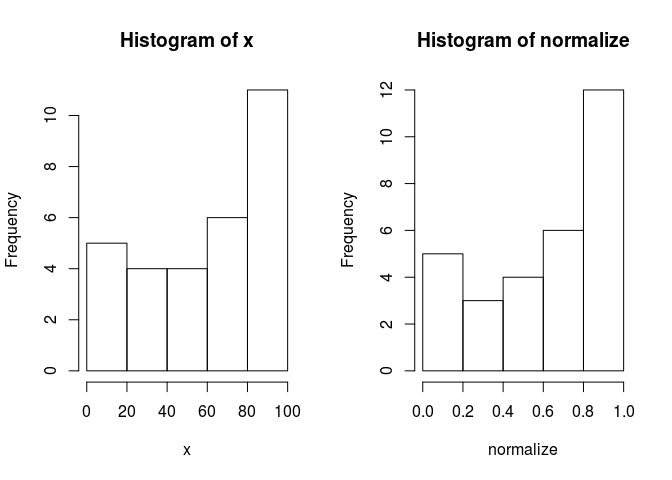

``` r
######################################################
install.packages("nnet", repos="http://cran.nexr.com/")
```

    ## Installing package into '/home/jw/R/x86_64-pc-linux-gnu-library/3.3'
    ## (as 'lib' is unspecified)

``` r
library(nnet)
m <- nnet(Species ~ ., data = iris, size = 3)  # 은닉층 노드수
```

    ## # weights:  27
    ## initial  value 189.108297 
    ## iter  10 value 81.246008
    ## iter  20 value 9.684410
    ## iter  30 value 6.187856
    ## iter  40 value 6.152561
    ## iter  50 value 6.028863
    ## iter  60 value 5.994390
    ## iter  70 value 5.972622
    ## iter  80 value 5.966337
    ## iter  90 value 5.958745
    ## iter 100 value 5.945343
    ## final  value 5.945343 
    ## stopped after 100 iterations

``` r
m
```

    ## a 4-3-3 network with 27 weights
    ## inputs: Sepal.Length Sepal.Width Petal.Length Petal.Width 
    ## output(s): Species 
    ## options were - softmax modelling

``` r
y<-iris$Species
y
```

    ##   [1] setosa     setosa     setosa     setosa     setosa     setosa    
    ##   [7] setosa     setosa     setosa     setosa     setosa     setosa    
    ##  [13] setosa     setosa     setosa     setosa     setosa     setosa    
    ##  [19] setosa     setosa     setosa     setosa     setosa     setosa    
    ##  [25] setosa     setosa     setosa     setosa     setosa     setosa    
    ##  [31] setosa     setosa     setosa     setosa     setosa     setosa    
    ##  [37] setosa     setosa     setosa     setosa     setosa     setosa    
    ##  [43] setosa     setosa     setosa     setosa     setosa     setosa    
    ##  [49] setosa     setosa     versicolor versicolor versicolor versicolor
    ##  [55] versicolor versicolor versicolor versicolor versicolor versicolor
    ##  [61] versicolor versicolor versicolor versicolor versicolor versicolor
    ##  [67] versicolor versicolor versicolor versicolor versicolor versicolor
    ##  [73] versicolor versicolor versicolor versicolor versicolor versicolor
    ##  [79] versicolor versicolor versicolor versicolor versicolor versicolor
    ##  [85] versicolor versicolor versicolor versicolor versicolor versicolor
    ##  [91] versicolor versicolor versicolor versicolor versicolor versicolor
    ##  [97] versicolor versicolor versicolor versicolor virginica  virginica 
    ## [103] virginica  virginica  virginica  virginica  virginica  virginica 
    ## [109] virginica  virginica  virginica  virginica  virginica  virginica 
    ## [115] virginica  virginica  virginica  virginica  virginica  virginica 
    ## [121] virginica  virginica  virginica  virginica  virginica  virginica 
    ## [127] virginica  virginica  virginica  virginica  virginica  virginica 
    ## [133] virginica  virginica  virginica  virginica  virginica  virginica 
    ## [139] virginica  virginica  virginica  virginica  virginica  virginica 
    ## [145] virginica  virginica  virginica  virginica  virginica  virginica 
    ## Levels: setosa versicolor virginica

``` r
#iris 데이터에 대한 예측
predict(m ,newdata = iris)
```

    ##           setosa   versicolor    virginica
    ## 1   1.000000e+00 5.148558e-09 2.251265e-08
    ## 2   1.000000e+00 5.079555e-09 2.343609e-08
    ## 3   1.000000e+00 5.114550e-09 2.296070e-08
    ## 4   1.000000e+00 5.059545e-09 2.371591e-08
    ## 5   1.000000e+00 5.155282e-09 2.242560e-08
    ## 6   1.000000e+00 5.094484e-09 2.322932e-08
    ## 7   1.000000e+00 5.082227e-09 2.339694e-08
    ## 8   1.000000e+00 5.118365e-09 2.290911e-08
    ## 9   1.000000e+00 5.038989e-09 2.401114e-08
    ## 10  1.000000e+00 5.111617e-09 2.300227e-08
    ## 11  1.000000e+00 5.165183e-09 2.229826e-08
    ## 12  1.000000e+00 5.092578e-09 2.325730e-08
    ## 13  1.000000e+00 5.111757e-09 2.300033e-08
    ## 14  1.000000e+00 5.138998e-09 2.263805e-08
    ## 15  1.000000e+00 5.229252e-09 2.149710e-08
    ## 16  1.000000e+00 5.187210e-09 2.201839e-08
    ## 17  1.000000e+00 5.157041e-09 2.240292e-08
    ## 18  1.000000e+00 5.117435e-09 2.292147e-08
    ## 19  1.000000e+00 5.129098e-09 2.276712e-08
    ## 20  1.000000e+00 5.136479e-09 2.267015e-08
    ## 21  1.000000e+00 5.101745e-09 2.313293e-08
    ## 22  1.000000e+00 5.090202e-09 2.328738e-08
    ## 23  1.000000e+00 5.191715e-09 2.196172e-08
    ## 24  1.000000e+00 4.923832e-09 2.571186e-08
    ## 25  1.000000e+00 5.032677e-09 2.410543e-08
    ## 26  1.000000e+00 5.044475e-09 2.393228e-08
    ## 27  1.000000e+00 5.018027e-09 2.429834e-08
    ## 28  1.000000e+00 5.137740e-09 2.265363e-08
    ## 29  1.000000e+00 5.141588e-09 2.260335e-08
    ## 30  1.000000e+00 5.059379e-09 2.371840e-08
    ## 31  1.000000e+00 5.049373e-09 2.386132e-08
    ## 32  1.000000e+00 5.061973e-09 2.367495e-08
    ## 33  1.000000e+00 5.214338e-09 2.168011e-08
    ## 34  1.000000e+00 5.218393e-09 2.163015e-08
    ## 35  1.000000e+00 5.074557e-09 2.350543e-08
    ## 36  1.000000e+00 5.141839e-09 2.260008e-08
    ## 37  1.000000e+00 5.174863e-09 2.217467e-08
    ## 38  1.000000e+00 5.178126e-09 2.213322e-08
    ## 39  1.000000e+00 5.074505e-09 2.350588e-08
    ## 40  1.000000e+00 5.122443e-09 2.285502e-08
    ## 41  1.000000e+00 5.129336e-09 2.276398e-08
    ## 42  1.000000e+00 4.908478e-09 2.612811e-08
    ## 43  1.000000e+00 5.101670e-09 2.313375e-08
    ## 44  1.000000e+00 4.928706e-09 2.562875e-08
    ## 45  1.000000e+00 5.022870e-09 2.422858e-08
    ## 46  1.000000e+00 5.031769e-09 2.410481e-08
    ## 47  1.000000e+00 5.151581e-09 2.247346e-08
    ## 48  1.000000e+00 5.092884e-09 2.325305e-08
    ## 49  1.000000e+00 5.161906e-09 2.234030e-08
    ## 50  1.000000e+00 5.122581e-09 2.285320e-08
    ## 51  3.656328e-06 9.998719e-01 1.243984e-04
    ## 52  4.565791e-06 9.996962e-01 2.992086e-04
    ## 53  7.897277e-06 9.972705e-01 2.721631e-03
    ## 54  4.418119e-06 9.997263e-01 2.693141e-04
    ## 55  8.212772e-06 9.968074e-01 3.184394e-03
    ## 56  4.974485e-06 9.995630e-01 4.320694e-04
    ## 57  8.028302e-06 9.971007e-01 2.891305e-03
    ## 58  1.461901e-06 9.999968e-01 1.754895e-06
    ## 59  3.727061e-06 9.998597e-01 1.366054e-04
    ## 60  3.780234e-06 9.998545e-01 1.417600e-04
    ## 61  1.786278e-06 9.999910e-01 7.257823e-06
    ## 62  4.406809e-06 9.997378e-01 2.577654e-04
    ## 63  1.960308e-06 9.999874e-01 1.063354e-05
    ## 64  7.188339e-06 9.981215e-01 1.871287e-03
    ## 65  2.559399e-06 9.999910e-01 6.440085e-06
    ## 66  3.050958e-06 9.999393e-01 5.769619e-05
    ## 67  7.928894e-06 9.972275e-01 2.764542e-03
    ## 68  1.614284e-06 9.999936e-01 4.741514e-06
    ## 69  1.709601e-05 9.274982e-01 7.248472e-02
    ## 70  1.945844e-06 9.999880e-01 1.003686e-05
    ## 71  1.890721e-05 5.934958e-01 4.064853e-01
    ## 72  2.362751e-06 9.999778e-01 1.986277e-05
    ## 73  1.987688e-05 7.771168e-01 2.228633e-01
    ## 74  4.253306e-06 9.997636e-01 2.321051e-04
    ## 75  2.736514e-06 9.999585e-01 3.871943e-05
    ## 76  3.427404e-06 9.999016e-01 9.500936e-05
    ## 77  7.152719e-06 9.981582e-01 1.834667e-03
    ## 78  1.986095e-05 7.119820e-01 2.879981e-01
    ## 79  7.569023e-06 9.976975e-01 2.294974e-03
    ## 80  1.793862e-06 9.999968e-01 1.398702e-06
    ## 81  1.944715e-06 9.999881e-01 1.000450e-05
    ## 82  1.504464e-06 9.999951e-01 3.389787e-06
    ## 83  2.005027e-06 9.999876e-01 1.043379e-05
    ## 84  7.836099e-06 1.421787e-01 8.578134e-01
    ## 85  8.655407e-06 9.960600e-01 3.931381e-03
    ## 86  5.820525e-06 9.992117e-01 7.825254e-04
    ## 87  6.159814e-06 9.989882e-01 1.005676e-03
    ## 88  5.977180e-06 9.990965e-01 8.975621e-04
    ## 89  2.541487e-06 9.999695e-01 2.791245e-05
    ## 90  3.597649e-06 9.998780e-01 1.183969e-04
    ## 91  4.249284e-06 9.997645e-01 2.312122e-04
    ## 92  5.425369e-06 9.993858e-01 6.087320e-04
    ## 93  2.347966e-06 9.999764e-01 2.123350e-05
    ## 94  1.430635e-06 9.999966e-01 1.950676e-06
    ## 95  3.729892e-06 9.998594e-01 1.368942e-04
    ## 96  2.189916e-06 9.999821e-01 1.575881e-05
    ## 97  2.991392e-06 9.999410e-01 5.599439e-05
    ## 98  2.898808e-06 9.999479e-01 4.924764e-05
    ## 99  1.630476e-05 9.999796e-01 4.081714e-06
    ## 100 2.901060e-06 9.999478e-01 4.930615e-05
    ## 101 6.643545e-13 4.744108e-11 1.000000e+00
    ## 102 5.876582e-08 1.947682e-04 9.998052e-01
    ## 103 3.343240e-10 1.941689e-07 9.999998e-01
    ## 104 4.976587e-08 1.559540e-04 9.998440e-01
    ## 105 4.922977e-11 1.499511e-08 1.000000e+00
    ## 106 5.313934e-12 7.645530e-10 1.000000e+00
    ## 107 6.532476e-06 1.101065e-01 8.898870e-01
    ## 108 1.463675e-09 1.398011e-06 9.999986e-01
    ## 109 2.214014e-09 2.431094e-06 9.999976e-01
    ## 110 6.200848e-12 9.397826e-10 1.000000e+00
    ## 111 8.274927e-07 6.700133e-03 9.932990e-01
    ## 112 4.011343e-08 1.168960e-04 9.998831e-01
    ## 113 4.156227e-09 5.642517e-06 9.999944e-01
    ## 114 6.544367e-09 1.035310e-05 9.999896e-01
    ## 115 3.838638e-11 1.075215e-08 1.000000e+00
    ## 116 1.159561e-09 1.023954e-06 9.999990e-01
    ## 117 2.877675e-07 1.629620e-03 9.983701e-01
    ## 118 4.718190e-11 1.416708e-08 1.000000e+00
    ## 119 2.126471e-14 4.762317e-13 1.000000e+00
    ## 120 5.267400e-06 8.170416e-02 9.182906e-01
    ## 121 1.427828e-10 6.225895e-08 9.999999e-01
    ## 122 6.798852e-08 2.366819e-04 9.997633e-01
    ## 123 4.720701e-12 6.526457e-10 1.000000e+00
    ## 124 3.305394e-06 4.321900e-02 9.567777e-01
    ## 125 4.039504e-09 5.431673e-06 9.999946e-01
    ## 126 7.318145e-08 2.611582e-04 9.997388e-01
    ## 127 8.522240e-06 1.601976e-01 8.397938e-01
    ## 128 9.632603e-06 1.910943e-01 8.088961e-01
    ## 129 2.772221e-10 1.511596e-07 9.999998e-01
    ## 130 2.470397e-06 2.913956e-02 9.708580e-01
    ## 131 9.654230e-10 8.014836e-07 9.999992e-01
    ## 132 1.639240e-08 3.533465e-05 9.999646e-01
    ## 133 5.996277e-11 1.951916e-08 1.000000e+00
    ## 134 1.971015e-05 8.079590e-01 1.920212e-01
    ## 135 3.191308e-06 4.120792e-02 9.587889e-01
    ## 136 1.170524e-11 2.197457e-09 1.000000e+00
    ## 137 6.375150e-11 2.118531e-08 1.000000e+00
    ## 138 4.185937e-07 2.690454e-03 9.973091e-01
    ## 139 1.363170e-05 3.227257e-01 6.772607e-01
    ## 140 2.003815e-08 4.621695e-05 9.999538e-01
    ## 141 2.659534e-11 6.583088e-09 1.000000e+00
    ## 142 8.419077e-09 1.449820e-05 9.999855e-01
    ## 143 5.876582e-08 1.947682e-04 9.998052e-01
    ## 144 2.736319e-11 6.838415e-09 1.000000e+00
    ## 145 8.841759e-12 1.510181e-09 1.000000e+00
    ## 146 1.442494e-09 1.371030e-06 9.999986e-01
    ## 147 1.089081e-07 4.443860e-04 9.995555e-01
    ## 148 1.225627e-07 5.204184e-04 9.994795e-01
    ## 149 1.134939e-09 9.949915e-07 9.999990e-01
    ## 150 1.877626e-06 2.012927e-02 9.798689e-01

``` r
# 모델로 부터 예측된 분류를 바로 알고자 할 때
predict(m, newdata = iris, type = 'class')
```

    ##   [1] "setosa"     "setosa"     "setosa"     "setosa"     "setosa"    
    ##   [6] "setosa"     "setosa"     "setosa"     "setosa"     "setosa"    
    ##  [11] "setosa"     "setosa"     "setosa"     "setosa"     "setosa"    
    ##  [16] "setosa"     "setosa"     "setosa"     "setosa"     "setosa"    
    ##  [21] "setosa"     "setosa"     "setosa"     "setosa"     "setosa"    
    ##  [26] "setosa"     "setosa"     "setosa"     "setosa"     "setosa"    
    ##  [31] "setosa"     "setosa"     "setosa"     "setosa"     "setosa"    
    ##  [36] "setosa"     "setosa"     "setosa"     "setosa"     "setosa"    
    ##  [41] "setosa"     "setosa"     "setosa"     "setosa"     "setosa"    
    ##  [46] "setosa"     "setosa"     "setosa"     "setosa"     "setosa"    
    ##  [51] "versicolor" "versicolor" "versicolor" "versicolor" "versicolor"
    ##  [56] "versicolor" "versicolor" "versicolor" "versicolor" "versicolor"
    ##  [61] "versicolor" "versicolor" "versicolor" "versicolor" "versicolor"
    ##  [66] "versicolor" "versicolor" "versicolor" "versicolor" "versicolor"
    ##  [71] "versicolor" "versicolor" "versicolor" "versicolor" "versicolor"
    ##  [76] "versicolor" "versicolor" "versicolor" "versicolor" "versicolor"
    ##  [81] "versicolor" "versicolor" "versicolor" "virginica"  "versicolor"
    ##  [86] "versicolor" "versicolor" "versicolor" "versicolor" "versicolor"
    ##  [91] "versicolor" "versicolor" "versicolor" "versicolor" "versicolor"
    ##  [96] "versicolor" "versicolor" "versicolor" "versicolor" "versicolor"
    ## [101] "virginica"  "virginica"  "virginica"  "virginica"  "virginica" 
    ## [106] "virginica"  "virginica"  "virginica"  "virginica"  "virginica" 
    ## [111] "virginica"  "virginica"  "virginica"  "virginica"  "virginica" 
    ## [116] "virginica"  "virginica"  "virginica"  "virginica"  "virginica" 
    ## [121] "virginica"  "virginica"  "virginica"  "virginica"  "virginica" 
    ## [126] "virginica"  "virginica"  "virginica"  "virginica"  "virginica" 
    ## [131] "virginica"  "virginica"  "virginica"  "versicolor" "virginica" 
    ## [136] "virginica"  "virginica"  "virginica"  "virginica"  "virginica" 
    ## [141] "virginica"  "virginica"  "virginica"  "virginica"  "virginica" 
    ## [146] "virginica"  "virginica"  "virginica"  "virginica"  "virginica"

``` r
# 신경망
# http://m.blog.naver.com/swkim4610/220469528029
# 원래 블로그

install.packages("nnet", repos="http://cran.nexr.com/")
```

    ## Installing package into '/home/jw/R/x86_64-pc-linux-gnu-library/3.3'
    ## (as 'lib' is unspecified)

``` r
library(nnet)

normalize <- function(x) {return((x - min(x)) / (max(x) - min(x)))}
# iris 데이터는 열이 5개다. iris[, -5]는 5번째 열을 제외한 데이터프레임
irisNorm <- as.data.frame(lapply(iris[,-5], normalize))

# 다시 iris의 5번째 열을 붙인다.
irisNorm$Species <- iris$Species


samp <- c(sample(1:50,25), sample(51:100,25), sample(101:150,25))

# [1, ] 행의 모든 열을 출력
# [samp, ]행들의 모든 열들을 출력
# 총 75개의 sample이 뽑힌다
iris.tr<-irisNorm[samp,]
irisNorm[-1,]
```

    ##     Sepal.Length Sepal.Width Petal.Length Petal.Width    Species
    ## 2     0.16666667  0.41666667   0.06779661  0.04166667     setosa
    ## 3     0.11111111  0.50000000   0.05084746  0.04166667     setosa
    ## 4     0.08333333  0.45833333   0.08474576  0.04166667     setosa
    ## 5     0.19444444  0.66666667   0.06779661  0.04166667     setosa
    ## 6     0.30555556  0.79166667   0.11864407  0.12500000     setosa
    ## 7     0.08333333  0.58333333   0.06779661  0.08333333     setosa
    ## 8     0.19444444  0.58333333   0.08474576  0.04166667     setosa
    ## 9     0.02777778  0.37500000   0.06779661  0.04166667     setosa
    ## 10    0.16666667  0.45833333   0.08474576  0.00000000     setosa
    ## 11    0.30555556  0.70833333   0.08474576  0.04166667     setosa
    ## 12    0.13888889  0.58333333   0.10169492  0.04166667     setosa
    ## 13    0.13888889  0.41666667   0.06779661  0.00000000     setosa
    ## 14    0.00000000  0.41666667   0.01694915  0.00000000     setosa
    ## 15    0.41666667  0.83333333   0.03389831  0.04166667     setosa
    ## 16    0.38888889  1.00000000   0.08474576  0.12500000     setosa
    ## 17    0.30555556  0.79166667   0.05084746  0.12500000     setosa
    ## 18    0.22222222  0.62500000   0.06779661  0.08333333     setosa
    ## 19    0.38888889  0.75000000   0.11864407  0.08333333     setosa
    ## 20    0.22222222  0.75000000   0.08474576  0.08333333     setosa
    ## 21    0.30555556  0.58333333   0.11864407  0.04166667     setosa
    ## 22    0.22222222  0.70833333   0.08474576  0.12500000     setosa
    ## 23    0.08333333  0.66666667   0.00000000  0.04166667     setosa
    ## 24    0.22222222  0.54166667   0.11864407  0.16666667     setosa
    ## 25    0.13888889  0.58333333   0.15254237  0.04166667     setosa
    ## 26    0.19444444  0.41666667   0.10169492  0.04166667     setosa
    ## 27    0.19444444  0.58333333   0.10169492  0.12500000     setosa
    ## 28    0.25000000  0.62500000   0.08474576  0.04166667     setosa
    ## 29    0.25000000  0.58333333   0.06779661  0.04166667     setosa
    ## 30    0.11111111  0.50000000   0.10169492  0.04166667     setosa
    ## 31    0.13888889  0.45833333   0.10169492  0.04166667     setosa
    ## 32    0.30555556  0.58333333   0.08474576  0.12500000     setosa
    ## 33    0.25000000  0.87500000   0.08474576  0.00000000     setosa
    ## 34    0.33333333  0.91666667   0.06779661  0.04166667     setosa
    ## 35    0.16666667  0.45833333   0.08474576  0.04166667     setosa
    ## 36    0.19444444  0.50000000   0.03389831  0.04166667     setosa
    ## 37    0.33333333  0.62500000   0.05084746  0.04166667     setosa
    ## 38    0.16666667  0.66666667   0.06779661  0.00000000     setosa
    ## 39    0.02777778  0.41666667   0.05084746  0.04166667     setosa
    ## 40    0.22222222  0.58333333   0.08474576  0.04166667     setosa
    ## 41    0.19444444  0.62500000   0.05084746  0.08333333     setosa
    ## 42    0.05555556  0.12500000   0.05084746  0.08333333     setosa
    ## 43    0.02777778  0.50000000   0.05084746  0.04166667     setosa
    ## 44    0.19444444  0.62500000   0.10169492  0.20833333     setosa
    ## 45    0.22222222  0.75000000   0.15254237  0.12500000     setosa
    ## 46    0.13888889  0.41666667   0.06779661  0.08333333     setosa
    ## 47    0.22222222  0.75000000   0.10169492  0.04166667     setosa
    ## 48    0.08333333  0.50000000   0.06779661  0.04166667     setosa
    ## 49    0.27777778  0.70833333   0.08474576  0.04166667     setosa
    ## 50    0.19444444  0.54166667   0.06779661  0.04166667     setosa
    ## 51    0.75000000  0.50000000   0.62711864  0.54166667 versicolor
    ## 52    0.58333333  0.50000000   0.59322034  0.58333333 versicolor
    ## 53    0.72222222  0.45833333   0.66101695  0.58333333 versicolor
    ## 54    0.33333333  0.12500000   0.50847458  0.50000000 versicolor
    ## 55    0.61111111  0.33333333   0.61016949  0.58333333 versicolor
    ## 56    0.38888889  0.33333333   0.59322034  0.50000000 versicolor
    ## 57    0.55555556  0.54166667   0.62711864  0.62500000 versicolor
    ## 58    0.16666667  0.16666667   0.38983051  0.37500000 versicolor
    ## 59    0.63888889  0.37500000   0.61016949  0.50000000 versicolor
    ## 60    0.25000000  0.29166667   0.49152542  0.54166667 versicolor
    ## 61    0.19444444  0.00000000   0.42372881  0.37500000 versicolor
    ## 62    0.44444444  0.41666667   0.54237288  0.58333333 versicolor
    ## 63    0.47222222  0.08333333   0.50847458  0.37500000 versicolor
    ## 64    0.50000000  0.37500000   0.62711864  0.54166667 versicolor
    ## 65    0.36111111  0.37500000   0.44067797  0.50000000 versicolor
    ## 66    0.66666667  0.45833333   0.57627119  0.54166667 versicolor
    ## 67    0.36111111  0.41666667   0.59322034  0.58333333 versicolor
    ## 68    0.41666667  0.29166667   0.52542373  0.37500000 versicolor
    ## 69    0.52777778  0.08333333   0.59322034  0.58333333 versicolor
    ## 70    0.36111111  0.20833333   0.49152542  0.41666667 versicolor
    ## 71    0.44444444  0.50000000   0.64406780  0.70833333 versicolor
    ## 72    0.50000000  0.33333333   0.50847458  0.50000000 versicolor
    ## 73    0.55555556  0.20833333   0.66101695  0.58333333 versicolor
    ## 74    0.50000000  0.33333333   0.62711864  0.45833333 versicolor
    ## 75    0.58333333  0.37500000   0.55932203  0.50000000 versicolor
    ## 76    0.63888889  0.41666667   0.57627119  0.54166667 versicolor
    ## 77    0.69444444  0.33333333   0.64406780  0.54166667 versicolor
    ## 78    0.66666667  0.41666667   0.67796610  0.66666667 versicolor
    ## 79    0.47222222  0.37500000   0.59322034  0.58333333 versicolor
    ## 80    0.38888889  0.25000000   0.42372881  0.37500000 versicolor
    ## 81    0.33333333  0.16666667   0.47457627  0.41666667 versicolor
    ## 82    0.33333333  0.16666667   0.45762712  0.37500000 versicolor
    ## 83    0.41666667  0.29166667   0.49152542  0.45833333 versicolor
    ## 84    0.47222222  0.29166667   0.69491525  0.62500000 versicolor
    ## 85    0.30555556  0.41666667   0.59322034  0.58333333 versicolor
    ## 86    0.47222222  0.58333333   0.59322034  0.62500000 versicolor
    ## 87    0.66666667  0.45833333   0.62711864  0.58333333 versicolor
    ## 88    0.55555556  0.12500000   0.57627119  0.50000000 versicolor
    ## 89    0.36111111  0.41666667   0.52542373  0.50000000 versicolor
    ## 90    0.33333333  0.20833333   0.50847458  0.50000000 versicolor
    ## 91    0.33333333  0.25000000   0.57627119  0.45833333 versicolor
    ## 92    0.50000000  0.41666667   0.61016949  0.54166667 versicolor
    ## 93    0.41666667  0.25000000   0.50847458  0.45833333 versicolor
    ## 94    0.19444444  0.12500000   0.38983051  0.37500000 versicolor
    ## 95    0.36111111  0.29166667   0.54237288  0.50000000 versicolor
    ## 96    0.38888889  0.41666667   0.54237288  0.45833333 versicolor
    ## 97    0.38888889  0.37500000   0.54237288  0.50000000 versicolor
    ## 98    0.52777778  0.37500000   0.55932203  0.50000000 versicolor
    ## 99    0.22222222  0.20833333   0.33898305  0.41666667 versicolor
    ## 100   0.38888889  0.33333333   0.52542373  0.50000000 versicolor
    ## 101   0.55555556  0.54166667   0.84745763  1.00000000  virginica
    ## 102   0.41666667  0.29166667   0.69491525  0.75000000  virginica
    ## 103   0.77777778  0.41666667   0.83050847  0.83333333  virginica
    ## 104   0.55555556  0.37500000   0.77966102  0.70833333  virginica
    ## 105   0.61111111  0.41666667   0.81355932  0.87500000  virginica
    ## 106   0.91666667  0.41666667   0.94915254  0.83333333  virginica
    ## 107   0.16666667  0.20833333   0.59322034  0.66666667  virginica
    ## 108   0.83333333  0.37500000   0.89830508  0.70833333  virginica
    ## 109   0.66666667  0.20833333   0.81355932  0.70833333  virginica
    ## 110   0.80555556  0.66666667   0.86440678  1.00000000  virginica
    ## 111   0.61111111  0.50000000   0.69491525  0.79166667  virginica
    ## 112   0.58333333  0.29166667   0.72881356  0.75000000  virginica
    ## 113   0.69444444  0.41666667   0.76271186  0.83333333  virginica
    ## 114   0.38888889  0.20833333   0.67796610  0.79166667  virginica
    ## 115   0.41666667  0.33333333   0.69491525  0.95833333  virginica
    ## 116   0.58333333  0.50000000   0.72881356  0.91666667  virginica
    ## 117   0.61111111  0.41666667   0.76271186  0.70833333  virginica
    ## 118   0.94444444  0.75000000   0.96610169  0.87500000  virginica
    ## 119   0.94444444  0.25000000   1.00000000  0.91666667  virginica
    ## 120   0.47222222  0.08333333   0.67796610  0.58333333  virginica
    ## 121   0.72222222  0.50000000   0.79661017  0.91666667  virginica
    ## 122   0.36111111  0.33333333   0.66101695  0.79166667  virginica
    ## 123   0.94444444  0.33333333   0.96610169  0.79166667  virginica
    ## 124   0.55555556  0.29166667   0.66101695  0.70833333  virginica
    ## 125   0.66666667  0.54166667   0.79661017  0.83333333  virginica
    ## 126   0.80555556  0.50000000   0.84745763  0.70833333  virginica
    ## 127   0.52777778  0.33333333   0.64406780  0.70833333  virginica
    ## 128   0.50000000  0.41666667   0.66101695  0.70833333  virginica
    ## 129   0.58333333  0.33333333   0.77966102  0.83333333  virginica
    ## 130   0.80555556  0.41666667   0.81355932  0.62500000  virginica
    ## 131   0.86111111  0.33333333   0.86440678  0.75000000  virginica
    ## 132   1.00000000  0.75000000   0.91525424  0.79166667  virginica
    ## 133   0.58333333  0.33333333   0.77966102  0.87500000  virginica
    ## 134   0.55555556  0.33333333   0.69491525  0.58333333  virginica
    ## 135   0.50000000  0.25000000   0.77966102  0.54166667  virginica
    ## 136   0.94444444  0.41666667   0.86440678  0.91666667  virginica
    ## 137   0.55555556  0.58333333   0.77966102  0.95833333  virginica
    ## 138   0.58333333  0.45833333   0.76271186  0.70833333  virginica
    ## 139   0.47222222  0.41666667   0.64406780  0.70833333  virginica
    ## 140   0.72222222  0.45833333   0.74576271  0.83333333  virginica
    ## 141   0.66666667  0.45833333   0.77966102  0.95833333  virginica
    ## 142   0.72222222  0.45833333   0.69491525  0.91666667  virginica
    ## 143   0.41666667  0.29166667   0.69491525  0.75000000  virginica
    ## 144   0.69444444  0.50000000   0.83050847  0.91666667  virginica
    ## 145   0.66666667  0.54166667   0.79661017  1.00000000  virginica
    ## 146   0.66666667  0.41666667   0.71186441  0.91666667  virginica
    ## 147   0.55555556  0.20833333   0.67796610  0.75000000  virginica
    ## 148   0.61111111  0.41666667   0.71186441  0.79166667  virginica
    ## 149   0.52777778  0.58333333   0.74576271  0.91666667  virginica
    ## 150   0.44444444  0.41666667   0.69491525  0.70833333  virginica

``` r
# [-1, ] = [1, ]행을 제외한 나머지 행들을 출력
iris.te<-irisNorm[-samp,]

ir1 <- nnet(Species~., data=iris.tr, size = 3)
```

    ## # weights:  27
    ## initial  value 90.773171 
    ## iter  10 value 18.498372
    ## iter  20 value 1.909506
    ## iter  30 value 0.001001
    ## final  value 0.000060 
    ## converged

``` r
y<-iris.te$Species
p<- predict(ir1, iris.te, type = "class")
table(y,p)
```

    ##             p
    ## y            setosa versicolor virginica
    ##   setosa         25          0         0
    ##   versicolor      0         25         0
    ##   virginica       0          5        20

``` r
a <- iris$Sepal.Length[1] - min(iris$Sepal.Length)
b <- max(iris$Sepal.Length) - min(iris$Sepal.Length)
a/b
```

    ## [1] 0.2222222

``` r
x <- sample(1:100, 30)

# 아래는 정규화시키는 것 scale을 0 ~ 1로 바꿀 때
normalize <- (x - min(x)) / (max(x) - min(x))

par(mfrow = c(1, 2))
hist(x)
hist(normalize)
```


