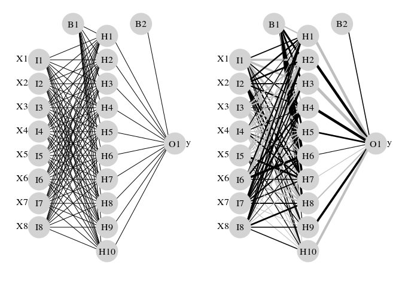
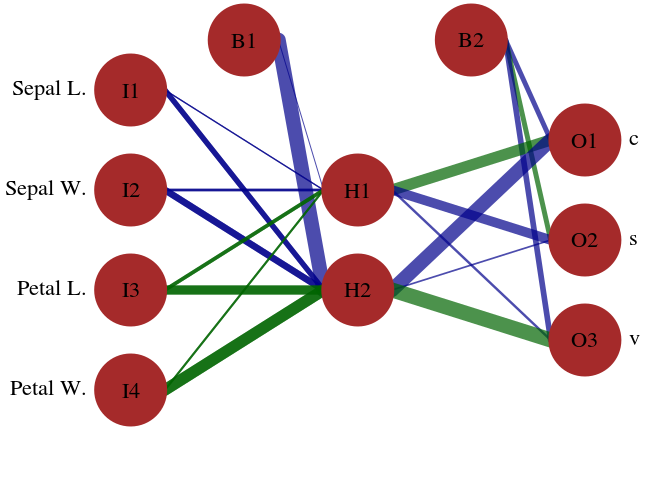
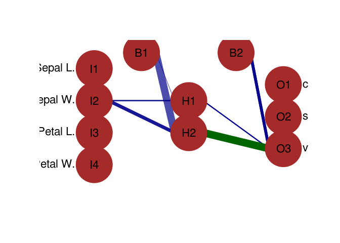

<http://biba.etsii.upm.es/web/tiki-view_blog_post.php?postId=25>

<http://stats.stackexchange.com/questions/116327/in-neural-networks-how-to-tell-the-feature-which-contributes-the-most-to-the-ou/116328>

<https://www.r-bloggers.com/variable-importance-in-neural-networks/>

########################################################################## 

<https://beckmw.wordpress.com/2013/03/> Visualizing neural networks from the nnet package 아래 예제 출처

``` r
require(clusterGeneration)
```

    ## Loading required package: clusterGeneration

    ## Loading required package: MASS

``` r
set.seed(2)
num.vars<-8
num.obs<-1000
 
#arbitrary correlation matrix and random variables
cov.mat<-genPositiveDefMat(num.vars,covMethod=c("unifcorrmat"))$Sigma
rand.vars<-mvrnorm(num.obs,rep(0,num.vars),Sigma=cov.mat)
parms<-runif(num.vars,-10,10)
 
#response variable as linear combination of random variables and random error term
y<-rand.vars %*% matrix(parms) + rnorm(num.obs,sd=20)
```

``` r
require(nnet)
```

    ## Loading required package: nnet

``` r
rand.vars<-data.frame(rand.vars)
y<-data.frame((y-min(y))/(max(y)-min(y)))
names(y)<-'y'
 
mod1<-nnet(rand.vars,y,size=10,linout=T)
```

    ## # weights:  101
    ## initial  value 3132.767198 
    ## iter  10 value 157.102682
    ## iter  20 value 23.481751
    ## iter  30 value 10.386797
    ## iter  40 value 6.965947
    ## iter  50 value 4.751437
    ## iter  60 value 3.968032
    ## iter  70 value 3.678686
    ## iter  80 value 3.590391
    ## iter  90 value 3.543412
    ## iter 100 value 3.499845
    ## final  value 3.499845 
    ## stopped after 100 iterations

``` r
#import function from Github
require(RCurl)
```

    ## Loading required package: RCurl

    ## Loading required package: bitops

``` r
root.url<-'https://gist.githubusercontent.com/fawda123'
raw.fun<-paste(
  root.url,
  '5086859/raw/cc1544804d5027d82b70e74b83b3941cd2184354/nnet_plot_fun.r',
  sep='/'
  )
script<-getURL(raw.fun, ssl.verifypeer = FALSE)
eval(parse(text = script))
rm('script','raw.fun')
```

``` r
par(mar=numeric(4),mfrow=c(1,2),family='serif')
plot(mod1,nid=F)
```

    ## Loading required package: scales

``` r
plot(mod1)
```



``` r
#example data and code from nnet function examples
ir<-rbind(iris3[,,1],iris3[,,2],iris3[,,3])
targets<-class.ind( c(rep("s", 50), rep("c", 50), rep("v", 50)) )
samp<-c(sample(1:50,25), sample(51:100,25), sample(101:150,25))
ir1<-nnet(ir[samp,], targets[samp,], size = 2, rang = 0.1,decay = 5e-4, maxit = 200)
```

    ## # weights:  19
    ## initial  value 56.693217 
    ## iter  10 value 49.451455
    ## iter  20 value 37.728639
    ## iter  30 value 37.293632
    ## iter  40 value 27.406810
    ## iter  50 value 1.267700
    ## iter  60 value 0.855189
    ## iter  70 value 0.706392
    ## iter  80 value 0.683082
    ## iter  90 value 0.672195
    ## iter 100 value 0.664555
    ## iter 110 value 0.663556
    ## iter 120 value 0.662398
    ## iter 130 value 0.662124
    ## iter 140 value 0.661913
    ## iter 150 value 0.661847
    ## iter 160 value 0.661830
    ## iter 170 value 0.661817
    ## iter 180 value 0.661813
    ## iter 190 value 0.661811
    ## final  value 0.661811 
    ## converged

``` r
#plot the model with different default values for the arguments
par(mar=numeric(4),family='serif')
plot.nnet(ir1,pos.col='darkgreen',neg.col='darkblue',alpha.val=0.7,rel.rsc=15,
circle.cex=10,cex=1.4,
    circle.col='brown')
```



``` r
plot.nnet(ir1,wts.only=T)
```

    ## $`hidden 1`
    ## [1] -0.3366664 -0.6115477 -1.8387131  2.8976545  1.3599321
    ## 
    ## $`hidden 2`
    ## [1] -13.374079  -4.469481  -5.762370   8.089016  10.377965
    ## 
    ## $`out 1`
    ## [1]  -4.114137  10.232544 -12.971393
    ## 
    ## $`out 2`
    ## [1]  4.161845 -8.612888 -1.029928
    ## 
    ## $`out 3`
    ## [1] -4.816624 -1.721431 13.789095

``` r
plot.nnet(ir1,pos.col='darkgreen',neg.col='darkblue',alpha.val=0.7,rel.rsc=15,
    circle.cex=10,cex=1.4,circle.col='brown',all.in='Sepal W.',all.out='v')
```


