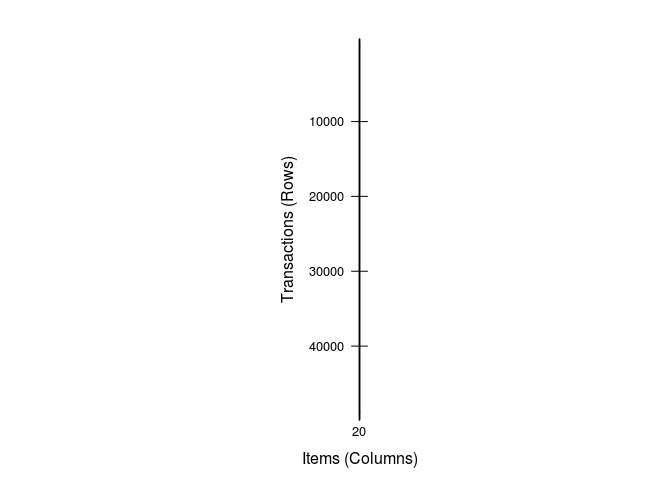
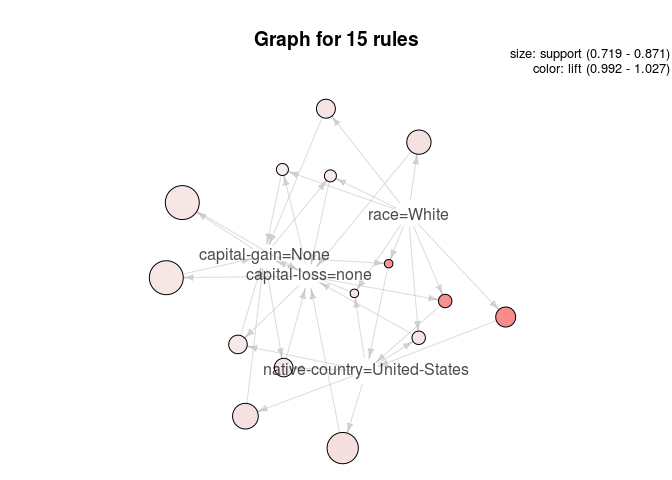
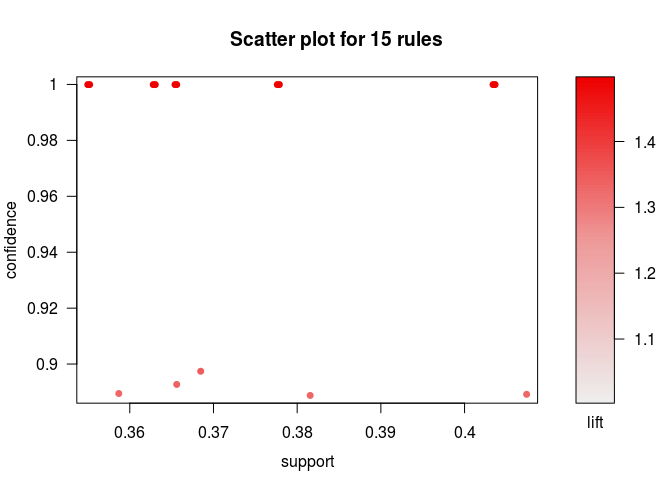

``` r
# 연관분석 apriori
install.packages('arules', repos="http://cran.nexr.com/")
```

    ## Installing package into '/home/jw/R/x86_64-pc-linux-gnu-library/3.3'
    ## (as 'lib' is unspecified)

``` r
install.packages('arulesViz', repos="http://cran.nexr.com/")
```

    ## Installing package into '/home/jw/R/x86_64-pc-linux-gnu-library/3.3'
    ## (as 'lib' is unspecified)

``` r
library(arules)
```

    ## Loading required package: Matrix

    ## 
    ## Attaching package: 'arules'

    ## The following objects are masked from 'package:base':
    ## 
    ##     abbreviate, write

``` r
library(arulesViz)
```

    ## Loading required package: grid

``` r
data('AdultUCI')
dim(AdultUCI)
```

    ## [1] 48842    15

``` r
AdultUCI[1:2, ]
```

    ##   age        workclass fnlwgt education education-num     marital-status
    ## 1  39        State-gov  77516 Bachelors            13      Never-married
    ## 2  50 Self-emp-not-inc  83311 Bachelors            13 Married-civ-spouse
    ##        occupation  relationship  race  sex capital-gain capital-loss
    ## 1    Adm-clerical Not-in-family White Male         2174            0
    ## 2 Exec-managerial       Husband White Male            0            0
    ##   hours-per-week native-country income
    ## 1             40  United-States  small
    ## 2             13  United-States  small

``` r
str(AdultUCI)
```

    ## 'data.frame':    48842 obs. of  15 variables:
    ##  $ age           : int  39 50 38 53 28 37 49 52 31 42 ...
    ##  $ workclass     : Factor w/ 8 levels "Federal-gov",..: 7 6 4 4 4 4 4 6 4 4 ...
    ##  $ fnlwgt        : int  77516 83311 215646 234721 338409 284582 160187 209642 45781 159449 ...
    ##  $ education     : Ord.factor w/ 16 levels "Preschool"<"1st-4th"<..: 14 14 9 7 14 15 5 9 15 14 ...
    ##  $ education-num : int  13 13 9 7 13 14 5 9 14 13 ...
    ##  $ marital-status: Factor w/ 7 levels "Divorced","Married-AF-spouse",..: 5 3 1 3 3 3 4 3 5 3 ...
    ##  $ occupation    : Factor w/ 14 levels "Adm-clerical",..: 1 4 6 6 10 4 8 4 10 4 ...
    ##  $ relationship  : Factor w/ 6 levels "Husband","Not-in-family",..: 2 1 2 1 6 6 2 1 2 1 ...
    ##  $ race          : Factor w/ 5 levels "Amer-Indian-Eskimo",..: 5 5 5 3 3 5 3 5 5 5 ...
    ##  $ sex           : Factor w/ 2 levels "Female","Male": 2 2 2 2 1 1 1 2 1 2 ...
    ##  $ capital-gain  : int  2174 0 0 0 0 0 0 0 14084 5178 ...
    ##  $ capital-loss  : int  0 0 0 0 0 0 0 0 0 0 ...
    ##  $ hours-per-week: int  40 13 40 40 40 40 16 45 50 40 ...
    ##  $ native-country: Factor w/ 41 levels "Cambodia","Canada",..: 39 39 39 39 5 39 23 39 39 39 ...
    ##  $ income        : Ord.factor w/ 2 levels "small"<"large": 1 1 1 1 1 1 1 2 2 2 ...

``` r
# 변수조정 - 필요없는 변수값 제거하고 factor화 (복잡한 계산을 줄이고 정확성을 높이기 위해)
# remove attributes
AdultUCI[['fnlwgt']] <- NULL
AdultUCI[['education-num']] <- NULL

## map metric attributes
# 수치형 변수의 값들을 factor화
table(AdultUCI$age)
```

    ## 
    ##   17   18   19   20   21   22   23   24   25   26   27   28   29   30   31 
    ##  595  862 1053 1113 1096 1178 1329 1206 1195 1153 1232 1280 1223 1278 1325 
    ##   32   33   34   35   36   37   38   39   40   41   42   43   44   45   46 
    ## 1253 1335 1303 1337 1348 1280 1264 1206 1187 1235 1165 1104 1067 1096 1097 
    ##   47   48   49   50   51   52   53   54   55   56   57   58   59   60   61 
    ## 1081  845  847  866  877  738  711  613  621  564  551  555  523  449  450 
    ##   62   63   64   65   66   67   68   69   70   71   72   73   74   75   76 
    ##  394  335  340  284  237  238  178  149  133  118  120  108   77   72   69 
    ##   77   78   79   80   81   82   83   84   85   86   87   88   89   90 
    ##   54   34   30   38   37   15   11   13    5    1    3    6    2   55

``` r
AdultUCI[['age']] <- ordered(cut(AdultUCI[['age']], 
      c(15, 25, 45, 65, 100)), 
      labels = c('Young', 'Middle-aged', 'Senior', 'Old'))

AdultUCI[["hours-per-week"]] <- ordered(cut(AdultUCI[["hours-per-week"]], 
      c(0, 25, 40, 60, 168)), 
      labels = c("Part-time", "Full-time", "Over-time", "Workaholic"))

AdultUCI[["capital-gain"]] <- ordered(cut(AdultUCI[["capital-gain"]], 
      c(-Inf, 0, median(AdultUCI[["capital-gain"]][AdultUCI[["capital-gain"]] > 0]), Inf)), 
      labels = c("None", "Low", "High"))

AdultUCI[["capital-loss"]] <- ordered(cut(AdultUCI[["capital-loss"]], 
      c(-Inf, 0, median(AdultUCI[["capital-loss"]][AdultUCI[["capital-loss"]] > 0]), Inf)), 
      labels = c("none", "low", "high"))

Adult <- as(AdultUCI, "transactions") # 클래스 강제 변환
inspect(head(Adult))
```

    ##     items                               transactionID
    ## [1] {age=Middle-aged,                                
    ##      workclass=State-gov,                            
    ##      education=Bachelors,                            
    ##      marital-status=Never-married,                   
    ##      occupation=Adm-clerical,                        
    ##      relationship=Not-in-family,                     
    ##      race=White,                                     
    ##      sex=Male,                                       
    ##      capital-gain=Low,                               
    ##      capital-loss=none,                              
    ##      hours-per-week=Full-time,                       
    ##      native-country=United-States,                   
    ##      income=small}                                  1
    ## [2] {age=Senior,                                     
    ##      workclass=Self-emp-not-inc,                     
    ##      education=Bachelors,                            
    ##      marital-status=Married-civ-spouse,              
    ##      occupation=Exec-managerial,                     
    ##      relationship=Husband,                           
    ##      race=White,                                     
    ##      sex=Male,                                       
    ##      capital-gain=None,                              
    ##      capital-loss=none,                              
    ##      hours-per-week=Part-time,                       
    ##      native-country=United-States,                   
    ##      income=small}                                  2
    ## [3] {age=Middle-aged,                                
    ##      workclass=Private,                              
    ##      education=HS-grad,                              
    ##      marital-status=Divorced,                        
    ##      occupation=Handlers-cleaners,                   
    ##      relationship=Not-in-family,                     
    ##      race=White,                                     
    ##      sex=Male,                                       
    ##      capital-gain=None,                              
    ##      capital-loss=none,                              
    ##      hours-per-week=Full-time,                       
    ##      native-country=United-States,                   
    ##      income=small}                                  3
    ## [4] {age=Senior,                                     
    ##      workclass=Private,                              
    ##      education=11th,                                 
    ##      marital-status=Married-civ-spouse,              
    ##      occupation=Handlers-cleaners,                   
    ##      relationship=Husband,                           
    ##      race=Black,                                     
    ##      sex=Male,                                       
    ##      capital-gain=None,                              
    ##      capital-loss=none,                              
    ##      hours-per-week=Full-time,                       
    ##      native-country=United-States,                   
    ##      income=small}                                  4
    ## [5] {age=Middle-aged,                                
    ##      workclass=Private,                              
    ##      education=Bachelors,                            
    ##      marital-status=Married-civ-spouse,              
    ##      occupation=Prof-specialty,                      
    ##      relationship=Wife,                              
    ##      race=Black,                                     
    ##      sex=Female,                                     
    ##      capital-gain=None,                              
    ##      capital-loss=none,                              
    ##      hours-per-week=Full-time,                       
    ##      native-country=Cuba,                            
    ##      income=small}                                  5
    ## [6] {age=Middle-aged,                                
    ##      workclass=Private,                              
    ##      education=Masters,                              
    ##      marital-status=Married-civ-spouse,              
    ##      occupation=Exec-managerial,                     
    ##      relationship=Wife,                              
    ##      race=White,                                     
    ##      sex=Female,                                     
    ##      capital-gain=None,                              
    ##      capital-loss=none,                              
    ##      hours-per-week=Full-time,                       
    ##      native-country=United-States,                   
    ##      income=small}                                  6

``` r
image(Adult)
```



``` r
#==========================================================================================
adult_rules <- apriori(Adult, 
                 parameter = list(supp = 0.7, conf = 0.9, minlen=2, target = "rules"))
```

    ## Apriori
    ## 
    ## Parameter specification:
    ##  confidence minval smax arem  aval originalSupport maxtime support minlen
    ##         0.9    0.1    1 none FALSE            TRUE       5     0.7      2
    ##  maxlen target   ext
    ##      10  rules FALSE
    ## 
    ## Algorithmic control:
    ##  filter tree heap memopt load sort verbose
    ##     0.1 TRUE TRUE  FALSE TRUE    2    TRUE
    ## 
    ## Absolute minimum support count: 34189 
    ## 
    ## set item appearances ...[0 item(s)] done [0.00s].
    ## set transactions ...[115 item(s), 48842 transaction(s)] done [0.04s].
    ## sorting and recoding items ... [4 item(s)] done [0.00s].
    ## creating transaction tree ... done [0.03s].
    ## checking subsets of size 1 2 3 4 done [0.00s].
    ## writing ... [15 rule(s)] done [0.00s].
    ## creating S4 object  ... done [0.02s].

``` r
adult_rules.sorted <- sort(adult_rules, by="lift"); inspect(adult_rules.sorted)
```

    ##      lhs                               rhs                              support confidence      lift
    ## [1]  {race=White}                   => {native-country=United-States} 0.7881127  0.9217231 1.0270761
    ## [2]  {race=White,                                                                                   
    ##       capital-loss=none}            => {native-country=United-States} 0.7490480  0.9205626 1.0257830
    ## [3]  {race=White,                                                                                   
    ##       capital-gain=None}            => {native-country=United-States} 0.7194628  0.9202807 1.0254689
    ## [4]  {native-country=United-States} => {capital-loss=none}            0.8548380  0.9525461 0.9992323
    ## [5]  {native-country=United-States} => {capital-gain=None}            0.8219565  0.9159062 0.9983862
    ## [6]  {race=White}                   => {capital-loss=none}            0.8136849  0.9516307 0.9982720
    ## [7]  {race=White,                                                                                   
    ##       native-country=United-States} => {capital-loss=none}            0.7490480  0.9504325 0.9970152
    ## [8]  {race=White}                   => {capital-gain=None}            0.7817862  0.9143240 0.9966616
    ## [9]  {capital-loss=none}            => {capital-gain=None}            0.8706646  0.9133376 0.9955863
    ## [10] {capital-gain=None}            => {capital-loss=none}            0.8706646  0.9490705 0.9955863
    ## [11] {race=White,                                                                                   
    ##       native-country=United-States} => {capital-gain=None}            0.7194628  0.9128933 0.9951019
    ## [12] {capital-gain=None,                                                                            
    ##       native-country=United-States} => {capital-loss=none}            0.7793702  0.9481891 0.9946618
    ## [13] {capital-loss=none,                                                                            
    ##       native-country=United-States} => {capital-gain=None}            0.7793702  0.9117168 0.9938195
    ## [14] {race=White,                                                                                   
    ##       capital-gain=None}            => {capital-loss=none}            0.7404283  0.9470983 0.9935175
    ## [15] {race=White,                                                                                   
    ##       capital-loss=none}            => {capital-gain=None}            0.7404283  0.9099693 0.9919147

``` r
inspect(adult_rules)
```

    ##      lhs                               rhs                              support confidence      lift
    ## [1]  {race=White}                   => {native-country=United-States} 0.7881127  0.9217231 1.0270761
    ## [2]  {race=White}                   => {capital-gain=None}            0.7817862  0.9143240 0.9966616
    ## [3]  {race=White}                   => {capital-loss=none}            0.8136849  0.9516307 0.9982720
    ## [4]  {native-country=United-States} => {capital-gain=None}            0.8219565  0.9159062 0.9983862
    ## [5]  {native-country=United-States} => {capital-loss=none}            0.8548380  0.9525461 0.9992323
    ## [6]  {capital-gain=None}            => {capital-loss=none}            0.8706646  0.9490705 0.9955863
    ## [7]  {capital-loss=none}            => {capital-gain=None}            0.8706646  0.9133376 0.9955863
    ## [8]  {race=White,                                                                                   
    ##       native-country=United-States} => {capital-gain=None}            0.7194628  0.9128933 0.9951019
    ## [9]  {race=White,                                                                                   
    ##       capital-gain=None}            => {native-country=United-States} 0.7194628  0.9202807 1.0254689
    ## [10] {race=White,                                                                                   
    ##       native-country=United-States} => {capital-loss=none}            0.7490480  0.9504325 0.9970152
    ## [11] {race=White,                                                                                   
    ##       capital-loss=none}            => {native-country=United-States} 0.7490480  0.9205626 1.0257830
    ## [12] {race=White,                                                                                   
    ##       capital-gain=None}            => {capital-loss=none}            0.7404283  0.9470983 0.9935175
    ## [13] {race=White,                                                                                   
    ##       capital-loss=none}            => {capital-gain=None}            0.7404283  0.9099693 0.9919147
    ## [14] {capital-gain=None,                                                                            
    ##       native-country=United-States} => {capital-loss=none}            0.7793702  0.9481891 0.9946618
    ## [15] {capital-loss=none,                                                                            
    ##       native-country=United-States} => {capital-gain=None}            0.7793702  0.9117168 0.9938195

``` r
plot(adult_rules, method = "graph")
```



``` r
#==========================================================================================
adult_rules2 <- apriori(Adult, 
      parameter = list(supp=0.35, conf=0.8, minlen=2, target="rules"), 
      appearance = list(rhs=c("sex=Male", "sex=Female"), default="lhs"))
```

    ## Apriori
    ## 
    ## Parameter specification:
    ##  confidence minval smax arem  aval originalSupport maxtime support minlen
    ##         0.8    0.1    1 none FALSE            TRUE       5    0.35      2
    ##  maxlen target   ext
    ##      10  rules FALSE
    ## 
    ## Algorithmic control:
    ##  filter tree heap memopt load sort verbose
    ##     0.1 TRUE TRUE  FALSE TRUE    2    TRUE
    ## 
    ## Absolute minimum support count: 17094 
    ## 
    ## set item appearances ...[2 item(s)] done [0.00s].
    ## set transactions ...[115 item(s), 48842 transaction(s)] done [0.04s].
    ## sorting and recoding items ... [11 item(s)] done [0.01s].
    ## creating transaction tree ... done [0.05s].
    ## checking subsets of size 1 2 3 4 5 done [0.00s].
    ## writing ... [15 rule(s)] done [0.00s].
    ## creating S4 object  ... done [0.01s].

``` r
adult_rules.sorted <- sort(adult_rules2, by="lift"); inspect(adult_rules.sorted)
```

    ##      lhs                                    rhs          support confidence     lift
    ## [1]  {relationship=Husband}              => {sex=Male} 0.4036485  0.9999493 1.495851
    ## [2]  {marital-status=Married-civ-spouse,                                            
    ##       relationship=Husband}              => {sex=Male} 0.4034028  0.9999492 1.495851
    ## [3]  {relationship=Husband,                                                         
    ##       capital-loss=none}                 => {sex=Male} 0.3778715  0.9999458 1.495845
    ## [4]  {marital-status=Married-civ-spouse,                                            
    ##       relationship=Husband,                                                         
    ##       capital-loss=none}                 => {sex=Male} 0.3776258  0.9999458 1.495845
    ## [5]  {relationship=Husband,                                                         
    ##       race=White}                        => {sex=Male} 0.3656075  0.9999440 1.495843
    ## [6]  {marital-status=Married-civ-spouse,                                            
    ##       relationship=Husband,                                                         
    ##       race=White}                        => {sex=Male} 0.3654027  0.9999440 1.495843
    ## [7]  {relationship=Husband,                                                         
    ##       native-country=United-States}      => {sex=Male} 0.3630482  0.9999436 1.495842
    ## [8]  {marital-status=Married-civ-spouse,                                            
    ##       relationship=Husband,                                                         
    ##       native-country=United-States}      => {sex=Male} 0.3628025  0.9999436 1.495842
    ## [9]  {relationship=Husband,                                                         
    ##       capital-gain=None}                 => {sex=Male} 0.3552066  0.9999424 1.495840
    ## [10] {marital-status=Married-civ-spouse,                                            
    ##       relationship=Husband,                                                         
    ##       capital-gain=None}                 => {sex=Male} 0.3549814  0.9999423 1.495840
    ## [11] {marital-status=Married-civ-spouse,                                            
    ##       race=White}                        => {sex=Male} 0.3684739  0.8974269 1.342485
    ## [12] {marital-status=Married-civ-spouse,                                            
    ##       native-country=United-States}      => {sex=Male} 0.3656075  0.8927161 1.335438
    ## [13] {marital-status=Married-civ-spouse,                                            
    ##       capital-gain=None}                 => {sex=Male} 0.3586872  0.8894699 1.330582
    ## [14] {marital-status=Married-civ-spouse} => {sex=Male} 0.4074157  0.8891818 1.330151
    ## [15] {marital-status=Married-civ-spouse,                                            
    ##       capital-loss=none}                 => {sex=Male} 0.3815569  0.8887829 1.329554

``` r
inspect(adult_rules2)
```

    ##      lhs                                    rhs          support confidence     lift
    ## [1]  {relationship=Husband}              => {sex=Male} 0.4036485  0.9999493 1.495851
    ## [2]  {marital-status=Married-civ-spouse} => {sex=Male} 0.4074157  0.8891818 1.330151
    ## [3]  {marital-status=Married-civ-spouse,                                            
    ##       relationship=Husband}              => {sex=Male} 0.4034028  0.9999492 1.495851
    ## [4]  {relationship=Husband,                                                         
    ##       race=White}                        => {sex=Male} 0.3656075  0.9999440 1.495843
    ## [5]  {relationship=Husband,                                                         
    ##       native-country=United-States}      => {sex=Male} 0.3630482  0.9999436 1.495842
    ## [6]  {relationship=Husband,                                                         
    ##       capital-gain=None}                 => {sex=Male} 0.3552066  0.9999424 1.495840
    ## [7]  {relationship=Husband,                                                         
    ##       capital-loss=none}                 => {sex=Male} 0.3778715  0.9999458 1.495845
    ## [8]  {marital-status=Married-civ-spouse,                                            
    ##       race=White}                        => {sex=Male} 0.3684739  0.8974269 1.342485
    ## [9]  {marital-status=Married-civ-spouse,                                            
    ##       native-country=United-States}      => {sex=Male} 0.3656075  0.8927161 1.335438
    ## [10] {marital-status=Married-civ-spouse,                                            
    ##       capital-gain=None}                 => {sex=Male} 0.3586872  0.8894699 1.330582
    ## [11] {marital-status=Married-civ-spouse,                                            
    ##       capital-loss=none}                 => {sex=Male} 0.3815569  0.8887829 1.329554
    ## [12] {marital-status=Married-civ-spouse,                                            
    ##       relationship=Husband,                                                         
    ##       race=White}                        => {sex=Male} 0.3654027  0.9999440 1.495843
    ## [13] {marital-status=Married-civ-spouse,                                            
    ##       relationship=Husband,                                                         
    ##       native-country=United-States}      => {sex=Male} 0.3628025  0.9999436 1.495842
    ## [14] {marital-status=Married-civ-spouse,                                            
    ##       relationship=Husband,                                                         
    ##       capital-gain=None}                 => {sex=Male} 0.3549814  0.9999423 1.495840
    ## [15] {marital-status=Married-civ-spouse,                                            
    ##       relationship=Husband,                                                         
    ##       capital-loss=none}                 => {sex=Male} 0.3776258  0.9999458 1.495845

``` r
plot(adult_rules2)
```


