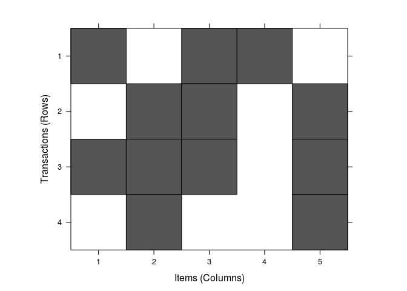

``` r
library(PASWR)
```

    ## Loading required package: e1071

    ## Loading required package: MASS

    ## Loading required package: lattice

``` r
data('titanic3')

# int형 변수들 확인
str(titanic3)
```

    ## 'data.frame':    1309 obs. of  14 variables:
    ##  $ pclass   : Factor w/ 3 levels "1st","2nd","3rd": 1 1 1 1 1 1 1 1 1 1 ...
    ##  $ survived : int  1 1 0 0 0 1 1 0 1 0 ...
    ##  $ name     : Factor w/ 1307 levels "Abbing, Mr. Anthony",..: 22 24 25 26 27 31 46 47 51 55 ...
    ##  $ sex      : Factor w/ 2 levels "female","male": 1 2 1 2 1 2 1 2 1 2 ...
    ##  $ age      : num  29 0.917 2 30 25 ...
    ##  $ sibsp    : int  0 1 1 1 1 0 1 0 2 0 ...
    ##  $ parch    : int  0 2 2 2 2 0 0 0 0 0 ...
    ##  $ ticket   : Factor w/ 929 levels "110152","110413",..: 188 50 50 50 50 125 93 16 77 826 ...
    ##  $ fare     : num  211 152 152 152 152 ...
    ##  $ cabin    : Factor w/ 187 levels "","A10","A11",..: 45 81 81 81 81 151 147 17 63 1 ...
    ##  $ embarked : Factor w/ 4 levels "","Cherbourg",..: 4 4 4 4 4 4 4 4 4 2 ...
    ##  $ boat     : Factor w/ 28 levels "","1","10","11",..: 13 4 1 1 1 14 3 1 28 1 ...
    ##  $ body     : int  NA NA NA 135 NA NA NA NA NA 22 ...
    ##  $ home.dest: Factor w/ 369 levels "","?Havana, Cuba",..: 309 231 231 231 231 237 163 25 23 229 ...

``` r
# int형 변수들(num포함): survivied, age, sibsp, parch, fare, body

# int형 변수들을 factor화 시킨다
# 그러기 위해서는 int형 변수들의 범위와 빈도수를 체크해야 함
table(titanic3$survived)
```

    ## 
    ##   0   1 
    ## 809 500

``` r
# table(titanic3$age) # 너무 많이 출력되어서 주석처리
table(titanic3$sibsp)
```

    ## 
    ##   0   1   2   3   4   5   8 
    ## 891 319  42  20  22   6   9

``` r
table(titanic3$parch)
```

    ## 
    ##    0    1    2    3    4    5    6    9 
    ## 1002  170  113    8    6    6    2    2

``` r
# table(titanic3$fare) # 너무 많이 출력되어서 주석처리
table(titanic3$body)
```

    ## 
    ##   1   4   7   9  14  15  16  17  18  19  22  32  35  37  38  43  45  46 
    ##   1   1   1   1   1   1   1   1   1   1   1   1   1   1   1   1   1   1 
    ##  47  50  51  52  53  58  61  62  67  68  69  70  72  75  79  80  81  89 
    ##   1   1   1   1   1   1   1   1   1   1   1   1   1   1   1   1   1   1 
    ##  96  97  98 101 103 108 109 110 119 120 121 122 124 126 130 131 133 135 
    ##   1   1   1   1   1   1   1   1   1   1   1   1   1   1   1   1   1   1 
    ## 142 143 147 148 149 153 155 156 165 166 169 171 172 173 174 175 176 181 
    ##   1   1   1   1   1   1   1   1   1   1   1   1   1   1   1   1   1   1 
    ## 187 188 189 190 196 197 201 206 207 208 209 230 232 234 236 245 249 255 
    ##   1   1   1   1   1   1   1   1   1   1   1   1   1   1   1   1   1   1 
    ## 256 258 259 260 261 263 269 271 275 283 284 285 286 287 292 293 294 295 
    ##   1   1   1   1   1   1   1   1   1   1   1   1   1   1   1   1   1   1 
    ## 297 298 299 304 305 306 307 309 312 314 322 327 328 
    ##   1   1   1   1   1   1   1   1   1   1   1   1   1

``` r
data("titanic3")
table(titanic3$survived)
```

    ## 
    ##   0   1 
    ## 809 500

``` r
#cut(titanic3$survived, c(-Inf, 0, Inf))
#if(titanic3$survived > 0) titanic3$survived = 'yes' else titanic3$survived = 'no'
#if(titanic3$survived[titanic3$survived == 1] ) titanic3$survived = 'yes' else titanic3$survived = 'no'

#titanic3$survived[titanic3$survived == 0] = 'no'
#titanic3$survived[titanic3$survived == 1] = 'yes'

titanic3$survived <- ordered(
  cut(titanic3$survived, c(-Inf, 0, 1)), 
  labels = c('no', 'yes')
  )
```

``` r
sum(table(titanic3$age)) # 1046명
```

    ## [1] 1046

``` r
summary(titanic3$age)
```

    ##    Min. 1st Qu.  Median    Mean 3rd Qu.    Max.    NA's 
    ##  0.1667 21.0000 28.0000 29.8800 39.0000 80.0000     263

``` r
sum(table(titanic3$age[titanic3$age <= 18])) # 193명
```

    ## [1] 193

``` r
sum(table(titanic3$age[titanic3$age > 18 & titanic3$age <= 30])) # 416명
```

    ## [1] 416

``` r
sum(table(titanic3$age[titanic3$age > 30 & titanic3$age <= 55])) # 378명
```

    ## [1] 378

``` r
sum(table(titanic3$age[titanic3$age > 55 & titanic3$age <= 80])) # 59명
```

    ## [1] 59

``` r
# titanic3$age <- titanic3$age[!is.na(titanic3$age)]
# titanic3$age3 <- na.omit(titanic3$age)
#y <- lapply(titanic3$age, na.omit)

titanic3$age <- ordered(
  cut(titanic3$age, c(0, 18, 30, 55, 80)), 
  labels = c('teenager', 'young', 'senior', 'old')
  )
```

``` r
table(titanic3$sibsp)
```

    ## 
    ##   0   1   2   3   4   5   8 
    ## 891 319  42  20  22   6   9

``` r
sum(table(titanic3$sibsp[titanic3$sibsp == 0])) # 891
```

    ## [1] 891

``` r
sum(table(titanic3$sibsp[titanic3$sibsp > 0 & titanic3$sibsp <= 3])) # 381
```

    ## [1] 381

``` r
sum(table(titanic3$sibsp[titanic3$sibsp > 3 & titanic3$sibsp <= 8])) # 37
```

    ## [1] 37

``` r
titanic3$sibsp <- ordered(
  cut(titanic3$sibsp, c(-Inf, 0, 3, 8, Inf)),
  labels = c('none', 'few', 'many')
)
```

``` r
table(titanic3$parch)
```

    ## 
    ##    0    1    2    3    4    5    6    9 
    ## 1002  170  113    8    6    6    2    2

``` r
titanic3$parch <- ordered(
  cut(titanic3$parch, c(-Inf, 0, 3, 9, Inf)),
  labels = c('alone', 'few', 'many')
)
```

``` r
# table(titanic3$fare) # 너무 많이 출력되어서 주석처리
summary(titanic3$fare)
```

    ##    Min. 1st Qu.  Median    Mean 3rd Qu.    Max.    NA's 
    ##   0.000   7.896  14.450  33.300  31.270 512.300       1

``` r
titanic3$fare <- ordered(
  cut(titanic3$fare, c(-Inf, 0, 10, 35, 100, Inf)),
  labels = c('free_ride', 'economy', '3rd_class', '2nd_class', '1st_class')
)
```

``` r
table(titanic3$body)
```

    ## 
    ##   1   4   7   9  14  15  16  17  18  19  22  32  35  37  38  43  45  46 
    ##   1   1   1   1   1   1   1   1   1   1   1   1   1   1   1   1   1   1 
    ##  47  50  51  52  53  58  61  62  67  68  69  70  72  75  79  80  81  89 
    ##   1   1   1   1   1   1   1   1   1   1   1   1   1   1   1   1   1   1 
    ##  96  97  98 101 103 108 109 110 119 120 121 122 124 126 130 131 133 135 
    ##   1   1   1   1   1   1   1   1   1   1   1   1   1   1   1   1   1   1 
    ## 142 143 147 148 149 153 155 156 165 166 169 171 172 173 174 175 176 181 
    ##   1   1   1   1   1   1   1   1   1   1   1   1   1   1   1   1   1   1 
    ## 187 188 189 190 196 197 201 206 207 208 209 230 232 234 236 245 249 255 
    ##   1   1   1   1   1   1   1   1   1   1   1   1   1   1   1   1   1   1 
    ## 256 258 259 260 261 263 269 271 275 283 284 285 286 287 292 293 294 295 
    ##   1   1   1   1   1   1   1   1   1   1   1   1   1   1   1   1   1   1 
    ## 297 298 299 304 305 306 307 309 312 314 322 327 328 
    ##   1   1   1   1   1   1   1   1   1   1   1   1   1

``` r
titanic3$body <- NULL

table(titanic3$boat)
```

    ## 
    ##               1      10      11      12      13   13 15 13 15 B      14 
    ##     823       5      29      25      19      39       2       1      33 
    ##      15   15 16      16       2       3       4       5     5 7     5 9 
    ##      37       1      23      13      26      31      27       2       1 
    ##       6       7       8    8 10       9       A       B       C     C D 
    ##      20      23      23       1      25      11       9      38       2 
    ##       D 
    ##      20

``` r
titanic3$boat <- NULL

# table(titanic3$cabin) # 너무 많이 출력되어서 주석처리
titanic3$cabin <- NULL
```

``` r
# sample(titanic3, 10) # 너무 많이 출력되어서 주석처리
```

``` r
#titanic3 <- as(titanic3, "transactions") #이거 왜 하는 거임?

install.packages("arules", repos="http://cran.nexr.com/")
```

    ## Installing package into '/home/jw/R/x86_64-pc-linux-gnu-library/3.3'
    ## (as 'lib' is unspecified)

``` r
library(arules)
```

    ## Loading required package: Matrix

    ## 
    ## Attaching package: 'arules'

    ## The following objects are masked from 'package:base':
    ## 
    ##     abbreviate, write

``` r
install.packages("arulesViz", repos="http://cran.nexr.com/")
```

    ## Installing package into '/home/jw/R/x86_64-pc-linux-gnu-library/3.3'
    ## (as 'lib' is unspecified)

``` r
library(arulesViz)
```

    ## Loading required package: grid

``` r
summary(titanic3)
```

    ##  pclass    survived                               name          sex     
    ##  1st:323   no :809   Connolly, Miss. Kate           :   2   female:466  
    ##  2nd:277   yes:500   Kelly, Mr. James               :   2   male  :843  
    ##  3rd:709             Abbing, Mr. Anthony            :   1               
    ##                      Abbott, Master. Eugene Joseph  :   1               
    ##                      Abbott, Mr. Rossmore Edward    :   1               
    ##                      Abbott, Mrs. Stanton (Rosa Hunt:   1               
    ##                      (Other)                        :1301               
    ##        age       sibsp       parch           ticket            fare    
    ##  teenager:193   none:891   alone:1002   CA. 2343:  11   free_ride: 17  
    ##  young   :416   few :381   few  : 291   1601    :   8   economy  :474  
    ##  senior  :378   many: 37   many :  16   CA 2144 :   8   3rd_class:522  
    ##  old     : 59                           3101295 :   7   2nd_class:211  
    ##  NA's    :263                           347077  :   7   1st_class: 84  
    ##                                         347082  :   7   NA's     :  1  
    ##                                         (Other) :1261                  
    ##         embarked                  home.dest  
    ##             :  2                       :564  
    ##  Cherbourg  :270   New York, NY        : 64  
    ##  Queenstown :123   London              : 14  
    ##  Southampton:914   Montreal, PQ        : 10  
    ##                    Cornwall / Akron, OH:  9  
    ##                    Paris, France       :  9  
    ##                    (Other)             :639

``` r
class(titanic3)
```

    ## [1] "data.frame"

``` r
titanic3_rules <- apriori(titanic3, 
                 parameter = list(supp = 0.005, conf = 0.8, minlen = 2),
                 appearance = list(rhs=c("survived=no", "survived=yes"), default="lhs"), 
                 control = list(verbose=F))

titanic3_rules.sorted <- sort(titanic3_rules, by="lift")
#inspect(titanic3_rules.sorted) # 너무 많이 출력되어서 주석처리

plot(titanic3_rules, method = "graph")
```


``` r
table(titanic3$sex)
```

    ## 
    ## female   male 
    ##    466    843

``` r
# 변수가 너무 많으므로 pclass, sex, age를 가지고 survived와의 연관관계를 분석해보겠다
#titanic3$age <- ordered(cut(titanic3$age, c(0, 18, 30, 55, 80)),labels = c('teenager', 'young', 'senior', 'old'))
# 0 ~ 18 : teenager
# 19 ~ 30 : young
# 31 ~ 55 : senior
# 56 ~ 80 : old

titanic3_new <- data.frame(titanic3$age, titanic3$sex, titanic3$pclass, titanic3$survived)
colnames(titanic3_new)[c(1, 2, 3, 4)] <- c('age', 'sex', 'pclass', 'survived')
titanic3_rules2 <- apriori(titanic3_new, 
                 parameter = list(supp = 0.005, conf = 0.8, minlen = 2),
                 appearance = list(rhs=c("survived=no", "survived=yes"), default="lhs"), 
                 control = list(verbose=F))

titanic3_rules.sorted2 <- sort(titanic3_rules2, by="lift")
inspect(titanic3_rules.sorted2)
```

    ##      lhs               rhs                support confidence     lift
    ## [1]  {age=young,                                                     
    ##       sex=female,                                                    
    ##       pclass=1st}   => {survived=yes} 0.026737968  0.9722222 2.545278
    ## [2]  {age=senior,                                                    
    ##       sex=female,                                                    
    ##       pclass=1st}   => {survived=yes} 0.051184110  0.9710145 2.542116
    ## [3]  {sex=female,                                                    
    ##       pclass=1st}   => {survived=yes} 0.106187930  0.9652778 2.527097
    ## [4]  {age=teenager,                                                  
    ##       sex=female,                                                    
    ##       pclass=2nd}   => {survived=yes} 0.015278839  0.9523810 2.493333
    ## [5]  {age=senior,                                                    
    ##       sex=female,                                                    
    ##       pclass=2nd}   => {survived=yes} 0.024446142  0.9411765 2.464000
    ## [6]  {age=old,                                                       
    ##       sex=female,                                                    
    ##       pclass=1st}   => {survived=yes} 0.010695187  0.9333333 2.443467
    ## [7]  {age=teenager,                                                  
    ##       sex=female,                                                    
    ##       pclass=1st}   => {survived=yes} 0.009167303  0.9230769 2.416615
    ## [8]  {sex=female,                                                    
    ##       pclass=2nd}   => {survived=yes} 0.071810542  0.8867925 2.321623
    ## [9]  {age=young,                                                     
    ##       sex=female,                                                    
    ##       pclass=2nd}   => {survived=yes} 0.030557678  0.8695652 2.276522
    ## [10] {age=teenager,                                                  
    ##       pclass=1st}   => {survived=yes} 0.013750955  0.8571429 2.244000
    ## [11] {age=old,                                                       
    ##       sex=female}   => {survived=yes} 0.011459129  0.8333333 2.181667
    ## [12] {age=senior,                                                    
    ##       sex=female}   => {survived=yes} 0.084797555  0.8222222 2.152578
    ## [13] {age=old,                                                       
    ##       sex=male,                                                      
    ##       pclass=3rd}   => {survived=no}  0.005347594  1.0000000 1.618047
    ## [14] {age=senior,                                                    
    ##       sex=male,                                                      
    ##       pclass=2nd}   => {survived=no}  0.042016807  0.9322034 1.508349
    ## [15] {age=old,                                                       
    ##       pclass=2nd}   => {survived=no}  0.008403361  0.9166667 1.483210
    ## [16] {age=old,                                                       
    ##       sex=male}     => {survived=no}  0.028265852  0.9024390 1.460189
    ## [17] {age=old,                                                       
    ##       sex=male,                                                      
    ##       pclass=2nd}   => {survived=no}  0.006875477  0.9000000 1.456242
    ## [18] {age=young,                                                     
    ##       sex=male,                                                      
    ##       pclass=2nd}   => {survived=no}  0.046600458  0.8970588 1.451483
    ## [19] {age=old,                                                       
    ##       pclass=3rd}   => {survived=no}  0.005347594  0.8750000 1.415791
    ## [20] {age=old,                                                       
    ##       sex=male,                                                      
    ##       pclass=1st}   => {survived=no}  0.016042781  0.8750000 1.415791
    ## [21] {age=senior,                                                    
    ##       sex=male,                                                      
    ##       pclass=3rd}   => {survived=no}  0.064171123  0.8659794 1.401195
    ## [22] {sex=male,                                                      
    ##       pclass=2nd}   => {survived=no}  0.111535523  0.8538012 1.381490
    ## [23] {sex=male,                                                      
    ##       pclass=3rd}   => {survived=no}  0.319327731  0.8478702 1.371894
    ## [24] {age=young,                                                     
    ##       sex=male,                                                      
    ##       pclass=3rd}   => {survived=no}  0.108479756  0.8208092 1.328108
    ## [25] {age=young,                                                     
    ##       sex=male}     => {survived=no}  0.170359053  0.8168498 1.321701
    ## [26] {sex=male}     => {survived=no}  0.521008403  0.8090154 1.309025
    ## [27] {age=senior,                                                    
    ##       pclass=3rd}   => {survived=no}  0.079449962  0.8062016 1.304472

``` r
plot(titanic3_rules2, method = "graph")
```


``` r
a_list = list(c('a', 'c', 'd'), c('b', 'c', 'e'), c('a', 'b', 'c', 'e'), c('b', 'e'))
names(a_list) = paste('Tr', c(1:4), sep = '')
a_list
```

    ## $Tr1
    ## [1] "a" "c" "d"
    ## 
    ## $Tr2
    ## [1] "b" "c" "e"
    ## 
    ## $Tr3
    ## [1] "a" "b" "c" "e"
    ## 
    ## $Tr4
    ## [1] "b" "e"

``` r
trans <- as(a_list, 'transactions')
trans
```

    ## transactions in sparse format with
    ##  4 transactions (rows) and
    ##  5 items (columns)

``` r
str(trans)
```

    ## Formal class 'transactions' [package "arules"] with 3 slots
    ##   ..@ data       :Formal class 'ngCMatrix' [package "Matrix"] with 5 slots
    ##   .. .. ..@ i       : int [1:12] 0 2 3 1 2 4 0 1 2 4 ...
    ##   .. .. ..@ p       : int [1:5] 0 3 6 10 12
    ##   .. .. ..@ Dim     : int [1:2] 5 4
    ##   .. .. ..@ Dimnames:List of 2
    ##   .. .. .. ..$ : NULL
    ##   .. .. .. ..$ : NULL
    ##   .. .. ..@ factors : list()
    ##   ..@ itemInfo   :'data.frame':  5 obs. of  1 variable:
    ##   .. ..$ labels: chr [1:5] "a" "b" "c" "d" ...
    ##   ..@ itemsetInfo:'data.frame':  4 obs. of  1 variable:
    ##   .. ..$ transactionID: chr [1:4] "Tr1" "Tr2" "Tr3" "Tr4"

``` r
summary(trans) # 행(각 transaction)과 열에 대한
```

    ## transactions as itemMatrix in sparse format with
    ##  4 rows (elements/itemsets/transactions) and
    ##  5 columns (items) and a density of 0.6 
    ## 
    ## most frequent items:
    ##       b       c       e       a       d (Other) 
    ##       3       3       3       2       1       0 
    ## 
    ## element (itemset/transaction) length distribution:
    ## sizes
    ## 2 3 4 
    ## 1 2 1 
    ## 
    ##    Min. 1st Qu.  Median    Mean 3rd Qu.    Max. 
    ##    2.00    2.75    3.00    3.00    3.25    4.00 
    ## 
    ## includes extended item information - examples:
    ##   labels
    ## 1      a
    ## 2      b
    ## 3      c
    ## 
    ## includes extended transaction information - examples:
    ##   transactionID
    ## 1           Tr1
    ## 2           Tr2
    ## 3           Tr3

``` r
inspect(trans) # 입력한 원자료를 보여줌
```

    ##     items     transactionID
    ## [1] {a,c,d}   Tr1          
    ## [2] {b,c,e}   Tr2          
    ## [3] {a,b,c,e} Tr3          
    ## [4] {b,e}     Tr4

``` r
image(trans)
```


